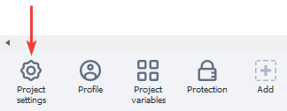
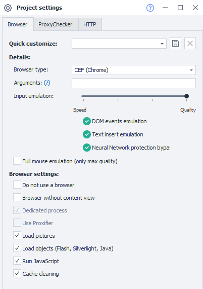
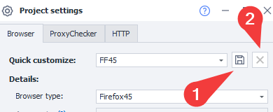
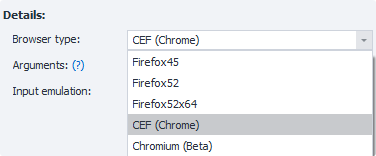
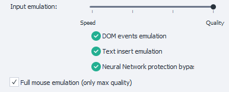
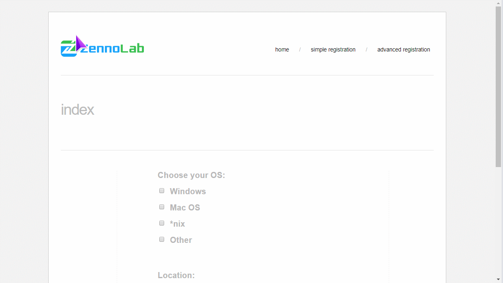
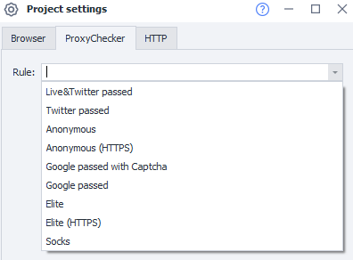
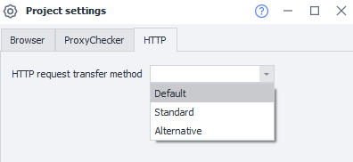

:::info **Please read the [*Material Usage Rules on this site*](../../../Disclaimer).**
:::

> 🔗 **[Original Page](https://zennolab.atlassian.net/wiki/spaces/RU/pages/534315477)** — Source of this material

_______________________________________________  

## Description

These settings allow you to fine-tune your project’s operation. They determine which parameters will be automatically applied when the template is launched.

## How to open the settings?

To open the project settings, you need to click the corresponding button in the static blocks panel. If you don’t see the static blocks, right-click on an empty area of the workspace and check the “**Show static blocks**” option in the context menu.

The project settings contain 3 sections: browser settings, proxy checker settings, and HTTP settings.

## Browser Settings

### Quick Setup

You can choose between 2 quick setup options from templates — **Quality** or **Speed**. Depending on your choice, the general browser settings will be auto-configured, but you can adjust each option individually if you wish.

#### Saving Settings

If you often use the same combination of settings in your projects, you can save it using the corresponding button (1). After clicking it, you’ll be prompted to enter a name for the new configuration.

:::warning Notice
Only the settings from the “Browser” and “Proxy Checker” tabs will be saved. Settings from the “HTTP” tab are not saved.
:::

To delete a configuration, use the corresponding button (2).

### Browser Type

:::info Info
In version 7.5.0.0, the Chromium engine was added. The Chrome engine was renamed to CEF (Chrome).
:::

Choose which browser to use in your project. Several options are available. You can also switch browsers during project execution using the [❗→ Browser Settings](https://zennolab.atlassian.net/wiki/spaces/RU/pages/489324572#%D0%97%D0%B0%D0%BF%D1%83%D1%81%D1%82%D0%B8%D1%82%D1%8C-%D0%B8%D0%BD%D1%81%D1%82%D0%B0%D0%BD%D1%81 "https://zennolab.atlassian.net/wiki/spaces/RU/pages/489324572#%D0%97%D0%B0%D0%BF%D1%83%D1%81%D1%82%D0%B8%D1%82%D1%8C-%D0%B8%D0%BD%D1%81%D1%82%D0%B0%D0%BD%D1%81") action.
In the [❗→ program settings](https://zennolab.atlassian.net/wiki/spaces/RU/pages/808845378#%D0%91%D1%80%D0%B0%D1%83%D0%B7%D0%B5%D1%80-%D0%BF%D0%BE-%D1%83%D0%BC%D0%BE%D0%BB%D1%87%D0%B0%D0%BD%D0%B8%D1%8E "https://zennolab.atlassian.net/wiki/spaces/RU/pages/808845378#%D0%91%D1%80%D0%B0%D1%83%D0%B7%D0%B5%D1%80-%D0%BF%D0%BE-%D1%83%D0%BC%D0%BE%D0%BB%D1%87%D0%B0%D0%BD%D0%B8%D1%8E"), you can set the default browser for all new projects.

### Arguments

For the Chrome browser, you can add custom startup arguments separated by spaces. You can find the full list of arguments at the following links:
https://www.chromium.org/developers/how-tos/run-chromium-with-flags
https://peter.sh/experiments/chromium-command-line-switches/

After changing the arguments, you need to restart the browser. You can do this by clicking the “Restart” button or by executing the “[❗→ Launch Instance](https://zennolab.atlassian.net/wiki/spaces/RU/pages/489324572#%D0%97%D0%B0%D0%BF%D1%83%D1%81%D1%82%D0%B8%D1%82%D1%8C-%D0%B8%D0%BD%D1%81%D1%82%D0%B0%D0%BD%D1%81 "https://zennolab.atlassian.net/wiki/spaces/RU/pages/489324572#%D0%97%D0%B0%D0%BF%D1%83%D1%81%D1%82%D0%B8%D1%82%D1%8C-%D0%B8%D0%BD%D1%81%D1%82%D0%B0%D0%BD%D1%81")” action.

### Input Emulation

Allows you to emulate real user actions when filling out fields on web pages, clicking buttons and links, which helps to bypass website protections. You can select from 4 preset options using the slider, choosing between project speed and quality. With maximum speed, all emulation and protection bypass options are disabled. With maximum quality, all emulation and protection bypass options are enabled, but execution speed will be lower.

- **DOM events emulation** — Emulates common DOM events via JS (such as onfocus, etc.). These events are tracked by scripts that add new fields to the web page, check field filling, or implement basic anti-bot checks.
- **Text input emulation** — Emulates data entry and page interaction through keyboard and mouse events, as if a real person is typing and clicking. Bypasses advanced protections that monitor input not using peripheral devices.
- **Neural protection bypass** — Advanced emulation that takes human behavior into account. Allows you to bypass most bot protection algorithms, including neural network-based ones.

### Full Mouse Emulation

This option enables mouse emulation at the project level.
This means that when executing “[❗→ Set Value](https://zennolab.atlassian.net/wiki/spaces/RU/pages/534315117 "https://zennolab.atlassian.net/wiki/spaces/RU/pages/534315117")” (Set) and “[❗→ Perform Action](https://zennolab.atlassian.net/wiki/spaces/RU/pages/534020211 "https://zennolab.atlassian.net/wiki/spaces/RU/pages/534020211")” (Rise) actions, mouse emulation from the current cursor to the specified HTML element will be automatically added.

So, to enable mouse emulation in your template, just one click is enough!
Nothing else is required.

:::info Info
Works only with maximum input emulation quality.
:::

Demonstration

### Do Not Use Browser

Disables the browser component, so you can’t interact with the page and its elements. If you work via POST/GET requests, databases, or command files, you can disable the browser to improve performance.

For more information on working with requests, see the articles [❗→ GET Request](https://zennolab.atlassian.net/wiki/spaces/RU/pages/534315165/GET- "https://zennolab.atlassian.net/wiki/spaces/RU/pages/534315165/GET-"), [❗→ POST Request](https://zennolab.atlassian.net/wiki/spaces/RU/pages/534315180/POST- "https://zennolab.atlassian.net/wiki/spaces/RU/pages/534315180/POST-") and [❗→ HTTP Requests](https://zennolab.atlassian.net/wiki/spaces/RU/pages/489259052/HTTP "https://zennolab.atlassian.net/wiki/spaces/RU/pages/489259052/HTTP").

### Browser Without Rendering Content

Allows you to keep loading all elements on the page, but without displaying them. This helps to save computer resources.

### Dedicated Process

If enabled, uses one instance per base.exe database — in this case, tasks inside the database will be executed faster, but resource consumption will increase.

:::info Info
This setting is available only for the Firefox engine.
:::

### Use Proxifier

Allows you to use a program for proxying network traffic in your template.

:::info Info
This setting is available only for the Firefox engine.
:::

### Load Images

For most websites, projects can work without images. Disabling them significantly saves traffic. You can also disable images via the [❗→ Browser Settings](https://zennolab.atlassian.net/wiki/spaces/RU/pages/489324572 "https://zennolab.atlassian.net/wiki/spaces/RU/pages/489324572") action.

### Load Objects (Flash, Silverlight, Java)

If disabled, Flash, Silverlight, and Java objects will not load or run on the page. This helps boost performance and reduce traffic usage. You can also control this setting via the [❗→ Browser Settings](https://zennolab.atlassian.net/wiki/spaces/RU/pages/489324572 "https://zennolab.atlassian.net/wiki/spaces/RU/pages/489324572") action.

If Flash is enabled in these settings but doesn’t work for some reason in the Chrome browser, add the [❗→ launch arguments](https://zennolab.atlassian.net/wiki/spaces/RU/pages/534315477#%D0%90%D1%80%D0%B3%D1%83%D0%BC%D0%B5%D0%BD%D1%82%D1%8B "https://zennolab.atlassian.net/wiki/spaces/RU/pages/534315477#%D0%90%D1%80%D0%B3%D1%83%D0%BC%D0%B5%D0%BD%D1%82%D1%8B") `--enable-system-flash --disable-software-rasterizer --disable-smooth-scrolling` to the launch parameters. More info: [Flash not working in browser](https://zennolab.kayako.com/ru/article/392-ne-rabotaet-flash-v-brauzere "https://zennolab.kayako.com/ru/article/392-ne-rabotaet-flash-v-brauzere")

### Run JavaScript

If disabled, scripts on the page will not execute. For most modern resources, this may affect website functionality. You can also control this setting via the [❗→ Browser Settings](https://zennolab.atlassian.net/wiki/spaces/RU/pages/489324572 "https://zennolab.atlassian.net/wiki/spaces/RU/pages/489324572") action.

### Clear Cache

Automically clear the contents of the cache (temporary storage) at the start of the project. Using the cache helps save traffic. You can also control this setting via the [❗→ Browser Settings](https://zennolab.atlassian.net/wiki/spaces/RU/pages/489324572 "https://zennolab.atlassian.net/wiki/spaces/RU/pages/489324572") action.

Some of these settings relate to content loading rules and can be changed during operation in the [❗→ browser window](https://zennolab.atlassian.net/wiki/spaces/RU/pages/534315373 "https://zennolab.atlassian.net/wiki/spaces/RU/pages/534315373").

## Proxy Checker Settings

Allows you to set the rule by which proxies will be used from the proxy checker when the project starts.

You can also change the rule for the proxy checker within the project using the “**Get proxy**” action. For more details, see the article [❗→ Using Proxies](https://zennolab.atlassian.net/wiki/spaces/RU/pages/492208129 "https://zennolab.atlassian.net/wiki/spaces/RU/pages/492208129").

## HTTP Settings

Sets the method for sending HTTP requests — **Standard** or **Alternative**. The “**Default**” option is configured in the [❗→ program settings under the "Execution" tab](https://zennolab.atlassian.net/wiki/spaces/RU/pages/809074766#%D0%98%D1%81%D0%BF%D0%BE%D0%BB%D1%8C%D0%B7%D0%BE%D0%B2%D0%B0%D1%82%D1%8C-%D0%B0%D0%BB%D1%8C%D1%82%D0%B5%D1%80%D0%BD%D0%B0%D1%82%D0%B8%D0%B2%D0%BD%D1%8B%D0%B9-%D1%81%D0%BF%D0%BE%D1%81%D0%BE%D0%B1-%D0%BF%D0%B5%D1%80%D0%B5%D0%B4%D0%B0%D1%87%D0%B8-HTTP-%D0%B7%D0%B0%D0%BF%D1%80%D0%BE%D1%81%D0%BE%D0%B2 "https://zennolab.atlassian.net/wiki/spaces/RU/pages/809074766#%D0%98%D1%81%D0%BF%D0%BE%D0%BB%D1%8C%D0%B7%D0%BE%D0%B2%D0%B0%D1%82%D1%8C-%D0%B0%D0%BB%D1%8C%D1%82%D0%B5%D1%80%D0%BD%D0%B0%D1%82%D0%B8%D0%B2%D0%BD%D1%8B%D0%B9-%D1%81%D0%BF%D0%BE%D1%81%D0%BE%D0%B1-%D0%BF%D0%B5%D1%80%D0%B5%D0%B4%D0%B0%D1%87%D0%B8-HTTP-%D0%B7%D0%B0%D0%BF%D1%80%D0%BE%D1%81%D0%BE%D0%B2").

By default, ZennoPoster uses the Chillkat library to send HTTP requests.
We have added an alternative option — **ZennoHttpClient**, which can resolve issues with some websites (for example, Yandex).

- Default — the method selected in the [❗→ program settings](https://zennolab.atlassian.net/wiki/spaces/RU/pages/809074766#%D0%98%D1%81%D0%BF%D0%BE%D0%BB%D1%8C%D0%B7%D0%BE%D0%B2%D0%B0%D1%82%D1%8C-%D0%B0%D0%BB%D1%8C%D1%82%D0%B5%D1%80%D0%BD%D0%B0%D1%82%D0%B8%D0%B2%D0%BD%D1%8B%D0%B9-%D1%81%D0%BF%D0%BE%D1%81%D0%BE%D0%B1-%D0%BF%D0%B5%D1%80%D0%B5%D0%B4%D0%B0%D1%87%D0%B8-HTTP-%D0%B7%D0%B0%D0%BF%D1%80%D0%BE%D1%81%D0%BE%D0%B2 "https://zennolab.atlassian.net/wiki/spaces/RU/pages/809074766#%D0%98%D1%81%D0%BF%D0%BE%D0%BB%D1%8C%D0%B7%D0%BE%D0%B2%D0%B0%D1%82%D1%8C-%D0%B0%D0%BB%D1%8C%D1%82%D0%B5%D1%80%D0%BD%D0%B0%D1%82%D0%B8%D0%B2%D0%BD%D1%8B%D0%B9-%D1%81%D0%BF%D0%BE%D1%81%D0%BE%D0%B1-%D0%BF%D0%B5%D1%80%D0%B5%D0%B4%D0%B0%D1%87%D0%B8-HTTP-%D0%B7%D0%B0%D0%BF%D1%80%D0%BE%D1%81%D0%BE%D0%B2").
- Standard — Chillkat.
- Alternative — ZennoHttpClient.

These settings are used for working with request actions. For more information about working with requests, see the articles [❗→ GET Request](https://zennolab.atlassian.net/wiki/spaces/RU/pages/534315165/GET- "https://zennolab.atlassian.net/wiki/spaces/RU/pages/534315165/GET-"), [❗→ POST Request](https://zennolab.atlassian.net/wiki/spaces/RU/pages/534315180/POST- "https://zennolab.atlassian.net/wiki/spaces/RU/pages/534315180/POST-") and [❗→ HTTP Requests](https://zennolab.atlassian.net/wiki/spaces/RU/pages/489259052/HTTP "https://zennolab.atlassian.net/wiki/spaces/RU/pages/489259052/HTTP").