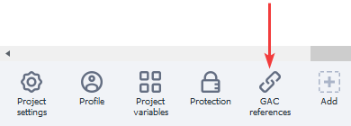
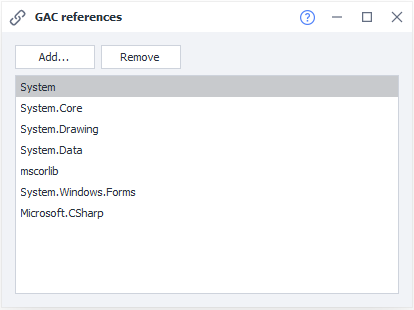
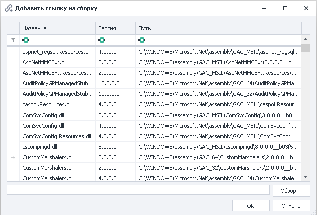
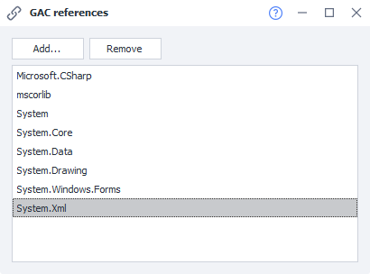

---
sidebar_position: 10
title: "References from GAC"
description: ""
date: "2025-08-04"
converted: true
originalFile: "Ссылки из GAC.txt"
targetUrl: "https://zennolab.atlassian.net/wiki/spaces/RU/pages/534315491/GAC"
---
:::info **Please read the [*Material Usage Rules on this site*](../Disclaimer).**
:::

> 🔗 **[Original Page](https://zennolab.atlassian.net/wiki/spaces/RU/pages/534315491/GAC)** — Source of this material

_______________________________________________  

## Description

When you use C# snippets, you have access to all features of the C# language. It includes an extensive library of classes and methods that cover most of the tasks you might encounter. You can learn more about the features and descriptions of these library classes on the [.NET Framework Class Library](http://msdn.microsoft.com/ru-ru/library/gg145045%28v=vs.110%29.aspx "http://msdn.microsoft.com/ru-ru/library/gg145045(v=vs.110).aspx") page.

If you can’t find a class to solve your task, you can add a third-party class library. To do this, add the **References from GAC** element to the panel, where you can connect your library.

## How to use?

If you can’t find a class you need when using C# snippets, you can add a third-party class library. To do this, add the **References from GAC** element to the static blocks panel.

A new element will appear in the static blocks panel:

When you open this element, a window will appear showing the libraries currently connected.

Use the “Add” button to add your library — select it from the list or upload it from a file.

You can also set a filter to help find the necessary data.

Once you’ve added the desired library, you need to specify a new namespace using the block [❗→ Using Directives and Shared Code](https://zennolab.atlassian.net/wiki/spaces/RU/pages/534086229/Using- "https://zennolab.atlassian.net/wiki/spaces/RU/pages/534086229/Using-").

Whether you are using the standard .NET Framework class library or a third-party library, to access classes without specifying the namespace and keep your code looking clean, it's a good idea to use [❗→ Using Directives and Shared Code](https://zennolab.atlassian.net/wiki/spaces/RU/pages/534086229/Using- "https://zennolab.atlassian.net/wiki/spaces/RU/pages/534086229/Using-").