:::info **Please read the [*Material Usage Rules on this site*](../../../Disclaimer).**
:::

> 🔗 **[Original page](https://zennolab.atlassian.net/wiki/spaces/RU/pages/735903776)** — Source of this material

_______________________________________________  

## Description

Tables are an ordered set of rows and columns. They allow you to get data from a file and save data to files in various formats, or work with data in memory without linking it to a file. Detailed instructions on how to work with tables can be found in the article [❗→ Table Operations](https://zennolab.atlassian.net/wiki/spaces/RU/pages/534052972 "https://zennolab.atlassian.net/wiki/spaces/RU/pages/534052972").

## Creating a Table

You can create a new table from the context menu **Add Action → Tables → table**:

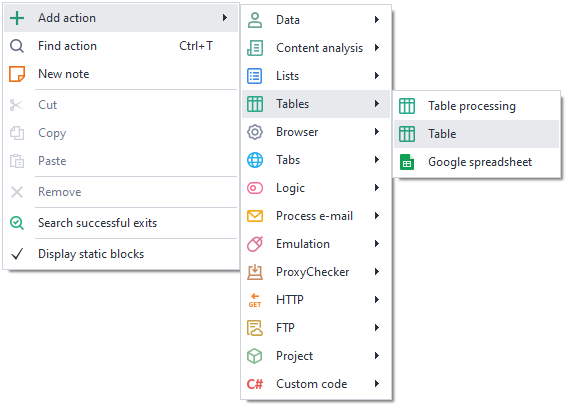

Or 

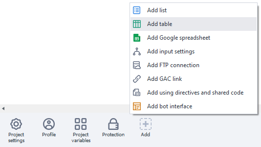

Or use [❗→ smart search](https://zennolab.atlassian.net/wiki/spaces/RU/pages/506200090/ProjectMaker+7#%D0%A3%D0%BC%D0%BD%D1%8B%D0%B9-%D0%BF%D0%BE%D0%B8%D1%81%D0%BA-%D0%B4%D0%B5%D0%B9%D1%81%D1%82%D0%B2%D0%B8%D0%B9 "https://zennolab.atlassian.net/wiki/spaces/RU/pages/506200090/ProjectMaker+7#%D0%A3%D0%BC%D0%BD%D1%8B%D0%B9-%D0%BF%D0%BE%D0%B8%D1%81%D0%BA-%D0%B4%D0%B5%D0%B9%D1%81%D1%82%D0%B2%D0%B8%D0%B9").

The created table will appear in the [❗→ static blocks panel](https://zennolab.atlassian.net/wiki/spaces/RU/pages/534053179 "https://zennolab.atlassian.net/wiki/spaces/RU/pages/534053179"):

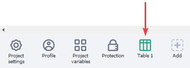

## Table Settings

### Main

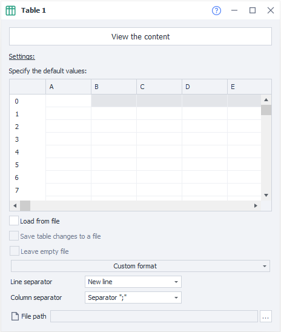

#### Load from file

Get data for the table from a file;

:::note Note
If you do NOT load the table from a file, each thread will have its own independent copy of the table.
:::

#### Save table changes to file

The results of your work with the table will be automatically saved to the linked file;

:::note Note
If you load data from a file but do not enable the Save table changes to file option, then each thread will get its own local copy of the table based on the specified file. Any changes to the table within threads will not affect the linked file. If the Save table changes to file option is enabled, then all threads will work with the same copy of the table and all changes will be saved to the linked file.
:::

#### Leave empty file

When all the data in the table runs out, should an empty file be left or deleted.

#### Custom format

You can use your own file format, or select one of the ready-made table formats.

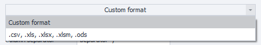

If a ready-made file format is selected, you can choose additional options for working with these formats:

##### First row as headers

Use the first row of the table as headers;

##### Proper display of non-Latin characters in Excel for .csv files

##### Parse data type (if possible)

Determine the data type in the content;

##### Delimiter for .csv format

Select the delimiter character “;“ or “,“

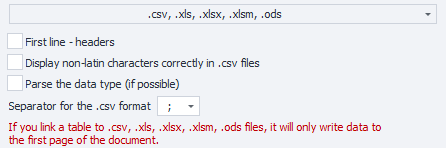

:::warning Attention
Please note that when linking a table to .csv, .xls, .xlsx, .xlsm, .ods files, only the first sheet of the document is used
:::

#### Row delimiter

Specifies what should be used as a row separator in the table. The separator can be “Enter,” any custom delimiter, or several delimiters.

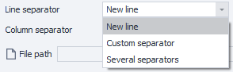

#### Column delimiter

Specifies what should be used as a column separator in the table. The separator can be a “;”, Tab character, any custom delimiter, or several delimiters.

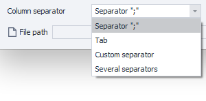

#### File path

If you have chosen to load the table from a file, you need to specify the path to the table file. The data from it will be loaded into the table when the project starts. 

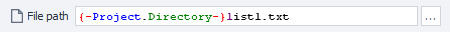

:::note Note
If the file path is not known in advance and will only be determined during project execution, you can use the table actions and its Attach to file function.
:::

#### 
View contents

Allows you to fully view the entire table contents. In this section, you can enable control character display, set a filter to search for the required row or cell, and also use the filter builder. 

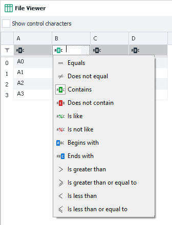

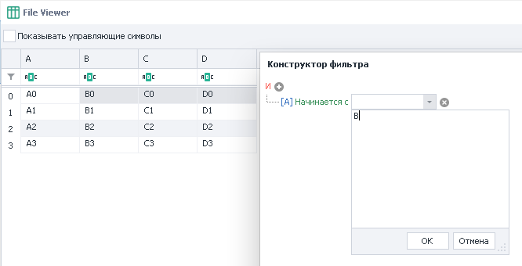

Detailed instructions on working with the table can be found in the article [❗→ Table Operations](https://zennolab.atlassian.net/wiki/spaces/RU/pages/534052972 "https://zennolab.atlassian.net/wiki/spaces/RU/pages/534052972").