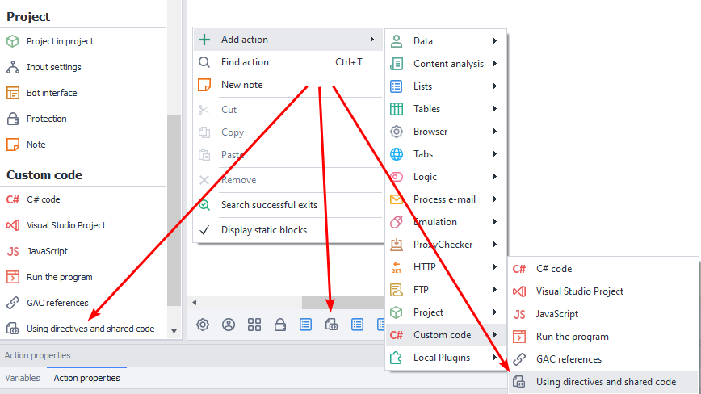
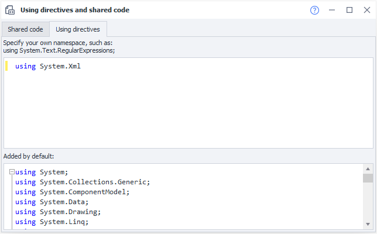
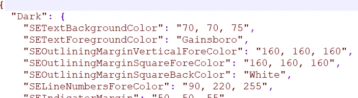

---
sidebar_position: 11
title: "Using Directives and Shared Code"
description: ""
date: "2025-08-04"
converted: true
originalFile: "Using-директивы и общий код.txt"
targetUrl: "https://zennolab.atlassian.net/wiki/spaces/RU/pages/534086229/Using-"
---
:::info **Please read the [*Material Usage Rules on this site*](../Disclaimer).**
:::

> 🔗 **[Original page](https://zennolab.atlassian.net/wiki/spaces/RU/pages/534086229/Using-)** — The source of this material

_______________________________________________  

## Description

:::note Note
Starting from ZennoPoster version 7.3.2.0, you can connect Visual Studio. For detailed instructions, see the Visual Studio Project article.
:::

Shared code is a ZennoPoster feature that extends the capabilities of standard [❗→ C# blocks](https://zennolab.atlassian.net/wiki/spaces/RU/pages/492011596 "https://zennolab.atlassian.net/wiki/spaces/RU/pages/492011596"). Shared code is used to insert additional classes and functions, which can then be used in C# actions. Using directives are for accessing functions and classes and for creating namespaces (**namespaces**).

:::info Information
Working with shared code assumes that you already have a basic knowledge of C#
:::

## How do I add an action to the project?

From the context menu, select **Add Action** → **Custom Code** → **Using Directives and Shared Code**




Or use the [❗→ Smart Search](https://zennolab.atlassian.net/wiki/spaces/RU/pages/506200090/ProjectMaker+7#%D0%A3%D0%BC%D0%BD%D1%8B%D0%B9-%D0%BF%D0%BE%D0%B8%D1%81%D0%BA-%D0%B4%D0%B5%D0%B9%D1%81%D1%82%D0%B2%D0%B8%D0%B9 "https://zennolab.atlassian.net/wiki/spaces/RU/pages/506200090/ProjectMaker+7#%D0%A3%D0%BC%D0%BD%D1%8B%D0%B9-%D0%BF%D0%BE%D0%B8%D1%81%D0%BA-%D0%B4%D0%B5%D0%B9%D1%81%D1%82%D0%B2%D0%B8%D0%B9").

Once you add the action, a new block called "**Using Directives and Shared Code**" will appear in the [❗→ static blocks panel](https://zennolab.atlassian.net/wiki/spaces/RU/pages/534053179 "https://zennolab.atlassian.net/wiki/spaces/RU/pages/534053179").

## Where can this be used?

- For more efficient and convenient work with C# code
- To create new namespaces
- To organize large amounts of code and avoid namespace conflicts

## How does the window work?

The "**Using Directives and Shared Code**" window consists of two tabs: **Shared Code** and **Using Directives**.

### Shared Code Window

This is a code editor with syntax highlighting, very similar to the [❗→ C# code editor](https://zennolab.atlassian.net/wiki/spaces/RU/pages/492011596 "https://zennolab.atlassian.net/wiki/spaces/RU/pages/492011596"). In the context menu, you also have access to basic code editing features: copy, paste, commenting, search, replace, and more.

In addition, you can load shared code from your own `.txt` or `.cs` (C# source file) file—there is a checkbox and a field for this at the bottom of the window.


At the top of the editor, all using directives used in the project are listed, and below is an example of declaring `namespace ZennoLab.OwnCode`. Similarly, you can create your own namespaces and use them later in [❗→ C# actions](https://zennolab.atlassian.net/wiki/spaces/RU/pages/492011596/C+.net "https://zennolab.atlassian.net/wiki/spaces/RU/pages/492011596/C+.net").

To be accessible, functions and methods in shared code must be declared with the `public` access modifier. Classes can be declared static (`public static`) if you don't need to work with class instances. If inheritance isn't required, it's best to declare the class as `public sealed` right away.

:::warning Attention
In shared code, you can't directly access `instance` or `project` entities like you can in C# blocks. Therefore, to work with, for example, an instance, you need to initialize these objects via `new` (`Instance instance = new Instance("127.0.0.1", 40500, "server");`) or pass them as function arguments. The same goes for project variables—you need to pass their values as function arguments.
:::

### Using Directives

This tab has two sections. At the top, you can add the namespaces you need for code execution in **C#** actions. For example, if you want to parse XML, you should add `using System.Xml;`.

At the bottom, all using directives used by the project by default are listed. These cannot be edited.




### Fine-tuning the appearance of the code editor

:::info Information
Added in ZennoPoster 7.2.1.0
:::

:::warning Attention
These settings affect both Using Directives and Shared Code and the code display in the C# code (C sharp .net code) action.
:::

You can customize the color scheme of the code editor to your liking. The configuration file `SyntaxEditorColors.json` can be found in the directory: `%AppData%\ZennoLab\ZennoPoster\7\ProjectMaker`. Colors for light and dark themes are set separately, in RGB format or by name.




  

## Usage Examples

In the example below, shared code is used to pass the `instance` object to the `HtmlClick` function, find an HTML element by its attributes, and click it. Upon success or failure, a string is returned for result checking.

```csharp
namespace ZennoLab.OwnCode
{
	public class CommonCode
	{
		public static string HtmlClick(Instance instance) {
			HtmlElement he = instance.ActiveTab.FindElementByAttribute("div", "class", "html", "regexp", 0);
			if (he.IsVoid) {
				return "fail";
			} else {
				he.Click();
				return "success";
			}
		}
    }
}
```

 To call this function, use a [❗→ C# block](https://zennolab.atlassian.net/wiki/spaces/RU/pages/492011596/C+.net "https://zennolab.atlassian.net/wiki/spaces/RU/pages/492011596/C+.net") with the following command:  
`return ZennoLab.OwnCode.CommonCode.HtmlClick(instance);`
If this HTML element is found on the page, it will be clicked; if not, you'll get the message "fail". This approach is helpful if you need to click the same element in multiple places throughout your project.

  

In the next example, the `SetImageOpacity` method receives an image and a transparency coefficient to apply. The result is a semi-transparent version of the image.

```csharp
public static Image SetImageOpacity(Image image, float opacity)  
{  
    try  {  
		Bitmap bmp = new Bitmap(image.Width, image.Height);
        // create graphics from image
        using (Graphics gfx = Graphics.FromImage(bmp)) {
            // create color matrix  
            ColorMatrix matrix = new ColorMatrix();      
            // set opacity 
            matrix.Matrix33 = opacity;  
            // create new attributes
            ImageAttributes attributes = new ImageAttributes();      
            // set color transparency for the image
            attributes.SetColorMatrix(matrix, ColorMatrixFlag.Default, ColorAdjustType.Bitmap);    
            // draw the image
            gfx.DrawImage(image, new Rectangle(0, 0, bmp.Width, bmp.Height), 0, 0, image.Width, image.Height, GraphicsUnit.Pixel, attributes);
        }
        return bmp;  
    }  
    catch (Exception ex) {  
        return null;  
    }  
} 
```

Here is how to call this function from a **C#** action:  
```csharp
Image img = OwnCode.CommonCode.SetImageOpacity(Image.FromFile(project.Directory + "//image.jpg"), .5f);
```

The loaded image file is then processed with the transparency effect and can be saved to disk.

  

## Useful Links

- [❗→ Visual Studio Project](https://zennolab.atlassian.net/wiki/spaces/RU/pages/1375109121 "https://zennolab.atlassian.net/wiki/spaces/RU/pages/1375109121")
- [❗→ References from GAC](https://zennolab.atlassian.net/wiki/spaces/RU/pages/534315491 "https://zennolab.atlassian.net/wiki/spaces/RU/pages/534315491")
- [The using Directive (C# Reference)](https://docs.microsoft.com/ru-ru/dotnet/csharp/language-reference/keywords/using-directive "https://docs.microsoft.com/ru-ru/dotnet/csharp/language-reference/keywords/using-directive")
- The [❗→ C# Code (C Sharp .net code) action](https://zennolab.atlassian.net/wiki/spaces/RU/pages/492011596 "https://zennolab.atlassian.net/wiki/spaces/RU/pages/492011596")