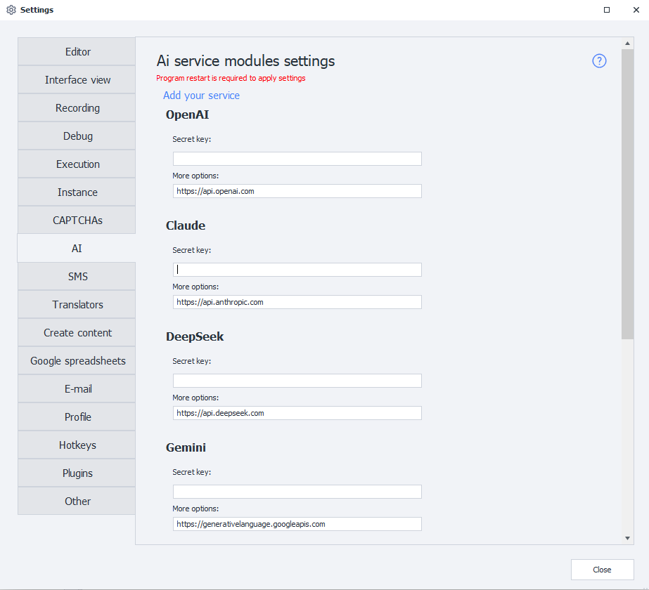
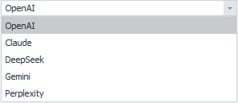

_______________________________________________
## Description

**AI services** are services that provide access to language models and other AI tools via API. They enable automatic text generation, comments, descriptions, data analysis, translation, code writing, image processing, and many other tasks.

## What is it used for?

Modern AI models can understand text prompts and generate responses that closely resemble human communication. Through API integration, ZennoPoster can send requests to AI services and use the responses in automation.

This can be used for:

- generating comments, posts, and descriptions;
- rewriting and translating text;
- content analysis;
- creating SEO texts;
- code generation;
- classifying and processing data;
- working with images and OCR;
- automating communication and user support.

After connecting an API key, you can select a model, configure generation parameters, and use AI directly inside your ZennoPoster project.

## How to open this window?

### ProjectMaker

- Via the top menu **Edit→Settings→AI**.


- Via [❗→ Start Page](https://zennolab.atlassian.net/wiki/spaces/RU/pages/735608964 "https://zennolab.atlassian.net/wiki/spaces/RU/pages/735608964")


### Settings window overview



## How to connect?

### Secret key

To work with an AI service you need an API key (Token) — a unique string of characters used to authorize requests and identify your account in the service.

Example API key:

```
sk-proj-8fKx2aBcD93kdPqLmN4...
```

To get an API key, go to the website of the selected AI service, register, and create a key in your account dashboard or developer section.

The API key is required for:

- sending requests to AI models;
- tracking used tokens;
- accessing available models;
- billing and API limits.

:::warning Important
- Keep your API key secret.
- Do not publish it publicly.
- If compromised, revoke the key immediately and create a new one.
:::

After adding the token, ZennoPoster will be able to make requests to the selected AI service on your behalf.

### Additional parameters

The URL address for receiving API requests. Set by default. If not set, please check with the developers of the selected service.

:::warning Warning
Do not change the value of this field unless necessary!
:::

### Available services

- [api.openai.com](https://openai.com) — ChatGPT
- [api.anthropic.com](https://anthropic.com) — Claude
- [api.deepseek.com](https://deepseek.com) — DeepSeek
- [generativelanguage.googleapis.com](https://ai.google.dev) — Gemini
- [api.perplexity.ai](https://perplexity.ai) — Perplexity Sonar

## Adding a new service

You can also add a custom AI service to the program, based on the API of popular services.

To do this, go to the **Settings** page and select **Add your own service**.


A window will appear for entering the data of the new service:


### Module name

Enter the name of the new service here.

### API

Select the API on which your module will be based.



### Token

The token key for the service.

Same as the **Secret key** field for built-in services (described above).

### Server

The URL address where requests will be sent.

### Working with the added service

After adding the service, you can select it in the [❗→ AI Agent action](/zennoposter/ProjectMaker/Project-editor/Actions-in-ProjectMaker-Actions-Blocks/AI/AI_Agent) and work with it just like a built-in LLM provider.


### Removing a module

To remove the created module from the program, delete these two files:

- `c:\Users\USERNAME\AppData\Roaming\ZennoLab\Configs\ModuleName.config.json`
- `c:\Users\USERNAME\AppData\Roaming\ZennoLab\CustomModules\Ai\ModuleName.dll`

`USERNAME` — replace with your operating system username.

:::warning Warning
It is recommended to close ZennoPoster and ProjectMaker before deleting these files.
:::

## Useful links

- [❗→ AI Agent action](/zennoposter/ProjectMaker/Project-editor/Actions-in-ProjectMaker-Actions-Blocks/AI/AI_Agent)
