---
sidebar_position: 2
title: "Appearance"
description: ""
date: "2025-08-25"
converted: true
originalFile: "Внешний вид.txt"
targetUrl: "https://zennolab.atlassian.net/wiki/spaces/RU/pages/735576065"
---
:::info **Please read the [*Terms of Use for Materials on this Resource*](../Disclaimer).**
:::

> 🔗 **[Original page](https://zennolab.atlassian.net/wiki/spaces/RU/pages/735576065)** — Source of this material

_______________________________________________  

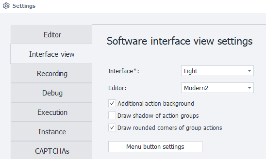

## Interface

Choose between a light or dark theme for the program interface.

### Light Interface:

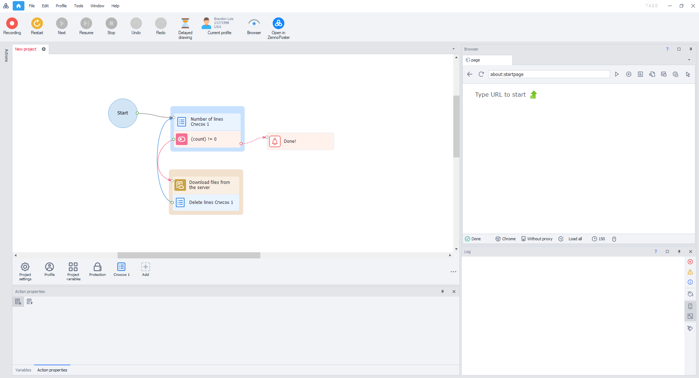

### Dark Interface:

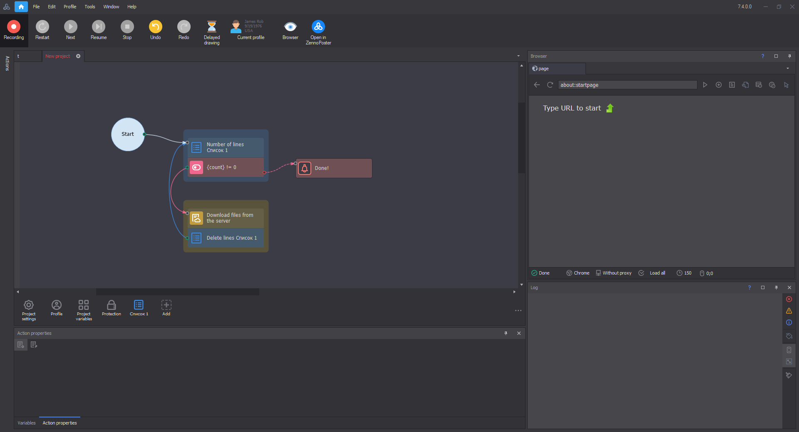

:::info Information
To change the interface theme, you need to restart the program.
:::

  

## Editor

Choose an editor theme. The appearance of actions will change depending on the selected theme.

### Modern1 Editor:

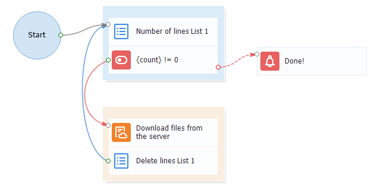

### Modern2 Editor:

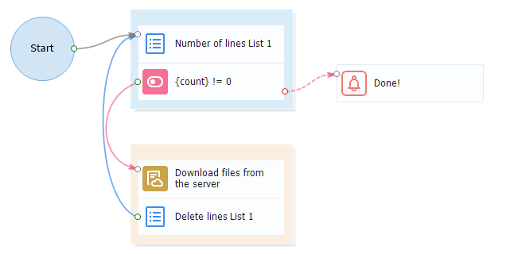

### Letter Editor:

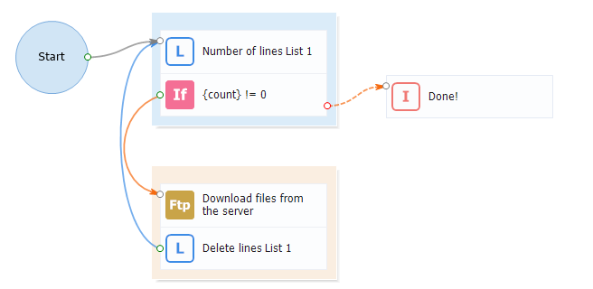

### Classic Editor:

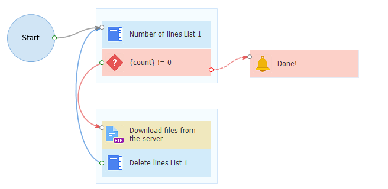

### Classic2 Editor:

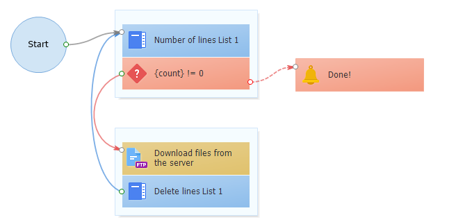

  

## Additional Action Background

With additional background

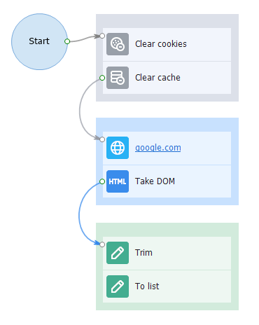

Without additional background

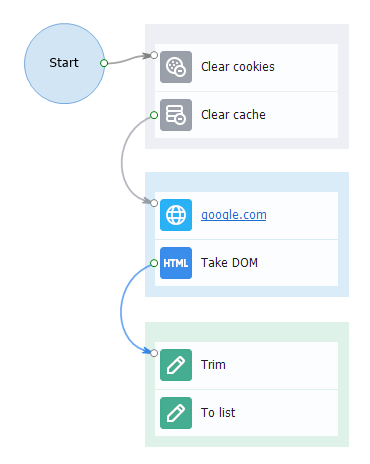

  

## Draw Shadow for Action Groups

:::warning Attention
Enabling this setting may slow down rendering speed!
:::

Setting enabled

<mark id="06ec7f47-93ca-4339-9960-a3d675f15fe0" data-renderer-mark="true" data-mark-type="annotation" data-mark-annotation-type="inlineComment" aria-details="06ec7f47-93ca-4339-9960-a3d675f15fe0" data-mark-annotation-state="active" data-has-focus="false" data-is-hovered="false">Setting disabled</mark>

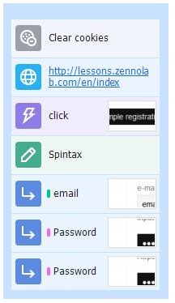

  

## Draw Rounded Corners for Actions and Groups

:::info Information
Added in 7.4.0.0
:::

When you enable this setting, corners of actions and action groups will have a rounded shape.

Setting enabled

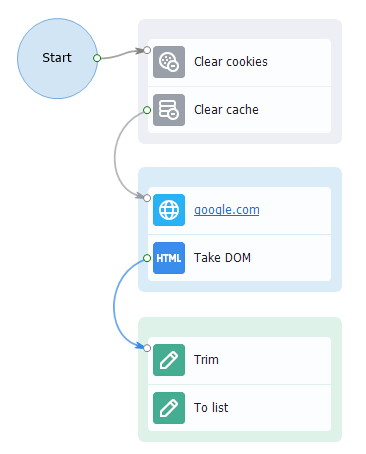

Setting disabled

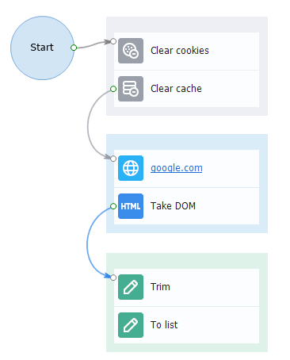

  

## Menu Button Settings

Contains an additional menu where you can choose which tool and section buttons are displayed in the program's main menu. Menu buttons give you quick access to essential features.

### Tool Button Settings

Select which tool buttons to display in the main menu.

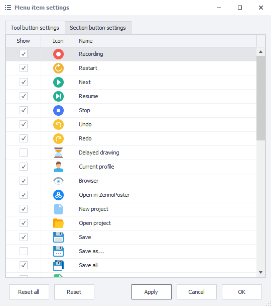

Once you select the desired tool buttons, they'll appear on the toolbar:

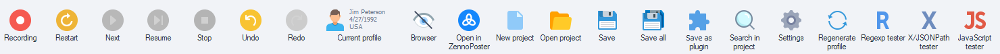

  

### Section Button Settings

Select which section buttons to show in the main menu.

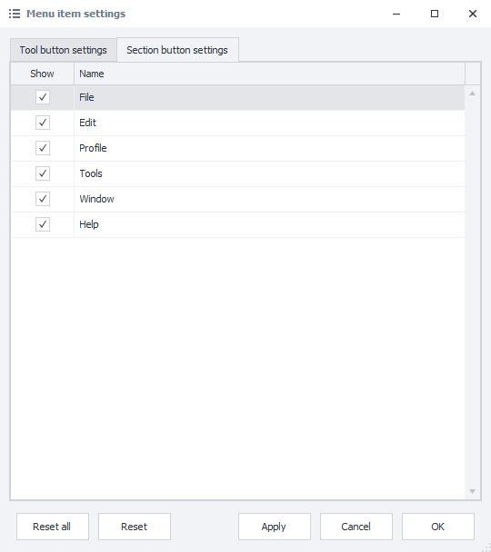

Once you select the necessary section buttons, they'll show up in the main menu:

### Button Arrangement

You can manually arrange the placement of buttons in the *Tool Button Settings and *Section Button Settings windows. To do this, simply left-click on the desired button and drag it to the position you want.

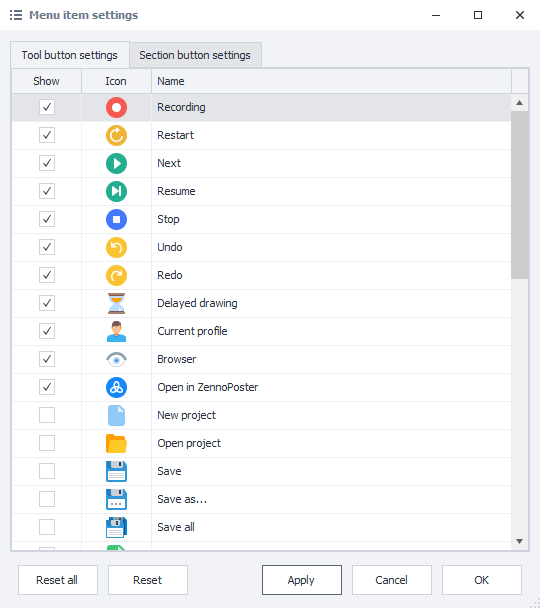

With the *Reset option, you can return the buttons in the currently active window to their default state.

*Reset All will return buttons in both windows to their default arrangements.