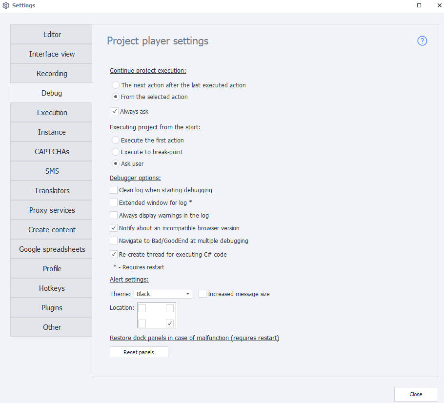

---
sidebar_position: 4
title: "Debugging"
description: ""
date: "2025-08-25"
converted: true
originalFile: "Отладка.txt"
targetUrl: "https://zennolab.atlassian.net/wiki/spaces/RU/pages/725352498"
---
:::info **Please read the [*Material Usage Rules on this site*](../Disclaimer).**
:::

> 🔗 **[Original page](https://zennolab.atlassian.net/wiki/spaces/RU/pages/725352498)** — Source of this material

_______________________________________________  

## Where project execution will continue from

This setting controls how the project will behave when you click the *Next* and *To End* buttons.

### Next action after the last executed one

The project will continue from the next action after the last one that was completed.

### From the selected action

The project will continue execution from the action you selected in the project scheme.

### Always ask

Ask the user for a choice.

  

## Running the project from the start

This setting controls how the project behaves when you click the [❗→ *From Start](https://zennolab.atlassian.net/wiki/spaces/RU/pages/494731265#%D0%A1-%D0%BD%D0%B0%D1%87%D0%B0%D0%BB%D0%B0 "https://zennolab.atlassian.net/wiki/spaces/RU/pages/494731265#%D0%A1-%D0%BD%D0%B0%D1%87%D0%B0%D0%BB%D0%B0")* button.

### Execute the first action

When you pick this option, after clicking the *From Start* button, the project's focus will switch to the very first action.

### Execute up to breakpoint

When starting the project from the beginning, actions will run up to the first [❗→ breakpoint](https://zennolab.atlassian.net/wiki/spaces/RU/pages/494731280#%D0%A2%D0%BE%D1%87%D0%BA%D0%B0-%D0%BE%D1%81%D1%82%D0%B0%D0%BD%D0%BE%D0%B2%D0%B0 "https://zennolab.atlassian.net/wiki/spaces/RU/pages/494731280#%D0%A2%D0%BE%D1%87%D0%BA%D0%B0-%D0%BE%D1%81%D1%82%D0%B0%D0%BD%D0%BE%D0%B2%D0%B0"), or until the end if there are no breakpoints in your project.

### Ask 

When starting the project from the beginning, you’ll be prompted to choose the execution order.

  

## Debugger options

### Delayed execution visualization

Enables real-time visualization of actions being performed. This setting is useful when debugging long projects and projects with loops.

:::warning Attention
This setting has been removed from the program starting from version 7.1.7.0
:::

### Clear the log at the start of debugging

Each time debugging is started (clicking the *From Start* button), the log will be cleared.

### Extended log window

The log will be displayed in a window with extra options and the ability to copy text. You can read more about the features of the Extended Log [❗→ in this article](https://zennolab.atlassian.net/wiki/spaces/RU/pages/725352532#%D0%A0%D0%B0%D1%81%D1%88%D0%B8%D1%80%D0%B5%D0%BD%D0%BD%D1%8B%D0%B9-%D0%B2%D0%B0%D1%80%D0%B8%D0%B0%D0%BD%D1%82-%D0%BB%D0%BE%D0%B3%D0%B0 "https://zennolab.atlassian.net/wiki/spaces/RU/pages/725352532#%D0%A0%D0%B0%D1%81%D1%88%D0%B8%D1%80%D0%B5%D0%BD%D0%BD%D1%8B%D0%B9-%D0%B2%D0%B0%D1%80%D0%B8%D0%B0%D0%BD%D1%82-%D0%BB%D0%BE%D0%B3%D0%B0").

### Always show warnings in the log

If you enable this setting, extra warnings will be shown in the ZennoPoster and ProjectMaker logs.

For example: 

- [❗→ if action](https://zennolab.atlassian.net/wiki/spaces/RU/pages/534315151/...+...+IF "https://zennolab.atlassian.net/wiki/spaces/RU/pages/534315151/...+...+IF") followed the red branch, and even if its red output is connected to another [❗→ action](https://zennolab.atlassian.net/wiki/spaces/RU/pages/486342706/ProjectMaker "https://zennolab.atlassian.net/wiki/spaces/RU/pages/486342706/ProjectMaker"), the log will have a message: “*Executing logical operator If Result: false” (ProjectMaker only)
- In cases where actions like [❗→ Set](https://zennolab.atlassian.net/wiki/spaces/RU/pages/534315117 "https://zennolab.atlassian.net/wiki/spaces/RU/pages/534315117"), [❗→ Get Value](https://zennolab.atlassian.net/wiki/spaces/RU/pages/534315124 "https://zennolab.atlassian.net/wiki/spaces/RU/pages/534315124"), [❗→ Trigger Event](https://zennolab.atlassian.net/wiki/spaces/RU/pages/534020211 "https://zennolab.atlassian.net/wiki/spaces/RU/pages/534020211") and others can't find an element to interact with, the log will show: “*Executing action HtmlElement No HTML element found matching criteria” (ZennoPoster and ProjectMaker)

:::note Note
A restart is required.
:::

### Show warning about unsupported browser version

This warning might appear, for example, when you use a [❗→ Project in Project](https://zennolab.atlassian.net/wiki/spaces/RU/pages/489291822 "https://zennolab.atlassian.net/wiki/spaces/RU/pages/489291822") and the embedded project uses a different [❗→ browser type](https://zennolab.atlassian.net/wiki/spaces/RU/pages/534315477#%D0%A2%D0%B8%D0%BF-%D0%B1%D1%80%D0%B0%D1%83%D0%B7%D0%B5%D1%80%D0%B0 "https://zennolab.atlassian.net/wiki/spaces/RU/pages/534315477#%D0%A2%D0%B8%D0%BF-%D0%B1%D1%80%D0%B0%D1%83%D0%B7%D0%B5%D1%80%D0%B0") from the main template.

For example: the embedded project uses the Firefox45 engine, while the main project uses Firefox52. When executing (and if this option is enabled), the following message will appear in the log: "*Executing ProjectInProject action. The current browser Firefox52 is not suitable for the embedded project, Firefox45 is required. The embedded project may not work correctly."

### Switch to Bad/GoodEnd on multiple debug runs

:::info Information
Added in 7.3.0.0
:::

If ** this option is enabled, whenever an action ends with an error (and is not connected to another action via the red branch), execution will be routed to [❗→ BadEnd](https://zennolab.atlassian.net/wiki/spaces/RU/pages/534020265/Bad+End "https://zennolab.atlassian.net/wiki/spaces/RU/pages/534020265/Bad+End"). Or execution will go to [❗→ GoodEnd](https://zennolab.atlassian.net/wiki/spaces/RU/pages/534085881/Good+End "https://zennolab.atlassian.net/wiki/spaces/RU/pages/534085881/Good+End") if the action was successful, isn't connected via the green branch, and there are no more actions in the current group.

If this option is disabled, execution will only be able to enter Bad/GoodEnd once per run. The next time this happens will only be after you restart the project with the *From Start* button.

### Recreate C# code execution thread

:::info Information
Added in 7.3.1.0
:::

This setting may help avoid memory leaks in ProjectMaker on AMD processors when executing C# code (the bug is in .NET Framework). It does not use ThreadStatic.

:::caution Important
If you use C# and ThreadStatic in your templates, you need to disable this setting.
:::

  

## Notification settings

This setting is relevant for [❗→ notifications](https://zennolab.atlassian.net/wiki/spaces/RU/pages/534053050/ "https://zennolab.atlassian.net/wiki/spaces/RU/pages/534053050/") that pop up on the desktop.

**Theme** - choose the color scheme for notifications.

**Large message size** - notifications will be shown in a larger format.

**Location** - choose the area where notifications will show in the program window.

  

## Resetting dock panel positions if something goes wrong

**Reset panels** - restores the display of program windows.

:::note Note
You can also reset window settings by switching the interface via the Window→Interface Mode setting.
:::