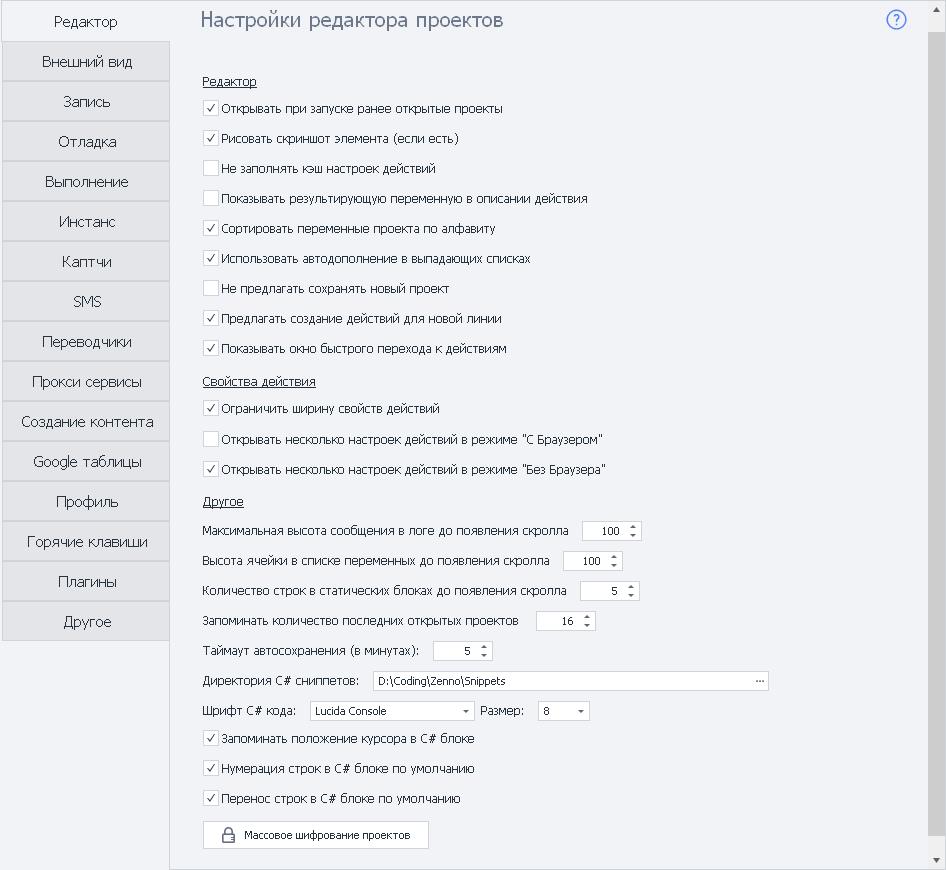
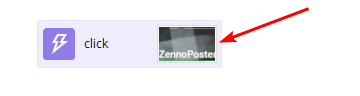
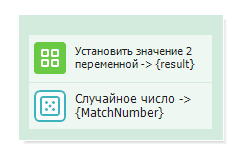
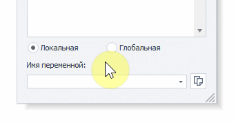
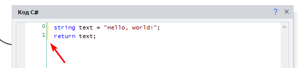
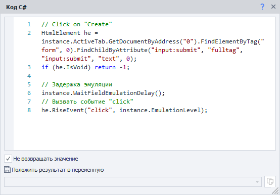
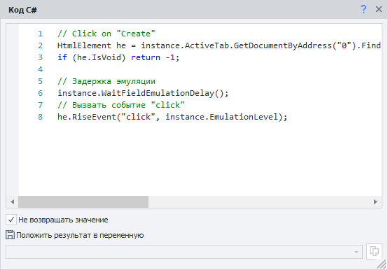

---
sidebar_position: 1
title: "Editor"
description: ""
date: "2025-08-25"
converted: true
originalFile: "Редактор.txt"
targetUrl: "https://zennolab.atlassian.net/wiki/spaces/RU/pages/725385223"
---
:::info **Please read the [*Terms of Use for Materials on This Resource*](../Disclaimer).**
:::

> 🔗 **[Original page](https://zennolab.atlassian.net/wiki/spaces/RU/pages/725385223)** — Source of this material

_______________________________________________  
# Editor

## Project Editor Settings

### Open previously opened projects on startup

All projects that were open before you last closed the program will be reopened.

### Draw an element screenshot (if available)

The action block will display a screenshot of the corresponding element. This increases the template size, but helps you navigate it more easily.

### Do not fill action settings cache

Disables caching action settings to speed up program startup.

### Show resulting variable in action description

In the comments of some action blocks—where a result is returned into a variable—`action name → {variable}` will be shown.

### Sort project variables alphabetically

Variables will be listed in alphabetical order.

### Use autocomplete in dropdown lists

When entering the name of a variable or a list/table in a dropdown, autocomplete will trigger. This saves you from typing the full name and lets you fill in the field quickly.

:::info Information
A restart is required
:::

### Do not prompt to save new project

Removes the save dialog for new projects after clicking the [❗→ "From the beginning" button](https://zennolab.atlassian.net/wiki/spaces/RU/pages/494731265#%D0%A1-%D0%BD%D0%B0%D1%87%D0%B0%D0%BB%D0%B0 "https://zennolab.atlassian.net/wiki/spaces/RU/pages/494731265#%D0%A1-%D0%BD%D0%B0%D1%87%D0%B0%D0%BB%D0%B0").

### Offer to create actions for a new line

Automatically shows a list of actions to add when you create a new line from a block.

### Show quick actions window

When you hover over line connection points, a quick actions window appears.

## Action Properties

### Limit action property width

Control the layout of the "Action Properties" window—choose between a fixed or flexible grid so the contents can adapt to the window width.

### Open multiple action settings at once in "..." mode

Lets you open several action settings at once next to the block. By default, this is only enabled in "No browser" mode.

## Other

### Max log message height before scroll

Height of a log entry before scrolling appears.

### Variable list cell height before scroll

Cell height in the Variables window before a scrollbar appears.

### Number of rows in static blocks before scroll

How many rows are shown in the static blocks section before scrolling appears.

### Remember number of recently opened projects

Lets you set how many recent projects show up on the [❗→ start page](https://zennolab.atlassian.net/wiki/spaces/RU/pages/735608964 "https://zennolab.atlassian.net/wiki/spaces/RU/pages/735608964").

### Autosave timeout

Time after which the project is auto-saved (set in minutes).

### C# Snippet Directory

Directory from which you can automatically load [❗→ C# snippets](https://zennolab.atlassian.net/wiki/spaces/RU/pages/492011596/ "https://zennolab.atlassian.net/wiki/spaces/RU/pages/492011596/") into the program.

The default directory is `c:\Users\USERNAME\AppData\Roaming\ZennoLab\ZennoPoster\7\Snippets\` (replace `USERNAME` with the name of your Windows user account)

### C# code font

The font used in the [❗→ C# block](https://zennolab.atlassian.net/wiki/spaces/RU/pages/492011596/ "https://zennolab.atlassian.net/wiki/spaces/RU/pages/492011596/"). By default, Lucida Console, size 8 is used.

### Remember cursor position in C# block

The code will open at the line where you last finished editing. If this option is off, the last edited position is remembered instead.

### Line numbering in C# block by default

Enables automatic line numbering in the [❗→ C# block](https://zennolab.atlassian.net/wiki/spaces/RU/pages/492011596/ "https://zennolab.atlassian.net/wiki/spaces/RU/pages/492011596/") by default.

### Line wrapping in C# block by default

Enables automatic word wrap in the action properties window for [❗→ C# code](https://zennolab.atlassian.net/wiki/spaces/RU/pages/492011596/ "https://zennolab.atlassian.net/wiki/spaces/RU/pages/492011596/") if a line doesn’t fit the current window.

Below you can see an example of the same window with word wrap enabled and disabled.

Option enabled

Option disabled

### Bulk encryption of projects

This option lets you [❗→ encrypt](http://zennolab.atlassian.net/wiki/spaces/RU/pages/534315498 "http://zennolab.atlassian.net/wiki/spaces/RU/pages/534315498") all open projects.