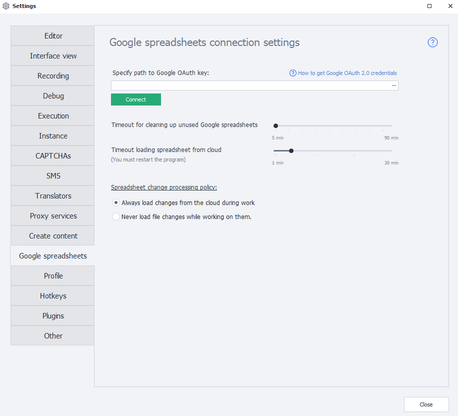

---
sidebar_position: 12
title: "Google Sheets (PM)"
description: ""
date: "2025-08-25"
converted: true
originalFile: "Google таблицы (PM).txt"
targetUrl: "https://zennolab.atlassian.net/wiki/spaces/RU/pages/735576090/Google+PM"
---
:::info **Please read the [*Material Usage Rules on this site*](../Disclaimer).**
:::

> 🔗 **[Original page](https://zennolab.atlassian.net/wiki/spaces/RU/pages/735576090/Google+PM)** — Source of this material

_______________________________________________  

:::warning Attention
This article describes the Google Sheets settings in the program. Instructions on how to connect can be found here - Setting up Google Sheets Connection
:::

### Specify the path to the Google OAuth key

Here you need to select the path to the file with your Google API connection settings.

:::note Note
You can read how to get an OAuth key and set up the connection in the article Setting up Google Sheets Connection
:::

:::warning Attention
The file must have the .json extension
:::

### Timeout for clearing unused Google Sheets

If no project in ZennoPoster uses a Google Sheet within the number of minutes specified in this setting, that sheet will be unloaded from memory to save your computer’s resources.

:::note Note
A long timeout can be useful if there is a break between runs of a particular project working with a Google Sheet (for example, on a schedule, every hour). Then you won’t have to download the sheet from the cloud each time.  
A short timeout may be useful, for example, if every run of a project generates a report in a new sheet and there’s no need to keep sheets in memory after unloading their data.
:::

### Timeout for loading a sheet from the cloud

Time allotted to load a sheet from the cloud.

:::note Note
If the sheet is very large, synchronization may take a long time, and without changing this setting, a loading error will occur as the request takes too long.
:::

### Sheet change handling policy

In this setting, you can choose whether ZennoPoster should load any external changes to the sheet while working with it.

:::note Note
If the sheet is large, loading it can take a lot of time. If you select Never load external changes while working, the program will only send data, not try to match local data with the cloud, in other words, it won’t spend time and resources syncing.  
Turning off synchronization can be useful, for example, when parsing data when you don’t need up-to-date information in the sheet.
:::

## Useful links:

- [❗→ Setting up Google Sheets Connection](https://zennolab.atlassian.net/wiki/spaces/RU/pages/1667727363 "https://zennolab.atlassian.net/wiki/spaces/RU/pages/1667727363")
- [❗→ Operations with Google Sheets](https://zennolab.atlassian.net/wiki/spaces/RU/pages/509411347 "https://zennolab.atlassian.net/wiki/spaces/RU/pages/509411347")
- [❗→ Google Sheet](https://zennolab.atlassian.net/wiki/spaces/RU/pages/724566092 "https://zennolab.atlassian.net/wiki/spaces/RU/pages/724566092")
- [❗→ Multithreaded Work with Google Sheets (Version 7.1.7.0 and above)](https://zennolab.atlassian.net/wiki/spaces/RU/pages/851673094 "https://zennolab.atlassian.net/wiki/spaces/RU/pages/851673094")