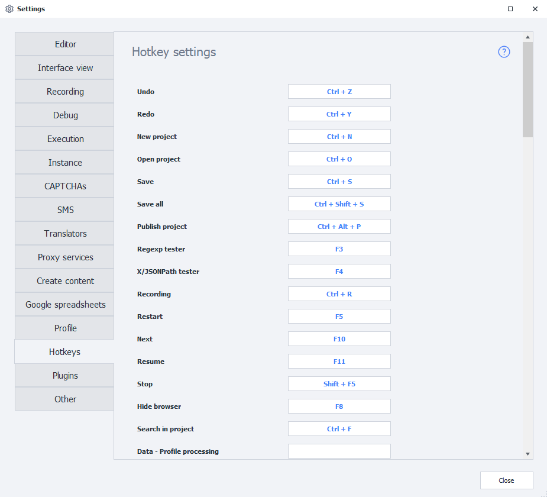

---
sidebar_position: 15
title: "Hotkeys"
description: ""
date: "2025-08-25"
converted: true
originalFile: "Горячие клавиши.txt"
targetUrl: "https://zennolab.atlassian.net/wiki/spaces/RU/pages/475332762"
---
:::info **Please read the [*Material Usage Rules on this site*](../Disclaimer).**
:::

> 🔗 **[Original page](https://zennolab.atlassian.net/wiki/spaces/RU/pages/475332762)** — Source of this material

_______________________________________________  

You can set up hotkey combinations in the program settings for convenience.

## Keyboard Shortcuts

**Enter** or **Space** - open the action settings  
**Esc** - close the action settings  
**Clrl + C** - copy the selected action  
**Ctrl + X** - cut the selected action  
**Ctrl + V** - paste the action from the clipboard to the cursor location  
**Delete** - delete the selected action  
**Up** - move the cursor up within the group or to the previous action  
**Down** - move the cursor down within the group or to the next action from a successful exit  
**Left** - move the cursor to the first incoming action or up within the group  
**Right** - move the cursor to the next action from a successful exit or down within the group  
**Ctrl + Right** - move the cursor to the next action from an unsuccessful exit  
**PageUp** - go to the first action in the group  
**PageDown** - go to the last action in the group  
**Ctrl + Z** - undo  
**Ctrl + Y** - redo  
**Ctrl + N** - new project  
**Ctrl + O** - open project  
**Ctrl + S** - save the current project  
**Ctrl + Shift + S** - save all open projects  
**Ctrl + Alt + P** - publish project  
**F3** - open the regular expression builder  
**F4** - open the X/JSON Path tester  
**F8** - hide the browser  
**Ctrl + F** - search the project  
**Delete** - deletes the selected action  

## Mouse Operations

**Double-click on an action** - open settings  
**Hold down the middle mouse button** - pan the project canvas  
**Ctrl + mouse wheel** - zoom in/out on the canvas  
**Double-click on an empty space** - reset zoom to 100%  
**Double-click on an exit (successful/unsuccessful) then double-click on an entry** - create a link  

## Hotkeys During Project Debugging

**Ctrl + R** - enable/disable recording  
**F5** - run the project from the beginning  
**F10** - go to the next action  
**F11** - run to breakpoint  
**Shift + F5** - stop debugging  

## Hotkeys When Editing a C# Macro

**Ctrl + C** - copy selected  
**Ctrl + X** - cut selected  
**Ctrl + V** - paste selected  
**Ctrl + G** - go to line n  
**Shift + Delete** - cut current line  
**Ctrl + K** - comment selected lines  
**Ctrl + U** - uncomment selected lines