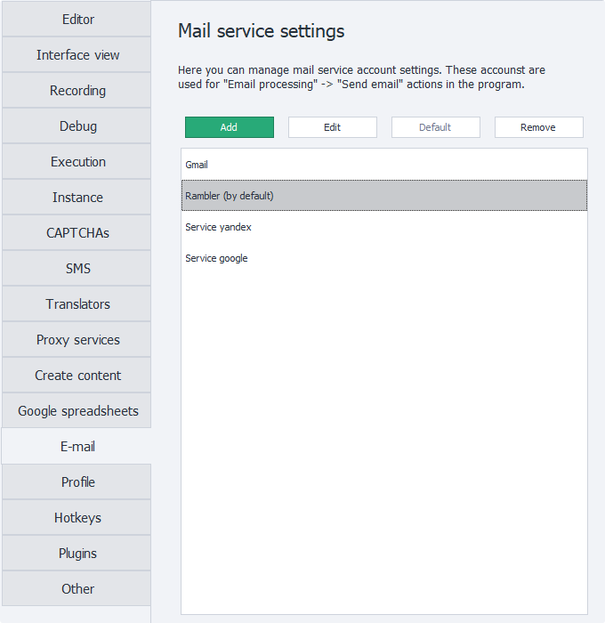
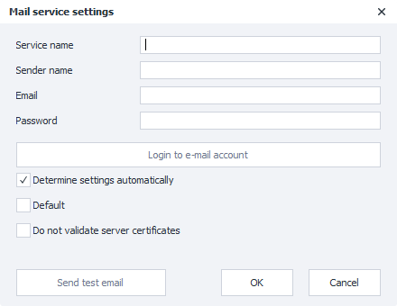
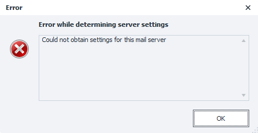

---
sidebar_position: 13
title: "Mail (PM)"
description: ""
date: "2025-08-25"
converted: true
originalFile: "Почта (PM).txt"
targetUrl: "https://zennolab.atlassian.net/wiki/spaces/RU/pages/2096660481/PM"
---
:::info **Please read the [*Material Usage Rules on this site*](../Disclaimer).**
:::

> 🔗 **[Original page](https://zennolab.atlassian.net/wiki/spaces/RU/pages/2096660481/PM)** — Source of this material

_______________________________________________  



## Description

In this section, you can set up connections to email accounts, which can later be used to send notifications to yourself using the [❗→ Send email](https://zennolab.atlassian.net/wiki/spaces/RU/pages/1399914500 "https://zennolab.atlassian.net/wiki/spaces/RU/pages/1399914500") action.

  

## Add

Clicking this button will open a window for adding a new connection.




### Service name

This name will be displayed in the list of available services and in the [❗→ Send email](https://zennolab.atlassian.net/wiki/spaces/RU/pages/1399914500 "https://zennolab.atlassian.net/wiki/spaces/RU/pages/1399914500") action.

:::warning Attention
The service name is a required field and must be unique within the program.
:::

### Sender name

The text that will be shown in the "Sender name" field to the recipient.

### Email

The full email address from which the emails will be sent.

### Password

Password for the email address.

Some email providers set a separate password for connecting to your mailbox via third-party applications (an app password).
Instructions for some programs can be found in the article [❗→ at this link](https://zennolab.atlassian.net/wiki/spaces/RU/pages/2084569120 "https://zennolab.atlassian.net/wiki/spaces/RU/pages/2084569120"). 

### Log in to mail

When you click this button, it checks whether the connection data for the SMTP server is correct.
It does not check if the email-password pair is valid.

If the information is entered correctly, a message will appear at the bottom of the window: “**Connection successful! Account ready to use**“:


If the program was unable to connect to the server, a pop-up window with an error will appear:




In this case, you’ll need to configure the connection manually. To do this, uncheck the “Detect settings automatically” option (this setting is described below).

### Detect settings automatically


If this setting is enabled, the program will try to automatically select the SMTP server connection settings based on the email address you entered.

If there is a connection error, you can enter the connection details manually by unchecking this option. You can find the connection settings on your email provider’s website.

### Default

When this option is enabled, the current connection will be used as the default. This means for all “[❗→ Send email](https://zennolab.atlassian.net/wiki/spaces/RU/pages/1399914500 "https://zennolab.atlassian.net/wiki/spaces/RU/pages/1399914500")“ actions where another service isn’t specified, this email service will be used to send messages.

### Don’t check server certificates

:::info Information
Added in ZennoPoster 7.7.0.0
:::

Sometimes, when trying to connect an account, you may get an error: “**An error occured while attempting to establish an SSL or TLS connection**“. 

This error most often occurs when there is a connection between your computer and the mail server, but a secure connection cannot be established. This can happen because, for some reason, the system can’t verify the authenticity of the server’s SSL/TLS certificates and therefore refuses to establish the connection.

There can be various reasons for this, for example: 

- Windows hasn’t been updated in a long time, so the trusted certificate stores are outdated,
- the antivirus checks all incoming traffic and, in order to decrypt it, substitutes its own certificates for the server’s,
- firewall or similar software.

The solution is pretty clear from the warning: you can update Windows, disable your antivirus (and pay particular attention to settings related to checking incoming traffic or email), or disable your firewall.

If nothing helps, you can enable this setting. In that case, any certificates that the mail server sends when establishing a connection will not be checked, and a secure connection will be established successfully.

:::warning Attention
Keep in mind that if you disable certificate checking, the traffic between you and your email provider can be intercepted!
:::

### Send test email

To check if the entered data works, click the “Send test email” button.
Zennoposter will then try to send an email to your address using the specified SMTP server and the credentials you provided.

If all credentials are correct, you’ll see the status: “**Test email sent successfully**“. After that, the email service is ready for use in the [❗→ block](https://zennolab.atlassian.net/wiki/spaces/RU/pages/1399914500 "https://zennolab.atlassian.net/wiki/spaces/RU/pages/1399914500").
If the credentials are incorrect, for example, if the password for the mailbox is wrong, you’ll see the status “**Failed to send test email**“, and a modal window will show a more detailed error description.

#### Note

Keep in mind that some email providers require you to explicitly enable access for third-party programs. Connection settings for some providers can be found on [❗→ this page](https://zennolab.atlassian.net/wiki/spaces/RU/pages/2084569120 "https://zennolab.atlassian.net/wiki/spaces/RU/pages/2084569120").
You can also search for the settings yourself by entering something like
```xml
smtp настройки подключения &lt;ВАШ_ПРОВАЙДЕР&gt;
```
—for example: `smtp настройки подключения aol`

* * *

## Edit

You can use this button to edit existing email accounts.

* * *

## Default

This setting allows you to change the default account.

* * *

## Delete

Removes the selected account from the program settings.

* * *

## Useful links

- [❗→ Send email](https://zennolab.atlassian.net/wiki/spaces/RU/pages/1399914500 "https://zennolab.atlassian.net/wiki/spaces/RU/pages/1399914500")
- [❗→ Email service connection settings](https://zennolab.atlassian.net/wiki/spaces/RU/pages/2084569120 "https://zennolab.atlassian.net/wiki/spaces/RU/pages/2084569120")
- [❗→ Receive email](https://zennolab.atlassian.net/wiki/spaces/RU/pages/735576144 "https://zennolab.atlassian.net/wiki/spaces/RU/pages/735576144")