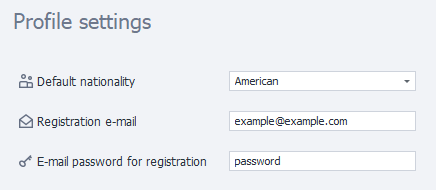
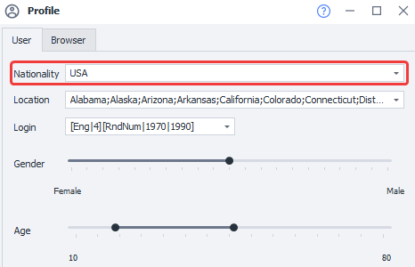
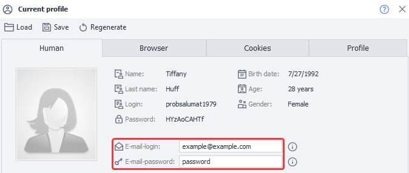

---
sidebar_position: 14
title: "Profile (PM)"
description: ""
date: "2025-08-25"
converted: true
originalFile: "Профиль (PM).txt"
targetUrl: "https://zennolab.atlassian.net/wiki/spaces/RU/pages/735608848/PM"
---
:::info **Please read the [*Terms of Use for materials on this resource*](../Disclaimer).**
:::

> 🔗 **[Original page](https://zennolab.atlassian.net/wiki/spaces/RU/pages/735608848/PM)** — Source of this material

_______________________________________________  

Allows you to set up the profile settings that will be generated by default when starting a project.

## Profile Fill Settings

### **Default Nationality**

The nationality to use when generating the profile. You can also change this at the template level, in the [❗→ project profile settings](https://zennolab.atlassian.net/wiki/spaces/RU/pages/483426308 "https://zennolab.atlassian.net/wiki/spaces/RU/pages/483426308").

### **E-mail for registrations**

The email you specify here will be used for all new profiles.

You can also change it by reassigning profile fields in [❗→ profile operations](https://zennolab.atlassian.net/wiki/spaces/RU/pages/486539291 "https://zennolab.atlassian.net/wiki/spaces/RU/pages/486539291"). The value is stored in the environment [❗→ variable](https://zennolab.atlassian.net/wiki/spaces/RU/pages/735608872 "https://zennolab.atlassian.net/wiki/spaces/RU/pages/735608872") `{ -Profile.Email- }`.

### **E-mail password for registrations**

The password you specify here will be used for all new profiles.

You can also change it by reassigning profile fields in [❗→ profile operations](https://zennolab.atlassian.net/wiki/spaces/RU/pages/486539291 "https://zennolab.atlassian.net/wiki/spaces/RU/pages/486539291"). The value is stored in the environment [❗→ variable](https://zennolab.atlassian.net/wiki/spaces/RU/pages/735608872 "https://zennolab.atlassian.net/wiki/spaces/RU/pages/735608872") `{ -Profile.EmailPassword- }`.

