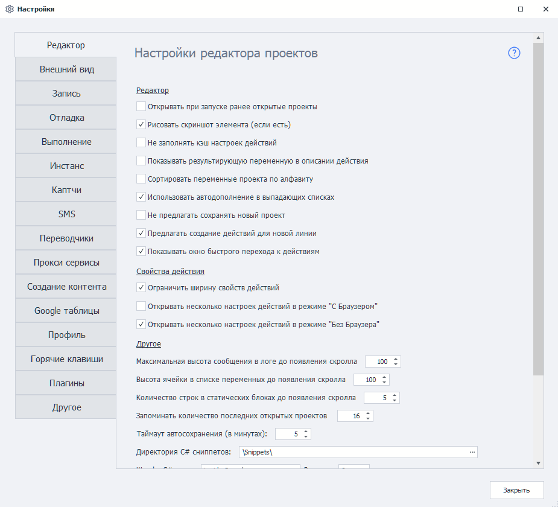

---
sidebar_position: 0
title: "ProjectMaker Settings"
description: ""
date: "2025-08-25"
converted: true
originalFile: "Настройки ProjectMaker.txt"
targetUrl: "https://zennolab.atlassian.net/wiki/spaces/RU/pages/475300064/ProjectMaker"
---
:::info **Please familiarize yourself with the [*Rules for using materials on this resource*](../Disclaimer).**
:::

> 🔗 **[Original page](https://zennolab.atlassian.net/wiki/spaces/RU/pages/475300064/ProjectMaker)** — Source of this material

_______________________________________________  

ProjectMaker settings let you optimize your project recording process, configure logs, debug project execution, and much more.

- [❗→ Editor](/wiki/spaces/RU/pages/725385223)
 - [❗→ Appearance](/wiki/spaces/RU/pages/735576065)
 - [❗→ Recording](/wiki/spaces/RU/pages/727777290)
 - [❗→ Debug](/wiki/spaces/RU/pages/725352498)
 - [❗→ Execution (PM)](/wiki/spaces/RU/pages/727777297/PM)
 - [❗→ Instance (PM)](/wiki/spaces/RU/pages/735608841/PM)
 - [❗→ Captchas (PM)](/wiki/spaces/RU/pages/735772673/PM)
 - [❗→ SMS services (PM)](/wiki/spaces/RU/pages/735576080/SMS-+PM)
 - [❗→ Translators (PM)](/wiki/spaces/RU/pages/725352505/PM)
 - [❗→ Proxy services (PM)](/wiki/spaces/RU/pages/725319756/-+PM)
 - [❗→ Content creation (PM)](/wiki/spaces/RU/pages/724566056/PM)
 - [❗→ Google Sheets (PM)](/wiki/spaces/RU/pages/735576090/Google+PM)
 - [❗→ Email (PM)](/wiki/spaces/RU/pages/2096660481/PM)
 - [❗→ Profile (PM)](/wiki/spaces/RU/pages/735608848/PM)
 - [❗→ Hotkeys](/wiki/spaces/RU/pages/475332762)
 - [❗→ Settings. Plugins](/wiki/spaces/RU/pages/735379481)
 - [❗→ Other settings (PM)](/wiki/spaces/RU/pages/735608855/PM)

The settings for **Execution**, **Instance**, **Captchas**, **Spintax**, and **Other** are identical to the [❗→ ZennoPoster settings](https://zennolab.atlassian.net/wiki/spaces/RU/pages/494764084/ZennoPoster "https://zennolab.atlassian.net/wiki/spaces/RU/pages/494764084/ZennoPoster").