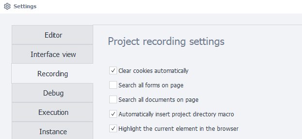
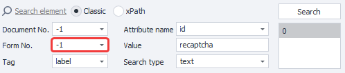
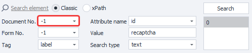
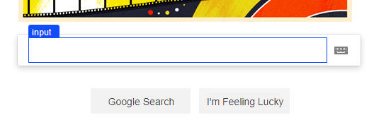

---
sidebar_position: 3
title: "Recording"
description: ""
date: "2025-08-25"
converted: true
originalFile: "Запись.txt"
targetUrl: "https://zennolab.atlassian.net/wiki/spaces/RU/pages/727777290"
---
import DisclaimerNotice from '@site/src/components/DisclaimerNotice';

<DisclaimerNotice />

> 🔗 **[Original page](https://zennolab.atlassian.net/wiki/spaces/RU/pages/727777290)** — Source of this material

_______________________________________________  



## Project Recording Settings

### Automatically clear cookies

At the start of the project, cookies will be cleared automatically. This setting is equivalent to the [❗→ Clear Cookie](https://zennolab.atlassian.net/wiki/spaces/RU/pages/489324572 "https://zennolab.atlassian.net/wiki/spaces/RU/pages/489324572") action.

### Search in all forms on the page

Enables searching for elements in all forms on the page. Relevant for the [❗→ Action Builder](https://zennolab.atlassian.net/wiki/spaces/RU/pages/483426337 "https://zennolab.atlassian.net/wiki/spaces/RU/pages/483426337").




### Search in all documents on the page

Enables searching for elements in all documents on the page. Relevant for the [❗→ Action Builder](https://zennolab.atlassian.net/wiki/spaces/RU/pages/483426337 "https://zennolab.atlassian.net/wiki/spaces/RU/pages/483426337").




### Automatically insert project directory macro

When specifying a file path, the project directory macro `{ -Project.Directory- }` will be inserted automatically. For example, in the properties of a list or table, when selecting a file from your hard drive—if the file is located in the template folder or below it, in one of its subfolders.

### Highlight current element in the browser

:::info Information
You need to restart the program for this setting to take effect.
:::

This setting highlights HTML elements with a blue border in the browser window.




It modifies the website’s DOM tree by adding the following to the end:

```
<div id="zp_fr_hl_top_hl" style="visiblity:hidden"></div><div id="zp_fr_hl_left_hl" style="visiblity:hidden"></div><div id="zp_fr_hl_right_hl" style="visiblity:hidden"></div><div id="zp_fr_hl_bottom_hl" style="visiblity:hidden"></div><font id="zp_fr_hl_label" style="visiblity:hidden"></font>
```

:::note Note
If you believe this kind of modification could de-anonymize you, you can turn it off by unchecking the option.
:::