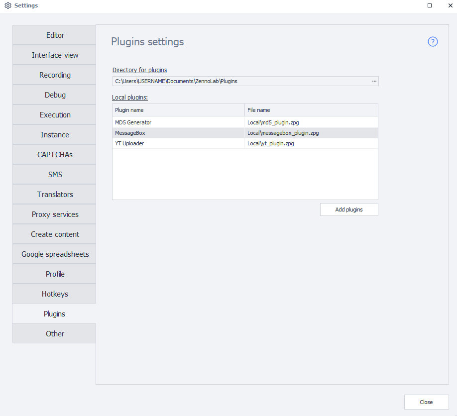
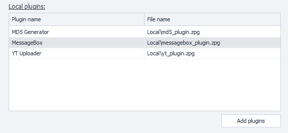
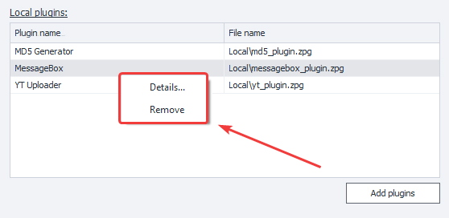
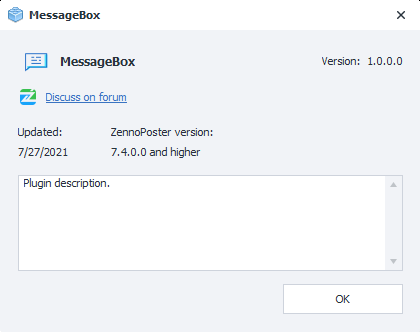

---
sidebar_position: 16
title: "Settings. Plugins"
description: ""
date: "2025-08-25"
converted: true
originalFile: "Настройки. Плагины.txt"
targetUrl: "https://zennolab.atlassian.net/wiki/spaces/RU/pages/735379481"
---
:::info **Please read the [*Material Usage Rules on this site*](../Disclaimer).**
:::

> 🔗 **[Original page](https://zennolab.atlassian.net/wiki/spaces/RU/pages/735379481)** — Source of this material

_______________________________________________  

:::note Note
This article describes the Plugin settings. For a detailed description of the plugins themselves, see here Plugins
:::

## Plugin Directory

The directory where installed plugins will be saved.

:::warning Attention
If you already had plugins installed and you changed the directory where they are saved using this setting, you will need to move the old plugins to the new folder manually.
:::

## Local Plugins

This table displays all plugins installed in ProjectMaker.

### Plugin Name

This is the name under which the plugin is displayed in ProjectMaker.

### File Name

This is the name under which the plugin is saved on your computer.

### Plugin Context Menu

When you right-click on a plugin, a context menu will appear.

#### Details

Selecting this item will open a window with detailed information about the plugin (provided that the developer has filled in this information).

#### Delete

With this menu item, you can delete the plugin from the program.

## Add Plugin

After clicking the "Add Plugin" button, the standard file selection window will open.

You can select multiple files at once and install them all together. If you try to add a plugin with a filename that matches an already installed plugin, a window will appear listing the plugins that could not be installed. After adding, the plugins are immediately ready to use.