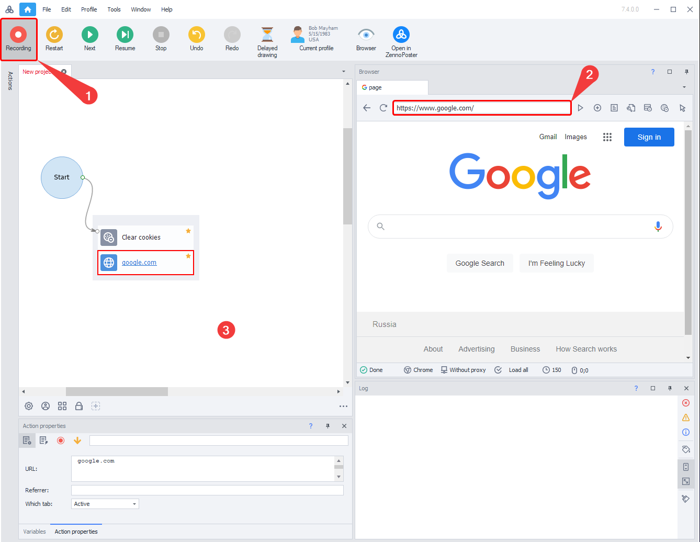
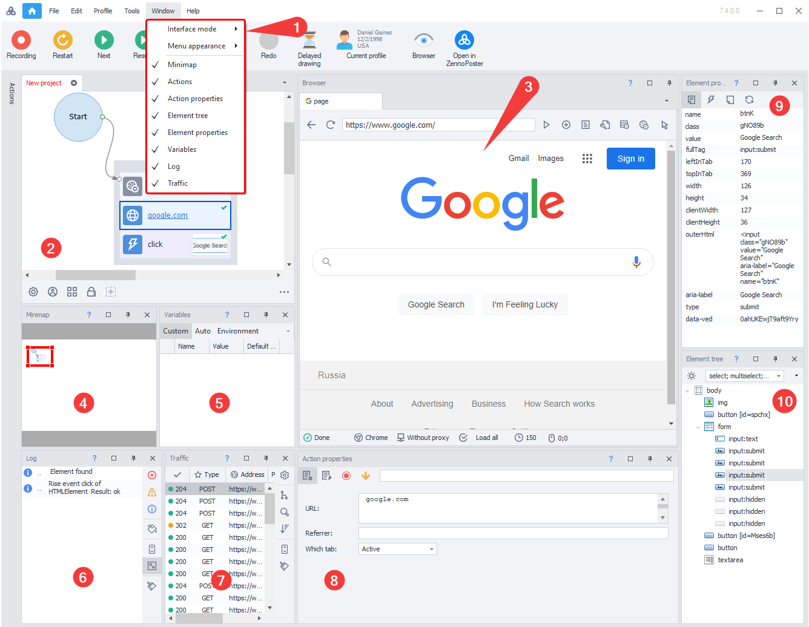
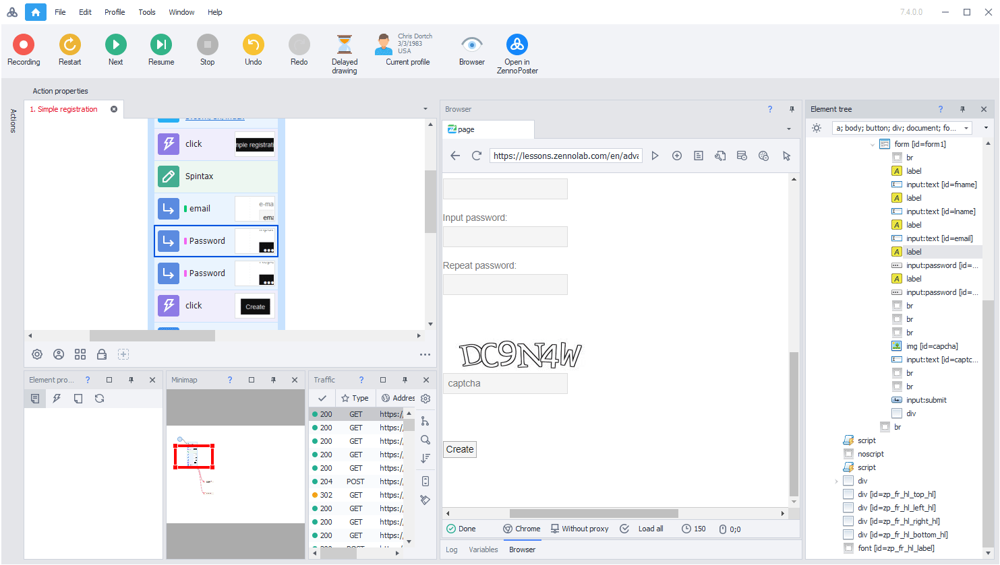
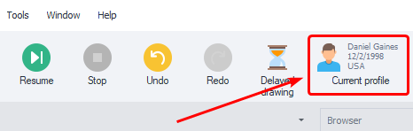
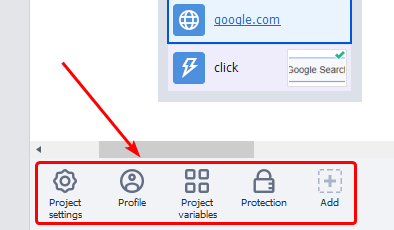
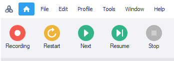

---
sidebar_position: 2
title: "Creating a Project"
description: ""
date: "2025-07-20"
converted: true
originalFile: "Создание проекта.txt"
targetUrl: "https://zennolab.atlassian.net/wiki/spaces/RU/pages/925728769"
---
import DisclaimerNotice from '@site/src/components/DisclaimerNotice';

<DisclaimerNotice />

> 🔗 **[Original Page](https://zennolab.atlassian.net/wiki/spaces/RU/pages/925728769)** — Source of this material

_______________________________________________  

## Where the Recording Starts

After launching the program, you'll see the [❗→ Start Page](/wiki/spaces/RU/pages/735608964 "/wiki/spaces/RU/pages/735608964") where you need to either click *New Project* or *Open Existing*, after which the main workspace will open with the main windows for creating and editing your project.

To start recording, click button [1] (see screenshot). After that, you can type the website address you plan to work with into the browser's address bar [2] and begin recording by performing actions in the browser. Alternatively, you can add actions to the project manually by right-clicking on any empty space in the project [3].

|  |
| :--: |
| In the screenshot, windows are arranged according to the setting: Window =&gt; Interface Mode =&gt; Standard |

## Main Windows

In the main workspace of the program, you can position 9 functional windows. You can drag and resize them as you like for convenience. Some windows can be closed if you don't use them often or at all. Closed windows can be restored through menu [1].

### [2] Project Window

In this window, [❗→ actions](https://zennolab.atlassian.net/wiki/spaces/RU/pages/486342706/ProjectMaker "https://zennolab.atlassian.net/wiki/spaces/RU/pages/486342706/ProjectMaker") will appear as you perform actions in the browser [3] during recording. You can also create new actions manually (right-click). Actions can be dragged, grouped, and logically connected to set the order for the project.

### [3] Browser

In [❗→ this window](/wiki/spaces/RU/pages/534315373 "/wiki/spaces/RU/pages/534315373") you can open various websites and record your actions step-by-step by clicking links, filling out text fields, etc. At the top of this window, you'll find icons for navigation, stopping page loading, tab management, clearing cache and cookies, plus tools for viewing page source, DOM, and text.

[❗→ More details](/wiki/spaces/RU/pages/534315373 "/wiki/spaces/RU/pages/534315373").

### [4] Minimap

By dragging the frame in your project's schematic view, you can easily change focus in the project window itself. This is especially useful for large templates.

[❗→ More details](/wiki/spaces/RU/pages/735772693 "/wiki/spaces/RU/pages/735772693").

### [5] Variables

This window shows current values of your project variables. While debugging, you can monitor and analyze their values.

[❗→ More details](/wiki/spaces/RU/pages/735608872 "/wiki/spaces/RU/pages/735608872").

### [6] Log

During debugging, the log displays messages about successfully completed actions as well as any errors that occur. This helps you refine and fix your project before it's finished.

[❗→ More details](/wiki/spaces/RU/pages/725352532 "/wiki/spaces/RU/pages/725352532").

### [7] Traffic Window

This window displays all requests made by the ProjectMaker browser, as well as requests made with [❗→ HTTP request actions](/wiki/spaces/RU/pages/534085713 "/wiki/spaces/RU/pages/534085713").

[❗→ More details](/wiki/spaces/RU/pages/735805465 "/wiki/spaces/RU/pages/735805465").

### [8] Action Properties

When you select an action in the project window [1], you can fill out and modify its settings here.

[❗→ More details](/wiki/spaces/RU/pages/494731280 "/wiki/spaces/RU/pages/494731280").

### [9] Element Properties

If you have "Follow cursor" mode enabled (right-click in the browser window), hovering over any element on the page will display its properties. Element properties will also be shown when using the [❗→ action builder](/wiki/spaces/RU/pages/483426337 "/wiki/spaces/RU/pages/483426337") (right-click in the browser window) and the element tree [10].

[❗→ More details](/wiki/spaces/RU/pages/735608879 "/wiki/spaces/RU/pages/735608879").

### [10] Element Tree

If you can't immediately identify an element in the browser, you can find it in the element tree window. This offers a structured, visual code view in a tree structure, letting you quickly find the element you need on a page.

[❗→ More details](/wiki/spaces/RU/pages/727777355 "/wiki/spaces/RU/pages/727777355").

## Project Data

### Current Profile Data

You can view the profile parameters used during debugging by clicking the corresponding icon.

[❗→ More details](/wiki/spaces/RU/pages/735903758 "/wiki/spaces/RU/pages/735903758").

### Project Settings

You can manage your project parameters with the settings panel for static blocks.

[❗→ More details](/wiki/spaces/RU/pages/534053179 "/wiki/spaces/RU/pages/534053179").

## Browser and Project Interaction

The project and browser are synchronized in real time. You can debug from any point in your template. If an error occurs during debugging, you can immediately fix the action parameters and test things right away with the new settings. You can also add to your project at any moment by clicking the "Record" button in the top menu.

With the debugging buttons, you can run your project from the very beginning, step-by-step, or up to a breakpoint. By selecting any action, you can test it right on the current browser page.