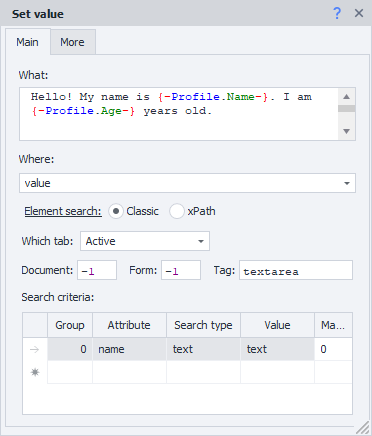
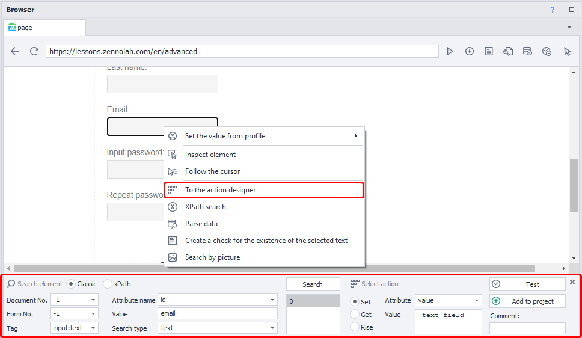
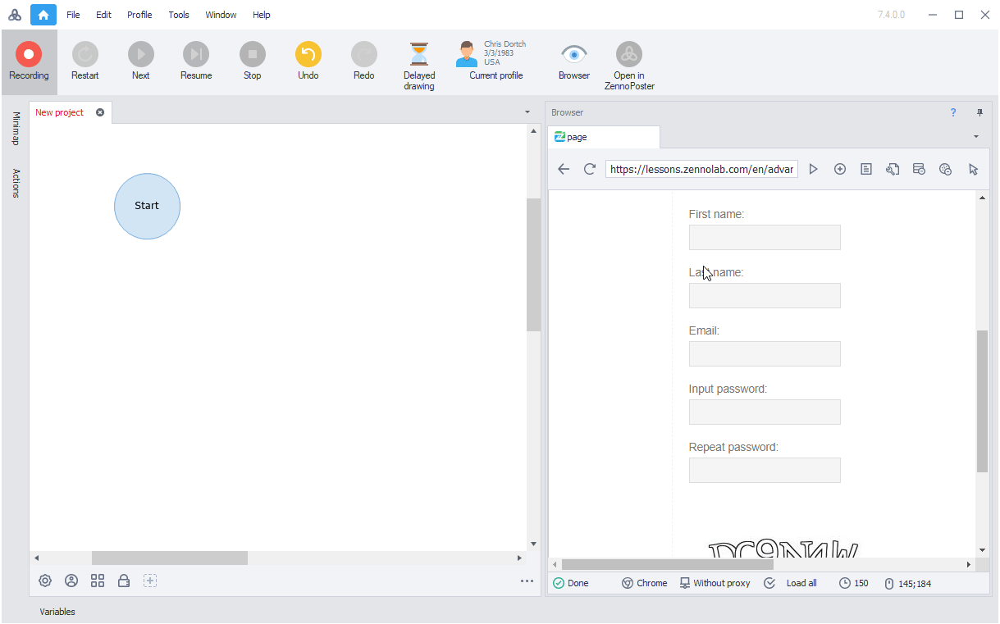

---
sidebar_position: 3
title: "Filling in Fields and Forms"
description: ""
date: "2025-07-20"
converted: true
originalFile: "Заполнение полей и форм.txt"
targetUrl: "https://zennolab.atlassian.net/wiki/spaces/RU/pages/534053331"
---
:::info **Please read the [*Rules for Using Materials on This Resource*](../Disclaimer).**
:::

> 🔗 **[Original page](https://zennolab.atlassian.net/wiki/spaces/RU/pages/534053331)** — Source of this material

_______________________________________________  

One of the most common actions is setting values in input fields. Most often, this is done using the [❗→ Set Value](/wiki/spaces/RU/pages/534315117 "/wiki/spaces/RU/pages/534315117") action. Alternatively, you can use [❗→ Keyboard Emulation](/wiki/spaces/RU/pages/735608949 "/wiki/spaces/RU/pages/735608949").

With these actions, you can enter both plain text and text from [❗→ variables](/wiki/spaces/RU/pages/486309922 "/wiki/spaces/RU/pages/486309922").

Here's an example of what the Set Value action settings might look like:

You can add the Set Value action in several ways:

- Manually, by adding it to your project through the context menu and filling in all the settings;

- Through the [❗→ Action Constructor](https://zennolab.atlassian.net/wiki/spaces/RU/pages/483426337/XPath "https://zennolab.atlassian.net/wiki/spaces/RU/pages/483426337/XPath");

- Enable *Recording* and start filling in the fields. ZennoPoster will automatically create an action with the required data:

