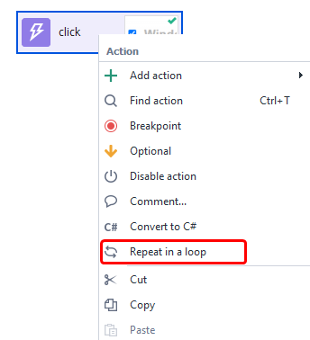
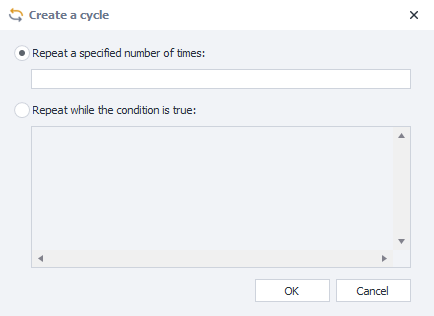

---
sidebar_position: 2
title: "Loops"
description: ""
date: "2025-07-20"
converted: true
originalFile: "Циклы.txt"
targetUrl: "https://zennolab.atlassian.net/wiki/spaces/RU/pages/489259031"
---
import DisclaimerNotice from '@site/src/components/DisclaimerNotice';

<DisclaimerNotice />

> 🔗 **[Original page](https://zennolab.atlassian.net/wiki/spaces/RU/pages/489259031)** — This is the source of the material

_______________________________________________  

A loop is an action, or group of actions, that are performed either a specific number of times, or until a certain event occurs.

:::info Information
In general, we recommend not using loops too often, as this is a complex construct and you may encounter a number of unforeseen errors (especially if you’re not familiar with programming).
:::

## Creation

### Automatic

Creating a loop in ZennoPoster is quite simple: just right-click on an action (or group of actions) and select *Repeat in loop* from the context menu:

After clicking, a window will appear for you to choose the loop exit condition:

#### Repeat a specified number of times

If you select this option, you’ll need to enter the desired number of repetitions in the input field. After clicking OK, ZennoPoster will create a counter variable, an action that compares the counter to your specified number, and an action that increments the counter.

#### Repeat while the condition is met

In the input field, you enter the required condition and as long as it returns True, the loop will continue. After clicking OK, the data from this field will be inserted into the [❗→ IF action](https://zennolab.atlassian.net/wiki/spaces/RU/pages/534315151/...+...+IF "https://zennolab.atlassian.net/wiki/spaces/RU/pages/534315151/...+...+IF"), so you need to follow the same rules for writing expressions as in the standard action.

|  |
| :--: |
| As long as the current URL equals https://google.com, a click will occur. |

### Manual loop creation

The examples above covered the automatic creation of loops, but you can also do it manually.

For example: you need to retrieve data from a site, the site has many pages, and to go to the next page you need to click the *Next button. If there are no more pages, this button is missing.

In this case, the exit condition will be an error when [❗→ clicking the *Next button](/wiki/spaces/RU/pages/534020211 "/wiki/spaces/RU/pages/534020211") (when the action can’t find the element, it completes with an error).

## Tips for use

- **Do not use infinite loops!** 

 - Add a counter to your loops. For example, if you need to wait for an element to appear on the page and you made an infinite loop that’s waiting for it. But if the site structure changes, your template will hang because it will never see the required element.
- **Don’t get your templates stuck in loops!** This can lead to all kinds of errors!

## Useful links:

- [❗→ IF action](https://zennolab.atlassian.net/wiki/spaces/RU/pages/534315151/...+...+IF "https://zennolab.atlassian.net/wiki/spaces/RU/pages/534315151/...+...+IF")
- [❗→ Pause](/wiki/spaces/RU/pages/534053057 "/wiki/spaces/RU/pages/534053057")