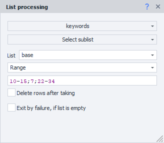
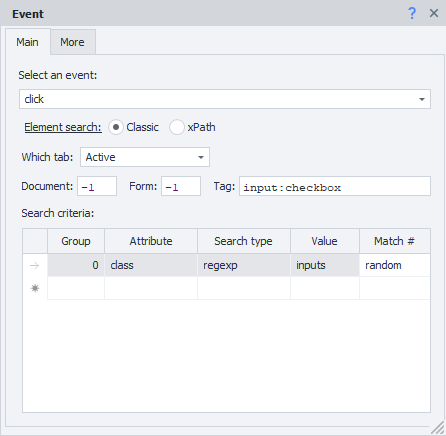
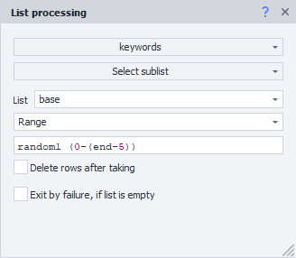

---
sidebar_position: 1
title: "Value Ranges"
description: ""
date: "2025-07-20"
converted: true
originalFile: "Диапазоны значений.txt"
targetUrl: "https://zennolab.atlassian.net/wiki/spaces/RU/pages/488964137"
---
:::info **Please read the [*Material Usage Rules on this site*](../Disclaimer).**
:::

> 🔗 **[Original page](https://zennolab.atlassian.net/wiki/spaces/RU/pages/488964137)** — Source of this material

_______________________________________________  

## What are ranges

Quite often, when setting up your project, you'll come across places where you need to specify a match number when searching, a line number, a cell number, and so on. However, in these cases, it's not always possible to specify a single number. Ranges help you set up more flexible numbering for such lists.

Below you'll find examples for working with a list, but remember, these examples apply anywhere you need to specify some kind of number.

  

## When should you use ranges:

- You need to select a range of lines. For example, from the fifth to the seventh, etc.;
- You need to select the last line without knowing the total number of lines;
- You need to select a random line;
- You need to select multiple random lines;
- You need to select several random lines from a specific range;
- You need to select even/odd lines from a specific range;
- You need to select random lines from the even/odd lines of a specific range.
- You can also use ranges as the match number when performing actions like [❗→ Perform Event](/wiki/spaces/RU/pages/534020211 "/wiki/spaces/RU/pages/534020211"), [❗→ Set Values](/wiki/spaces/RU/pages/534315117 "/wiki/spaces/RU/pages/534315117"), [❗→ Get Values](/wiki/spaces/RU/pages/534315124 "/wiki/spaces/RU/pages/534315124")

  

## Selecting lines from one or several ranges

If you need to select lines from the fifth to the seventh, for example, you enter:

**4-6** (one less, since line numbering starts from 0).

You can specify multiple ranges separated by '**;**' or '**,**': for example, **10-15;7;22-34**

  

## Selecting a random element

There are situations when a page has several identical elements, and you want to interact with any of them, it doesn't matter which.

For example, during registration, you need to choose an operating system from several options. To click a random one, you should set **random** as the match number.

  

## The list length is unknown, but you need to take it to the end

The end of the list is denoted by the keyword **end**.

Simply specify a range, for example: **10-end** and lines from **11** to the end of the file will be taken.

  

## Selecting all lines from a list

To select all lines, specify **all** as the line number.

  

## Selecting a random line or several random lines from a range

For this, in the line number, write the word random, then how many lines you need, then in parentheses, from which lines to pick.

For example:

**random1(1,12-15,35-end)** - to take **one** line from the specified ones,

or

**random15(1,12-15,35-end)** - to take **15** lines from the specified ones,

or

**randomAll(1,12-15,35-end)** - to take **all** lines from the specified ones in random order (randomAll is available in ZennoPoster version 5.9.3 and higher).

  

## Excluding ranges

Sometimes, you need to ignore the last options.

For example, to exclude the last 5 lines and select 1 random item, it would look like this:

**random1(0-(end-5))**

Excluding ranges is available in ZennoPoster version 5.9.3 and higher.

  

## Selecting only even values

To get the first even value from the range, write:

**even(1,12-15,35-end)** or **even1(1,12-15,35-end)**

To get the first 5 even values from the range, write:

**even5(1,12-15,35-end)**

To get all even values from the range, write:

**evenAll(1,12-15,35-end)**

The even operator is available in ZennoPoster version 5.9.3 and higher.

  

## Selecting only odd values

To get the first odd value from the range, write:

**odd(1,12-15,35-end)** or **odd1(1,12-15,35-end)**

To get the first 5 odd values from the range, write:

**odd5(1,12-15,35-end)**

To get all odd values from the range, write:

**oddAll(1,12-15,35-end)**

The odd operator is available in ZennoPoster version 5.9.3 and higher.

  

## Combining operators

You can combine random, even, and odd operators.

For example, to pick all even lines in random order from a range, write:

**randomAll(evenAll(1,12-15,35-end))**

Combining operators is available in ZennoPoster version 5.9.3 and higher.

  

## Useful links

- [❗→ Table Operations](/wiki/spaces/RU/pages/534052972 "/wiki/spaces/RU/pages/534052972")
- [❗→ List Operations](/wiki/spaces/RU/pages/534085798 "/wiki/spaces/RU/pages/534085798")
- [❗→ Set Value](/wiki/spaces/RU/pages/534315117 "/wiki/spaces/RU/pages/534315117")
- [❗→ Get Value](/wiki/spaces/RU/pages/534315124 "/wiki/spaces/RU/pages/534315124")