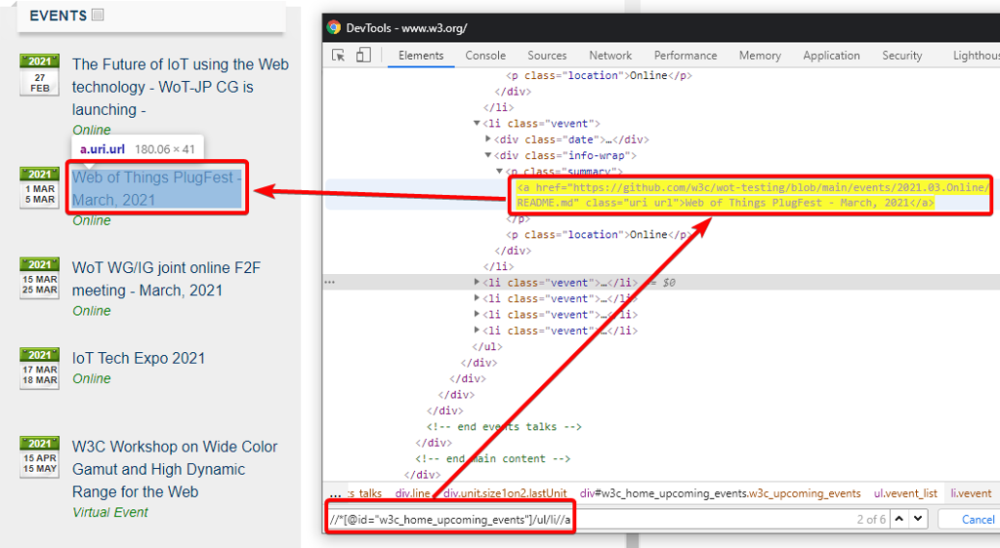

---
sidebar_position: 3
title: "XPath"
description: ""
date: "2025-07-20"
converted: true
originalFile: "XPath.txt"
targetUrl: "https://zennolab.atlassian.net/wiki/spaces/RU/pages/862093419/XPath"
---
:::info **Please review the [*Usage Policy for Materials on This Resource*](../Disclaimer).**
:::

> 🔗 **[Original page](https://zennolab.atlassian.net/wiki/spaces/RU/pages/862093419/XPath)** — Source of this material

_______________________________________________  

This is a flexible and powerful query language for selecting elements in XML or (X)HTML documents and for XSLT transformations by DOM. It is a standard created by the [W3C](https://ru.wikipedia.org/wiki/W3C "https://ru.wikipedia.org/wiki/W3C") consortium.

## What is XPath for in ZennoPoster?

- For parsing data from websites (action [❗→ Parse data](/wiki/spaces/RU/pages/534053279 "/wiki/spaces/RU/pages/534053279"))
- For searching for and interacting with web page elements

 - [❗→ Perform action](/wiki/spaces/RU/pages/534020211 "/wiki/spaces/RU/pages/534020211")
 - [❗→ Set value](/wiki/spaces/RU/pages/534315117 "/wiki/spaces/RU/pages/534315117")
 - [❗→ Get value](/wiki/spaces/RU/pages/534315124 "/wiki/spaces/RU/pages/534315124")
- You can use it in the [❗→ Action Builder](https://zennolab.atlassian.net/wiki/spaces/RU/pages/483426337/XPath "https://zennolab.atlassian.net/wiki/spaces/RU/pages/483426337/XPath").

With XPath, you can create a more universal and robust data search algorithm that is less sensitive to website layout changes compared to [❗→ regular expressions](/wiki/spaces/RU/pages/534086111 "/wiki/spaces/RU/pages/534086111").
This query language allows you to significantly simplify parser logic and speed up development.

## Testing queries as you create them

- ZennoPoster comes with a built-in [❗→ X/Json Path Tester](https://zennolab.atlassian.net/wiki/spaces/RU/pages/534315390/X+JSON+Path "https://zennolab.atlassian.net/wiki/spaces/RU/pages/534315390/X+JSON+Path") that lets you test the expressions you've created.
- You can also build and test XPath expressions in the [❗→ Web Developer Tools (DevTools)](https://zennolab.atlassian.net/wiki/spaces/RU/pages/1331134465/web-+DevTools "https://zennolab.atlassian.net/wiki/spaces/RU/pages/1331134465/web-+DevTools") window: open DevTools, press ctrl+f to open the search bar, and enter your XPath expression there:

For example, to get the names of events on the http://w3.org website, you can use the following expression:

`//*[@id="w3c_home_upcoming_events"]/ul/li//a`

## Basic syntax

### **Paths**

| **Expression** | **Description** |
| --- | --- |
| **.** | current context |
| **.//** | recursive descent (zero or more levels down from the current context) |
| **/html/body** | absolute path |
| **a** | relative path |
| **//\*** | everything in the current context |
| **li/\/a** | links that are “grandchildren” of li |
| **//a\|//button** | links and buttons (combines two node sets) |

### **Relationships**

| **Expression** | **Description** |
| --- | --- |
| **a/i/parent::p** | immediate parent &lt;p&gt; |
| **p/ancestor::**\ | all ancestors |
| **p/following-sibling::**\ | all following siblings |
| **p/preceding-sibling::**\ | all preceding siblings |
| **p/following::**\ | all elements after except descendants |
| **p/preceding::**\ | all elements before except ancestors |
| **p/descendant-or-self::**\ | the context node and all its descendants |
| **p/ancestor-or-self::**\ | the context node and all its ancestors |

### **Getting nodes**

| **Expression** | **Description** |
| --- | --- |
| **/div/text()** | get text nodes |
| **/div/text()[1]** | get the first text node |

### **Element position**

| **Expression** | **Description** |
| --- | --- |
| **a[1]** | first element |
| **a[last()]** | last element |
| **a[2]** | second link |
| **a[position() &lt;= 3]** | first 3 links |
| **ul[li[1]=”OK”]** | list (UL) whose first item is 'OK' |
| **tr[position() mod 2 = 1]** | odd elements |
| **tr[position() mod 2 = 0]** | even elements |
| **p/text()[2]** | second text node |

**Attributes and filters**
**[]** - means filtering elements

| **Expression** | **Description** |
| --- | --- |
| **input[@type=”text”]** | &lt;input&gt; tag with type attribute equal to text |
| **input[@class='OK']** | &lt;input&gt; tag with class attribute equal to OK |
| **p[not(@\)]** | paragraphs with no attributes |
| **\[@style]** | all elements with a style attribute |
| **a[. = “OK”]** | links with value “OK” |
| **a/@id** | link IDs |
| **a/@**\ | all link attributes |
| <ul><li>
<strong data-renderer-mark="true">a[@id and @rel]</strong>
</li><li>
<strong data-renderer-mark="true">a[@id][@rel]</strong>
</li></ul> | links that have both id and rel attributes |
| **a[i or b]** | links containing an &lt;i&gt; or &lt;b&gt; element |

### **Functions**
Basic Xpath functions - http://www.w3.org/TR/xpath/#corelib

| **Function** | **Description** | **Example** |
| --- | --- | --- |
| **name()** | Returns the element name | [name()='a'] |
| **string(val)** | Get the value of an attribute | string(a[1]/@id) |
| **substring(val, from, to)** | Cut part of a string | substring(@id, 1, 6) |
| **substring-before(val, to)** | Return the part of **val** before the string **to** | substring-before('12-May-1998', '-') = '12' |
| **substring-after(val, from)** | Return the part of **val** after the string **to** | substring-after('12-May-1998', '-') = 'May-1998' |
| **string-length()** | Returns the number of characters in a string | [string-length(text()) &gt; 5] |
| **count()** | Returns the number of elements | |
| **concat()** | Takes two or more strings and returns the concatenation of its arguments. | |
| **normalize-space()** | Just like Trim | [normalize-space(text())='SEARCH'] |
| **starts-with()** | Starts with | [starts-with(text(), 'SEARCH')] |
| **contains()** | Contains | [contains(name(), 'SEARCH')] |
| **translate(val, from, to)** | Replaces the characters in the first string argument that appear in the second argument with the corresponding characters in the third argument. | translate(«bar»,«abc»,«ABC») |

### **Grouping**

| **Expression** | **Description** |
| --- | --- |
| **(table/tbody/tr)[last()]** | the last &lt;tr&gt; row of all tables |
| **(//h1\|//h2)[contains(text(), 'Text')]** | heading 1 or 2 containing 'Text' |
| **a[//tr/@data-id=@data-id]** | all links whose data-id attribute matches the data-id attribute of a table row |

### Useful links

https://ru.wikipedia.org/wiki/XPath
https://www.w3schools.com/xml/xpath_syntax.asp