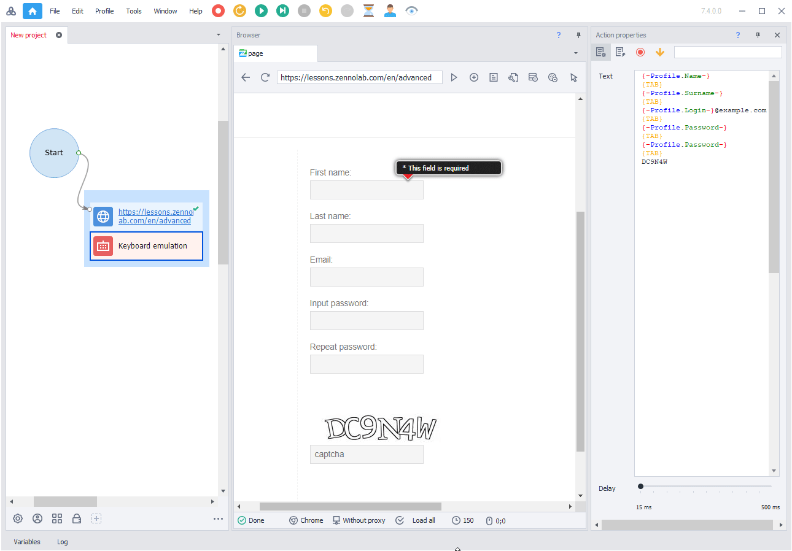

---
sidebar_position: 4
title: "Mouse and Keyboard Emulation"
description: ""
date: "2025-07-20"
converted: true
originalFile: "Эмуляция мыши и клавиатуры.txt"
targetUrl: "https://zennolab.atlassian.net/wiki/spaces/RU/pages/489291804"
---
:::info **Please review the [*Terms of Use for materials on this resource*](../Disclaimer).**
:::

> 🔗 **[Original page](https://zennolab.atlassian.net/wiki/spaces/RU/pages/489291804)** — Source of this material

_______________________________________________  
# Mouse and Keyboard Emulation

## What is emulation used for

- You need to send mouse clicks to specified coordinates on a web page;
- You need to emulate key presses, for example, “Escape” or “Enter” on a web page;
- Many websites have implemented bot protection, tracking whether keyboard keys are pressed when filling in input fields. Mouse and keyboard emulation can help bypass this protection.

## Where and how it is used

For [❗→ mouse click emulation](/wiki/spaces/RU/pages/534315158 "/wiki/spaces/RU/pages/534315158") you need to specify the coordinates where the click will happen, and choose which mouse button to click with. You can also choose the type of distribution: “normal” (where the click will tend to hit closer to the center) or “uniform” (evenly distributed within the specified coordinates).

For [❗→ keyboard text input emulation](/wiki/spaces/RU/pages/735608949 "/wiki/spaces/RU/pages/735608949") you’ll need to enter the text itself and set the delay between key presses. To emulate special key presses, press **Ctrl+Space** in the text input field and select the desired key from the list that appears.

When filling in fields and clicking buttons and links, emulation is enabled by default. In the [❗→ project settings](/wiki/spaces/RU/pages/534315477 "/wiki/spaces/RU/pages/534315477"), you can centrally change the emulation level for all actions that fill in fields on a web page and click buttons or links. Each action [❗→ has its own emulation setting](https://zennolab.atlassian.net/wiki/spaces/RU/pages/534315117#%D0%9D%D0%B0%D1%81%D1%82%D1%80%D0%BE%D0%B9%D0%BA%D0%B0-%D0%B4%D0%B5%D0%B9%D1%81%D1%82%D0%B2%D0%B8%D1%8F%3A--%D0%92%D0%BA%D0%BB%D0%B0%D0%B4%D0%BA%D0%B0-%E2%80%9C%D0%94%D0%BE%D0%BF%D0%BE%D0%BB%D0%BD%D0%B8%D1%82%D0%B5%D0%BB%D1%8C%D0%BD%D0%BE%E2%80%9D%5BhardBreak%5D "https://zennolab.atlassian.net/wiki/spaces/RU/pages/534315117#%D0%9D%D0%B0%D1%81%D1%82%D1%80%D0%BE%D0%B9%D0%BA%D0%B0-%D0%B4%D0%B5%D0%B9%D1%81%D1%82%D0%B2%D0%B8%D1%8F%3A--%D0%92%D0%BA%D0%BB%D0%B0%D0%B4%D0%BA%D0%B0-%E2%80%9C%D0%94%D0%BE%D0%BF%D0%BE%D0%BB%D0%BD%D0%B8%D1%82%D0%B5%D0%BB%D1%8C%D0%BD%D0%BE%E2%80%9D%5BhardBreak%5D") which can override the centralized setting.

In the keyboard emulation action, you can use plain text, project variables, and special keys (`{TAB}`**, `{ENTER}`**, `{BACKSPACE}`**, `{CTRL}` and others. To get the full list of available keys, press CTRL+SPACE in the text input field):

See also [❗→ screenshot search](/wiki/spaces/RU/pages/492044304 "/wiki/spaces/RU/pages/492044304").

## C# methods for moving the virtual mouse:

- [**FullEmulationMouseMoveToHtmlElement**](https://help.zennolab.com/en/v5/zennoposter/5.10.4.1/webframe.html#topic384.html "https://help.zennolab.com/en/v5/zennoposter/5.10.4.1/webframe.html#topic384.html") - move the virtual mouse to an element from its current virtual position;
- [**FullEmulationMouseMove**](https://help.zennolab.com/en/v5/zennoposter/5.10.4.1/webframe.html#topic382.html "https://help.zennolab.com/en/v5/zennoposter/5.10.4.1/webframe.html#topic382.html") - move the virtual mouse to coordinates from its current virtual position;
- [**FullEmulationMouseClick**](https://help.zennolab.com/en/v5/zennoposter/5.10.4.1/webframe.html#topic381.html "https://help.zennolab.com/en/v5/zennoposter/5.10.4.1/webframe.html#topic381.html") - click the mouse at the current position of the virtual mouse;
- [**FullEmulationMouseMoveAboveHtmlElement**](https://help.zennolab.com/en/v5/zennoposter/5.10.4.1/webframe.html#topic383.html "https://help.zennolab.com/en/v5/zennoposter/5.10.4.1/webframe.html#topic383.html") - emulates reading an element;
- Property [**FullEmulationMouseCurrentPosition**](https://help.zennolab.com/en/v5/zennoposter/5.10.4.1/webframe.html#topic413.html "https://help.zennolab.com/en/v5/zennoposter/5.10.4.1/webframe.html#topic413.html") - returns the current position of the virtual mouse.
- Method [**FullEmulationMouseSetOptions**](https://help.zennolab.com/en/v5/zennoposter/5.10.4.1/webframe.html#topic385.html "https://help.zennolab.com/en/v5/zennoposter/5.10.4.1/webframe.html#topic385.html") - sets mouse emulation parameters. This method should be called after each call to the Navigate method and is available starting from version 5.10.4.1.