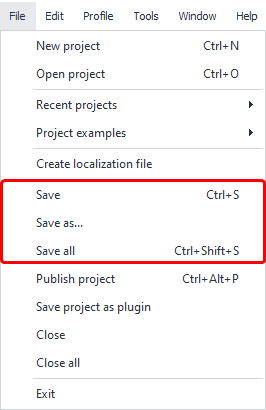
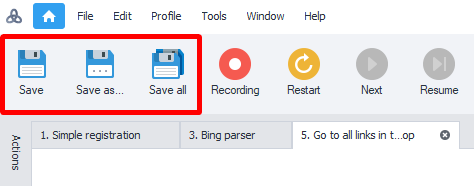
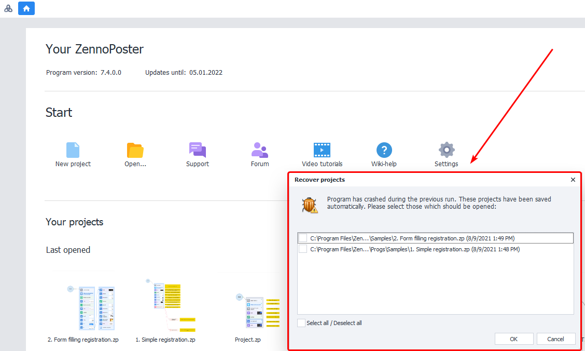
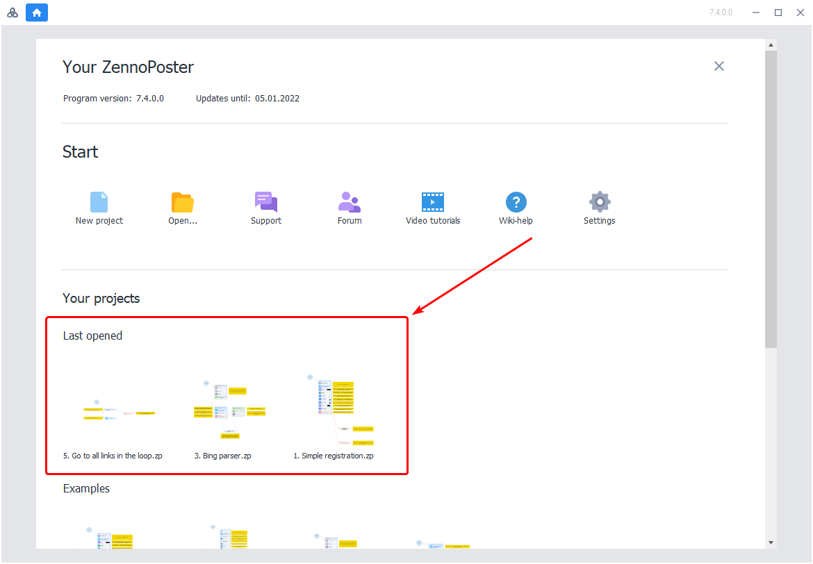

---
sidebar_position: 8
title: "Saving a Project"
description: ""
date: "2025-07-20"
converted: true
originalFile: "Сохранение проекта.txt"
targetUrl: "https://zennolab.atlassian.net/wiki/spaces/RU/pages/486342692"
---
import DisclaimerNotice from '@site/src/components/DisclaimerNotice';

<DisclaimerNotice />

> 🔗 **[Original page](https://zennolab.atlassian.net/wiki/spaces/RU/pages/486342692)** — Source of this material

_______________________________________________  

## Saving

You can save your projects in several ways:

- by using [❗→ keyboard shortcuts](/wiki/spaces/RU/pages/475332762 "/wiki/spaces/RU/pages/475332762") **Ctrl+S**
- through the menu

- using the toolbar buttons (after [❗→ adding buttons via settings](https://zennolab.atlassian.net/wiki/spaces/RU/pages/735576065#%D0%9D%D0%B0%D1%81%D1%82%D1%80%D0%BE%D0%B9%D0%BA%D0%B8-%D0%BA%D0%BD%D0%BE%D0%BF%D0%BE%D0%BA-%D1%80%D0%B0%D0%B7%D0%B4%D0%B5%D0%BB%D0%BE%D0%B2 "https://zennolab.atlassian.net/wiki/spaces/RU/pages/735576065#%D0%9D%D0%B0%D1%81%D1%82%D1%80%D0%BE%D0%B9%D0%BA%D0%B8-%D0%BA%D0%BD%D0%BE%D0%BF%D0%BE%D0%BA-%D1%80%D0%B0%D0%B7%D0%B4%D0%B5%D0%BB%D0%BE%D0%B2"))

If you're working on large projects, we recommend periodically saving your work yourself to avoid losing data in case the program freezes on lower-end machines.

## Project Backups

Projects are automatically saved every 5 minutes. If you haven't saved your current project, the next time you start the program, you'll be prompted to restore it from a backup. This way, even if something goes wrong and the program crashes, you can minimize the risk of losing data.

## Loading

You can open projects either from within ProjectMaker or by double-clicking the file in Windows Explorer.

The most recent projects you've worked on will be conveniently shown when the program starts:

