---
sidebar_position: 11
title: "Setting Up Google Sheets Connection"
description: ""
date: "2025-07-20"
converted: true
originalFile: "Настройка подключения Google Таблиц.txt"
targetUrl: "https://zennolab.atlassian.net/wiki/spaces/RU/pages/1667727363/Google"
---
import DisclaimerNotice from '@site/src/components/DisclaimerNotice';

<DisclaimerNotice />

> 🔗 **[Original page](https://zennolab.atlassian.net/wiki/spaces/RU/pages/1667727363/Google)** — Source of this material

_______________________________________________  

## Introduction

To start using [❗→ Google Sheets](https://zennolab.atlassian.net/wiki/spaces/RU/pages/724566092/Google "https://zennolab.atlassian.net/wiki/spaces/RU/pages/724566092/Google") in ZennoPoster, please follow these steps.

## Creating a New Google API Key

### Creating a New Application

- Log into your Google account or create a [new one](https://support.google.com/accounts/answer/27441?hl=ru "https://support.google.com/accounts/answer/27441?hl=ru").
- Go to [Google Cloud Platform](https://console.developers.google.com/?hl=ru "https://console.developers.google.com/?hl=ru"). On your first visit you will need to:

  - select a country (1)
  - read the terms of service and, if you agree, accept them by checking the appropriate box (2)
  - (optional) agree to receive emails (3)
  - finally, click **AGREE AND CONTINUE** (4)

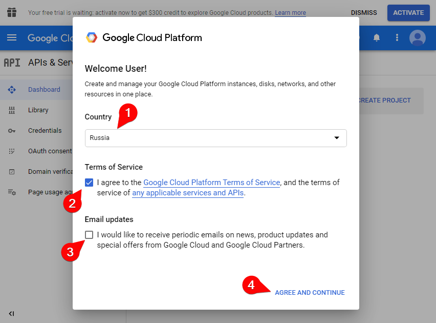

- Go to the **OAuth consent screen** section (1) and click **CREATE PROJECT** (2).
A new project will be created.

- Enter any project name in the **Project name** field (1), but only in English, **Location** (if needed) (2), and click **CREATE** (3).

- In the next window, select **External** (1) and click **CREATE** (2)

- In the opened window, enter any app name in the **App name** field (1), select an email in the **User support email** list (2)

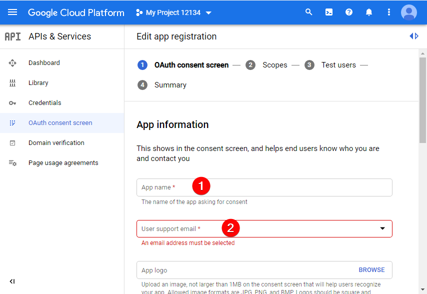

- Scroll all the way down, enter your email again (3), and click **SAVE AND CONTINUE** (4)

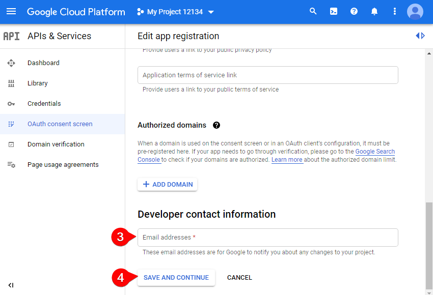

- In the next window (**Scopes**), just scroll down and click **SAVE AND CONTINUE**.

- In the Test users window, scroll down and click **SAVE AND CONTINUE** again.

- In the new (**Summary**) window, scroll down and click **BACK TO DASHBOARD**.

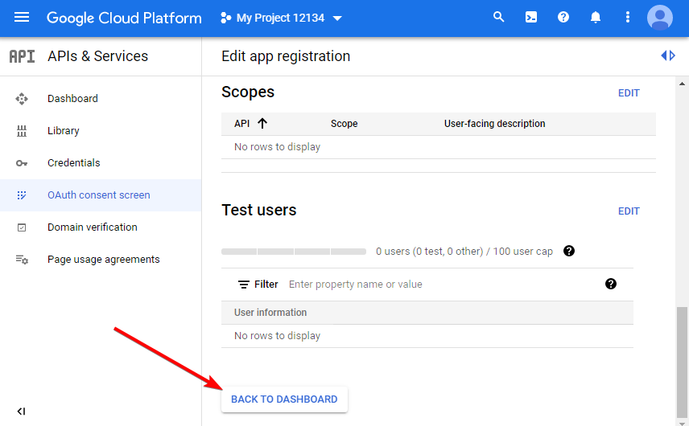

### Publishing the Project

#### Testing mode

:::warning Attention
In this mode, you'll need to reauthorize the app every 7 days (as of May 2021; Google may change this period in the future). See Google's help docs for details.
:::

:::warning Attention
The number of test users is limited — you can't have more than 100! Once you add a user to the tester list, you can't remove them!
:::

You can leave the app in testing mode. If so, it will be available only to the account that created it and those added to the **Test Users** list. To do this:

- On the **OAuth consent screen** tab, scroll down a bit and in the *Test users section click the **+ADD USERS** button.
- In the window that opens, add the email address of the required account and click **SAVE**.

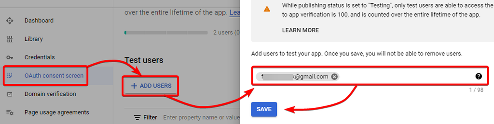

#### Publish App

You can also publish the app. Then it will be accessible to any user with a Google account.

In the opened window, click the **PUBLISH APP** button

- **CONFIRM** in the popup window

### Creating Credentials

- In the **Credentials** section (1), click **CREATE CREDENTIALS** (2) and select **OAuth client ID** (3)

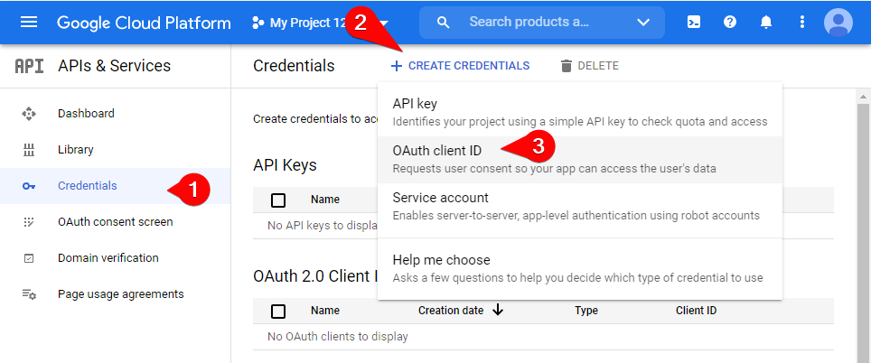

- Select **Desktop app** in the **Application type** dropdown (1) and click **CREATE** (2)

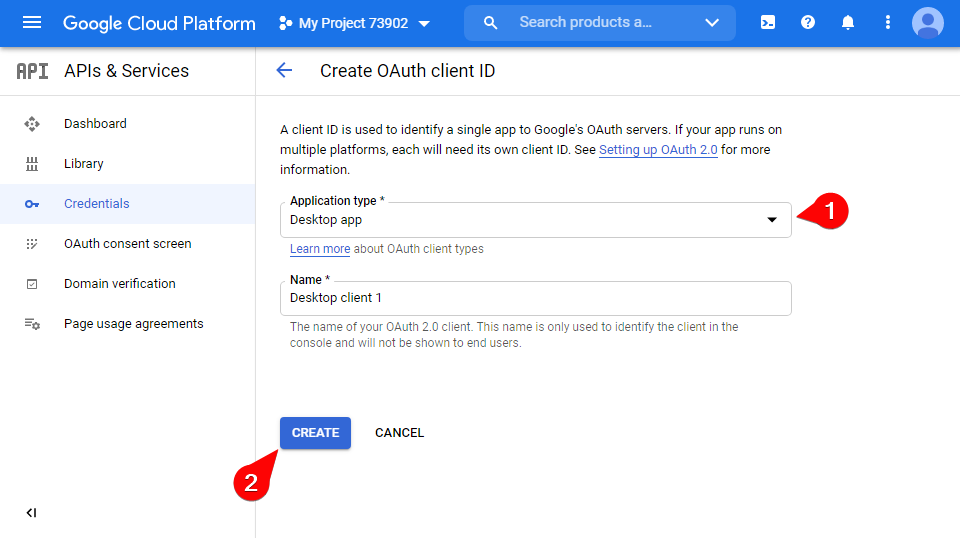

- A new window **OAuth client created** will open, click **OK**.

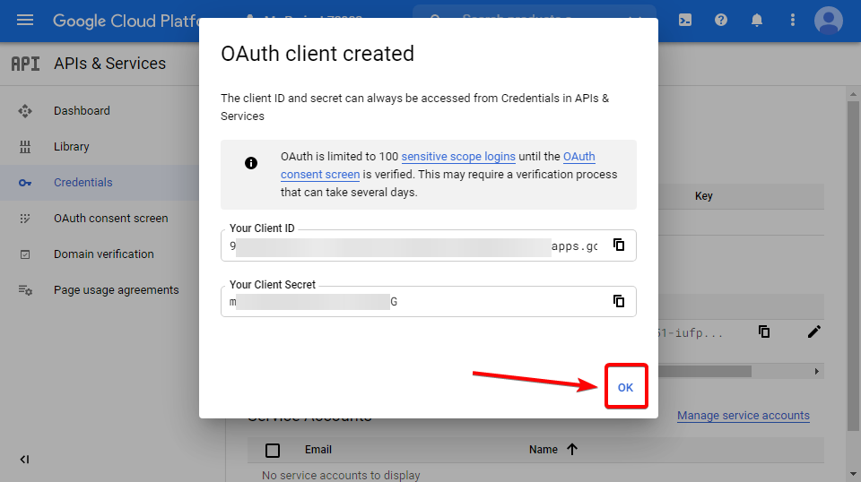

- After this, click either the name of the newly created app or its edit icon

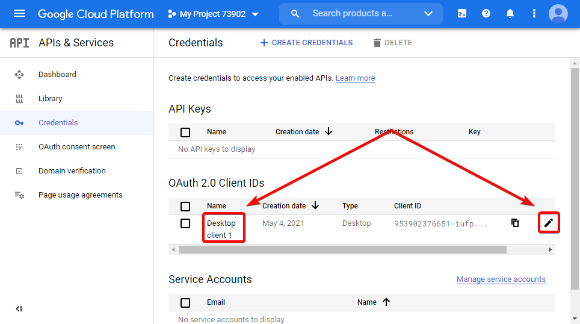

- In the window that opens, you need to download the key as a file. To do this, click the **DOWNLOAD JSON** button.

## Enabling Google Sheets and Drive APIs

:::warning Attention
Attention! It is very important to enable both APIs, otherwise the program will not work correctly.
:::

There’s just a little more to do for Google Sheets to work properly!

- To enable *Google Sheets API*, go to [this link](https://console.developers.google.com/apis/library/sheets.googleapis.com "https://console.developers.google.com/apis/library/sheets.googleapis.com").
- Select your project (1) and click **ENABLE** (2).

- To enable *Google Drive API*, go to [this link](https://console.developers.google.com/apis/library/drive.googleapis.com "https://console.developers.google.com/apis/library/drive.googleapis.com").
- Select your project (1) and click **ENABLE** (2).

## Adding the Key to the Program

:::warning Attention
Sheets must be connected separately in ProjectMaker and ZennoPoster
:::

- Open [❗→ Google Sheets settings](https://zennolab.atlassian.net/wiki/spaces/RU/pages/735576090/Google+PM "https://zennolab.atlassian.net/wiki/spaces/RU/pages/735576090/Google+PM") (**Edit => Settings => Google Sheets**)
- Click […] and choose your credentials file (1), then click **Connect** (2).

:::warning Attention
The file must have a .json extension!
:::

- Next, a browser window will open where you need to sign in to your Google account that you used to create the key.
- Since you just created your app, a warning window may appear. Because you trust your app, you need to choose **Advanced** (1) and **Go to "Your App"** (2).

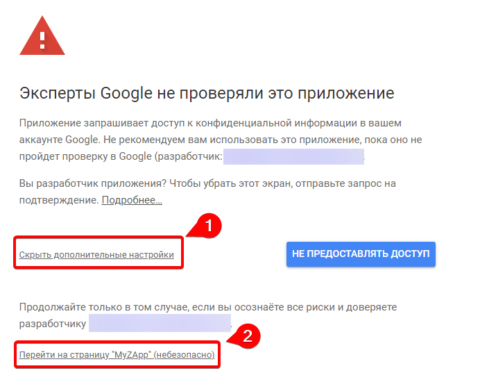

- After that, allow your app to access your account data so that it can read and write sheets.

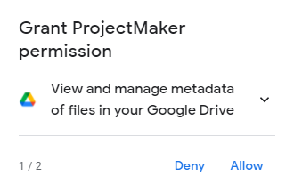

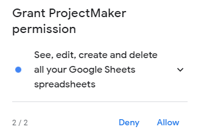

- Then again:

- After this, you’ll see **Received verification code. You may now close this window** in your browser — this means everything went well! You can now close this browser tab.

## API Request Limits

### What are the limits?

There are [limits on the number of requests](https://developers.google.com/analytics/devguides/config/mgmt/v3/limits-quotas?hl=ru "https://developers.google.com/analytics/devguides/config/mgmt/v3/limits-quotas?hl=ru"): 50,000 requests per day per project, and 10 requests per second per IP address (these limits as of May 2021).

### Where can I see the current number of requests made?

You can find this information in the [Google Cloud Platform Dashboard](https://console.cloud.google.com/apis/dashboard?hl=ru "https://console.cloud.google.com/apis/dashboard?hl=ru") (don’t forget to select the correct project).

### How can I increase the limits?

For information on how to increase your limits, see this link — [Requesting additional quota](https://developers.google.com/analytics/devguides/config/mgmt/v3/limits-quotas?hl=ru#additional_quota "https://developers.google.com/analytics/devguides/config/mgmt/v3/limits-quotas?hl=ru#additional_quota").

### How does ZennoPoster use the limits?

The number of requests, generally, depends on two factors — whether the sheet has changed and if loading third-party changes is enabled ([❗→ setting](https://zennolab.atlassian.net/wiki/spaces/RU/pages/735576090/Google+PM "https://zennolab.atlassian.net/wiki/spaces/RU/pages/735576090/Google+PM") *Sheet change handling policy).

If loading third-party changes is enabled, a request to the Drive API will be sent every minute to compare sheet versions.

When the sheet itself is changed, different types of requests are used, in general up to 5 requests per sheet per minute. So if 10 sheets are being changed actively, you’ll hit up to about 60 requests per minute (Sheets API + Drive API).

  

## Possible Errors

### Authorization Error (Error 403: access_denied)

Click here to expand

**Full error message**: *The developer hasn’t given you access to this app. It’s currently being tested and it hasn’t been verified by Google. If you think you should have access, contact the developer

**Solution**: The app you created to access the Google API is in testing mode, and the account you are trying to authorize with is neither the creator nor in the list of test users.
How to publish the app or add a user to the test list can be found in this article in the section [❗→ Publishing the project](https://zennolab.atlassian.net/wiki/spaces/RU/pages/1667727363/Google#Публикация-проекта "https://zennolab.atlassian.net/wiki/spaces/RU/pages/1667727363/Google#Публикация-проекта").

  

## Useful Links

- [❗→ Google Sheets Operations](/wiki/spaces/RU/pages/509411347 "/wiki/spaces/RU/pages/509411347")
- [❗→ Google Sheets (PM)](/wiki/spaces/RU/pages/735576090 "/wiki/spaces/RU/pages/735576090")
- [❗→ Multithreaded work with Google Sheets (Version 7.1.7.0 and above)](/wiki/spaces/RU/pages/851673094 "/wiki/spaces/RU/pages/851673094")