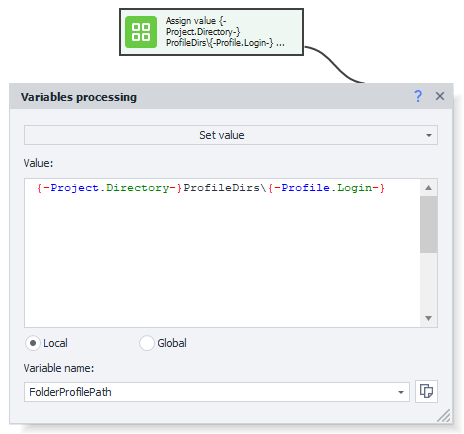
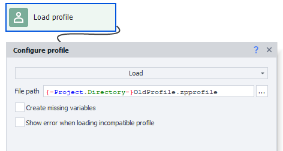
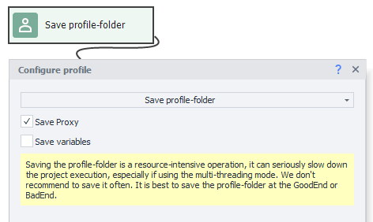
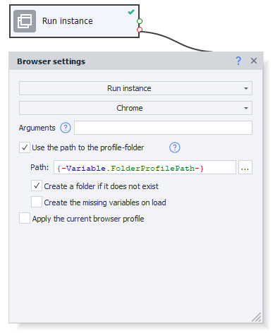
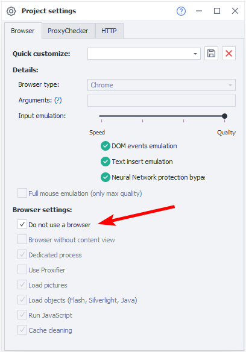

---
sidebar_position: 9
title: "Using a Profile Folder"
description: ""
date: "2025-07-20"
converted: true
originalFile: "Использование профиль-папки.txt"
targetUrl: "https://zennolab.atlassian.net/wiki/spaces/RU/pages/1251475485/-"
---
import DisclaimerNotice from '@site/src/components/DisclaimerNotice';

<DisclaimerNotice />

> 🔗 **[Original page](https://zennolab.atlassian.net/wiki/spaces/RU/pages/1251475485/-)** — Source of this material

_______________________________________________  

## Description

:::info Information
Available in ZennoPoster version 7.3.1.0 and above.
:::

A **profile folder** is an alternative way to save a profile, different from the usual method of saving to a file. It's designed to address issues such as:

### Profile integrity

When saving to a file, profile files could become “corrupted” if the instance encountered errors. The profile folder is meant to solve these problems—when you start your project, you launch the instance and specify a particular profile folder for it. While running, the instance saves some data to the profile folder automatically, just like a regular browser. And if the instance crashes, your data remains in the folder. The following instance data is saved automatically:

1. *Cookies
2. *Local Storage
3. *HSTS Super Cookie
4. *Indexed DB
5. *Everything related to the profile (first/last name, email, password, etc.)
6. *Everything related to the browser profile (UserAgent, Accept, Accept-Language). Now, browser profiles also include fonts, plugins, timezone, geolocation, and WebRTC, so these are also saved automatically.

The only things not saved automatically are Proxy and variables (to save these, you need to call a special action — see [❗→ Profile Browsing](https://zennolab.atlassian.net/wiki/spaces/RU/pages/1251475485/-#1.-%D0%9D%D0%B0%D0%B3%D1%83%D0%BB%D0%B8%D0%B2%D0%B0%D0%BD%D0%B8%D0%B5-%D0%BF%D1%80%D0%BE%D1%84%D0%B8%D0%BB%D1%8F "https://zennolab.atlassian.net/wiki/spaces/RU/pages/1251475485/-#1.-%D0%9D%D0%B0%D0%B3%D1%83%D0%BB%D0%B8%D0%B2%D0%B0%D0%BD%D0%B8%D0%B5-%D0%BF%D1%80%D0%BE%D1%84%D0%B8%D0%BB%D1%8F"))

### Fast loading and saving

When working with a file, as you use it for a long time, the file size may increase, leading to longer load and save times. A profile folder stores data in several files, and only the necessary files are touched when writing. This works much faster.

:::warning Attention
Unlike a profile file, you can't load a profile folder using the “Profile Operations” action. To use a profile folder, you need to launch an instance at the start of your project with the desired profile folder specified, and from then on the instance will be “linked” to this profile folder during work. See examples below for more details.
:::

  

## How to convert old-format profile files to the new profile folder format?

Demo project:

❗→ Open convert-old-profiles-to-new.zp

❗→ convert-old-profiles-to-new.zp

1. **Prepare the folder path where profile folders will be stored.** For example, in your project folder: 

`{ -Project.Directory- }ProfileDirs\`

 + You'll need to append a unique name for the profile folder, just like you did with profile files.

2. **Launch an instance with an empty profile folder.** Your instance will be linked to this profile folder path.

3. **Load the profile from a file.** Your profile file will be loaded into the instance (which is already linked to a profile folder).

4. **Save the profile folder.** This will save the instance data (the one loaded from the file) into the profile folder.

  

## How to use a profile folder?

Using a profile folder solves about the same tasks as before. Here are some of them:

### Profile browsing (“warming up” a profile)

Demo project:

❗→ Open warm-up-profile.zp

❗→ warm-up-profile.zp

1. **Prepare the folder path where profile folders will be stored.** For example, in your project folder: 

`{ -Project.Directory- }ProfileDirs\`
2. Open image-20210228-174212.png

 **Launch an instance with an empty profile folder.** Your instance will be linked to this profile folder path.

 You need to select “Chrome” and check the “Use profile folder path” option. Make sure the “Create folder if it doesn't exist” box is also checked, otherwise if the required files don't exist in the folder, it will be treated as an error and you’ll get a red branch exit.
3. **Warm up the profile.** Perform whatever actions are needed to warm up.
4. **Save the profile folder.**

 1. If you don't need to save variables/proxies, you don't need to add the special block. The profile folder will be saved automatically when you reload the instance, close the program, or when the project finishes.
 2. If you need to save variables/proxies, use the “Save profile folder” block and check the parameters you want:

:::info Information
Frequent use of the “Save profile folder” action is not recommended. It’s better to limit it to Bad end / Good end.
:::

### Using “warmed up” profile folders

Demo project:

❗→ Open use-profile.zp

❗→ use-profile.zp

1. **Set up a browserless project.** In your project settings, mark the project as browserless. This saves resources by not launching the default browser at project startup. 

2. **Launch an instance with the profile folder.** Specify the path to your unique profile folder. Make sure the “Create folder if it doesn't exist” option is unchecked.

3. **Use it.** Perform whatever actions you “warmed up” the profiles for.

  

## Notes

### One folder per instance

Note that only one browser instance can be launched using the same profile folder at any one time. Trying to launch two (or more) instances in the same profile folder will lead to an exit via the red branch.

### Debugging in ProjectMaker

Even if you close the browser using the [❗→ Browser Settings=&gt;Launch instance=&gt;Browserless](https://zennolab.atlassian.net/wiki/spaces/RU/pages/489324572#%D0%97%D0%B0%D0%BF%D1%83%D1%81%D1%82%D0%B8%D1%82%D1%8C-%D0%B8%D0%BD%D1%81%D1%82%D0%B0%D0%BD%D1%81 "https://zennolab.atlassian.net/wiki/spaces/RU/pages/489324572#%D0%97%D0%B0%D0%BF%D1%83%D1%81%D1%82%D0%B8%D1%82%D1%8C-%D0%B8%D0%BD%D1%81%D1%82%D0%B0%D0%BD%D1%81") action, ProjectMaker still won't “release” the profile folder. This is because of how the instance works inside ProjectMaker.

To free up profile folder resources while debugging, you need to launch the instance with a different type of browser, for example Firefox 45.

  

## Useful links

- [❗→ Browser settings](/wiki/spaces/RU/pages/489324572 "/wiki/spaces/RU/pages/489324572")