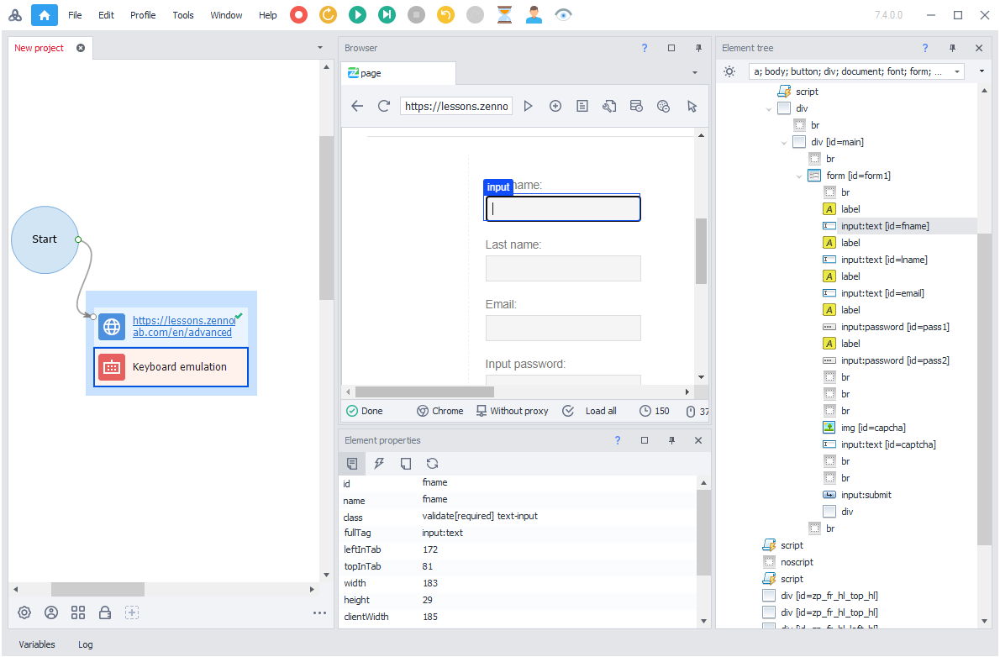
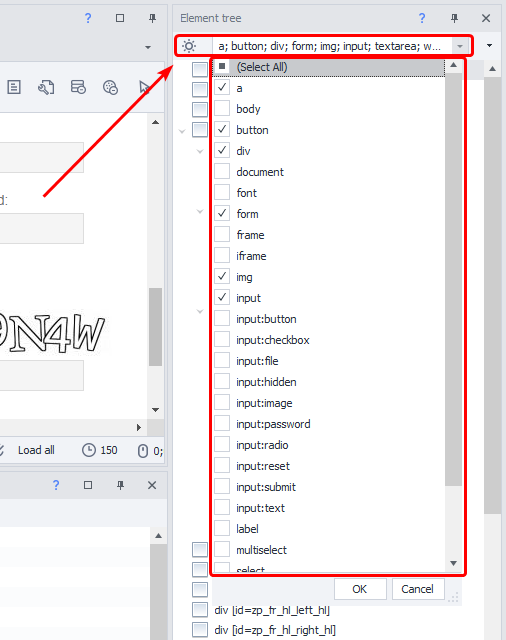
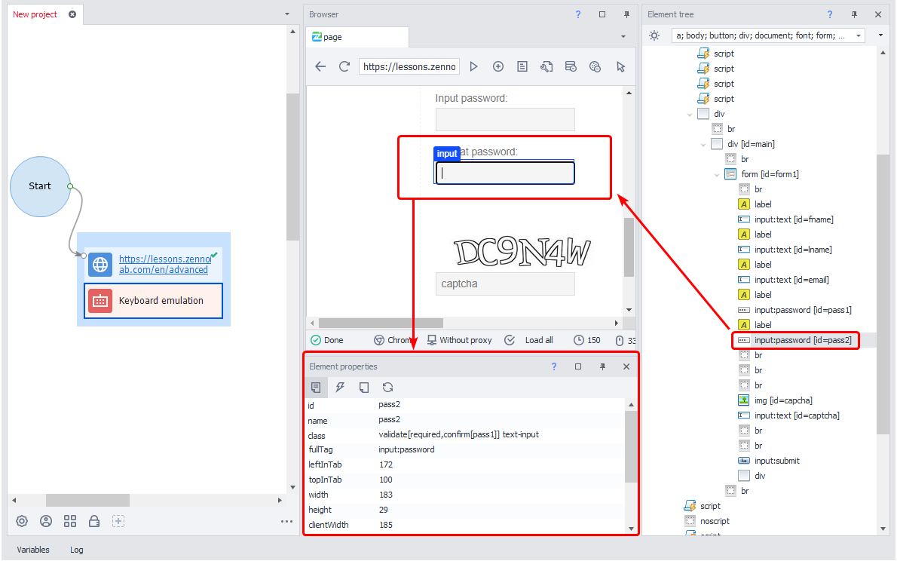

---
sidebar_position: 5
title: "Working with Web Page Elements"
description: ""
date: "2025-07-20"
converted: true
originalFile: "Работа с элементами веб-страниц.txt"
targetUrl: "https://zennolab.atlassian.net/wiki/spaces/RU/pages/486408229/-"
---
:::info **Please read the [*Material Usage Rules on this site*](../Disclaimer).**
:::

> 🔗 **[Original page](https://zennolab.atlassian.net/wiki/spaces/RU/pages/486408229/-)** — Source of this material

_______________________________________________  

## Element Tree

If you can't reach the desired element using the [❗→ action builder](/wiki/spaces/RU/pages/483426337 "/wiki/spaces/RU/pages/483426337"), you can open the [❗→ Element Tree Window](/wiki/spaces/RU/pages/727777355 "/wiki/spaces/RU/pages/727777355") and try to find the element there. In this window, the elements are arranged in a tree structure.

By looking at the elements' visual positions in the tree, you can find nearby elements, nested ones, and those that contain the current element. You can right-click an element in the tree to send its data directly to the action builder.

You can use the filter to highlight only those HTML elements you're interested in:

## Element Properties

When you select an element in the tree, you can view its [❗→ properties in the corresponding window](/wiki/spaces/RU/pages/735608879 "/wiki/spaces/RU/pages/735608879"). The element will also be highlighted in the browser with a border.

You can use these properties in the action builder to create actions.

When you enable [❗→ Follow Cursor Mode](https://zennolab.atlassian.net/wiki/spaces/RU/pages/534315373#%D0%A1%D0%BB%D0%B5%D0%B4%D0%BE%D0%B2%D0%B0%D1%82%D1%8C-%D0%B7%D0%B0-%D0%BA%D1%83%D1%80%D1%81%D0%BE%D1%80%D0%BE%D0%BC "https://zennolab.atlassian.net/wiki/spaces/RU/pages/534315373#%D0%A1%D0%BB%D0%B5%D0%B4%D0%BE%D0%B2%D0%B0%D1%82%D1%8C-%D0%B7%D0%B0-%D0%BA%D1%83%D1%80%D1%81%D0%BE%D1%80%D0%BE%D0%BC"), the element's properties and its position in the tree are updated in real time.