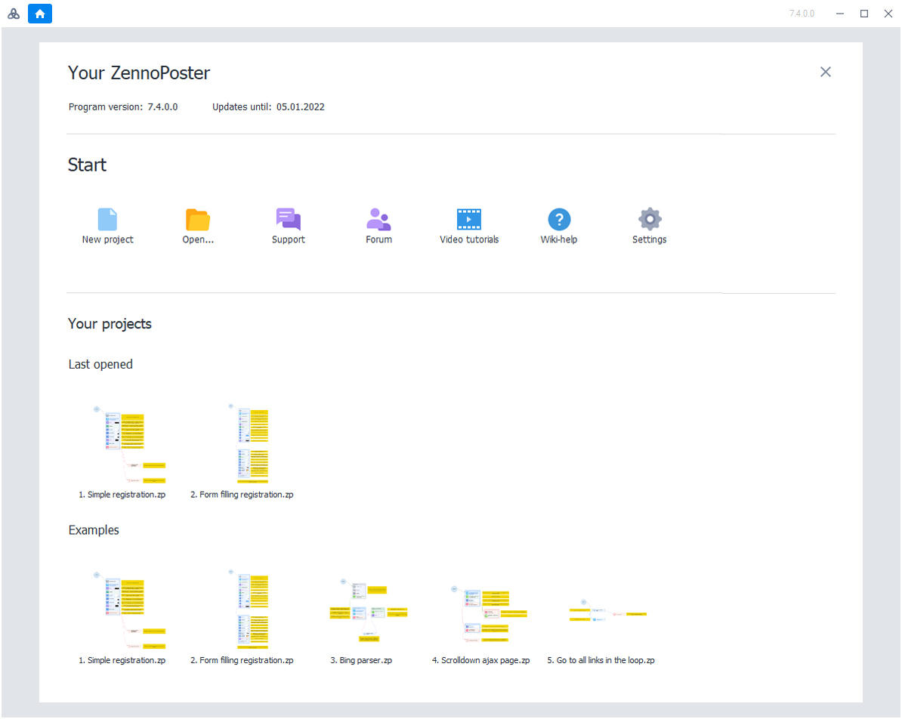
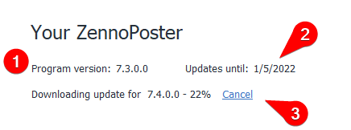
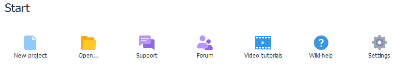
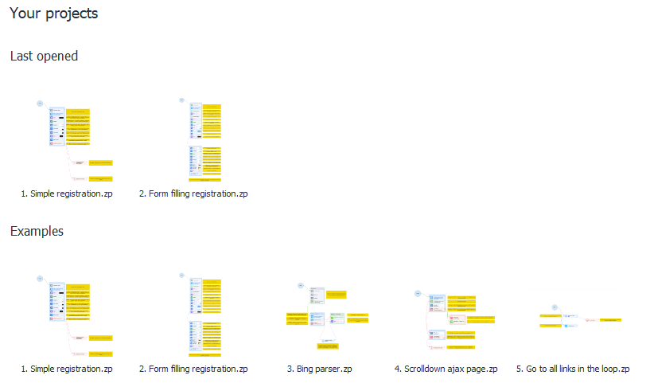
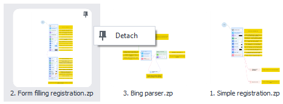

---
sidebar_position: 2
title: "Start Page"
description: ""
date: "2025-07-19"
converted: true
originalFile: "Стартовая страница.txt"
targetUrl: "https://zennolab.atlassian.net/wiki/spaces/RU/pages/735608964"
---
import DisclaimerNotice from '@site/src/components/DisclaimerNotice';

<DisclaimerNotice />

> 🔗 **[Original page](https://zennolab.atlassian.net/wiki/spaces/RU/pages/735608964)** — Source of this material

_______________________________________________  

The start screen is where your journey with ProjectMaker begins!

The start screen consists of three main sections:

1. Your ZennoPoster
2. Getting Started
3. Projects

## Your ZennoPoster

On this screen, you'll find the following information:

1. The current version of the program

2. The date until which your updates are paid for. After purchasing, you get 6 months of free updates. Once the update period ends, the program will still work—it just won't be able to update to a newer version.

:::tip Tip
You can check the prices for updating your version in your personal account.
:::

3. The update loading bar appears during automatic program updates. Once the update is downloaded, you'll be prompted to start installing the new version—the program will close and the update process will launch.

## Getting Started

In this section, you can:

1. Create a new project
2. Open a project from a file
3. Contact support
4. [Open the forum](https://zennolab.com/discussion/ "https://zennolab.com/discussion/") where you can discuss the program, ask questions, or report a bug
5. [❗→ Watch tutorial videos](https://zennolab.atlassian.net/wiki/spaces/RU/pages/475562082/ZennoPoster "https://zennolab.atlassian.net/wiki/spaces/RU/pages/475562082/ZennoPoster")
6. Open the help section in your browser
7. Open [❗→ program settings](/wiki/spaces/RU/pages/475300064 "/wiki/spaces/RU/pages/475300064")

## Your Projects

**This section displays:**

1. Your recently opened projects. You can change the number of projects shown in Settings → Editing → [❗→ Remember the number of recently opened projects](https://zennolab.atlassian.net/wiki/spaces/RU/pages/725385223#%D0%97%D0%B0%D0%BF%D0%BE%D0%BC%D0%B8%D0%BD%D0%B0%D1%82%D1%8C-%D0%BA%D0%BE%D0%BB%D0%B8%D1%87%D0%B5%D1%81%D1%82%D0%B2%D0%BE-%D0%BF%D0%BE%D1%81%D0%BB%D0%B5%D0%B4%D0%BD%D0%B8%D1%85-%D0%BE%D1%82%D0%BA%D1%80%D1%8B%D1%82%D1%8B%D1%85-%D0%BF%D1%80%D0%BE%D0%B5%D0%BA%D1%82%D0%BE%D0%B2 "https://zennolab.atlassian.net/wiki/spaces/RU/pages/725385223#%D0%97%D0%B0%D0%BF%D0%BE%D0%BC%D0%B8%D0%BD%D0%B0%D1%82%D1%8C-%D0%BA%D0%BE%D0%BB%D0%B8%D1%87%D0%B5%D1%81%D1%82%D0%B2%D0%BE-%D0%BF%D0%BE%D1%81%D0%BB%D0%B5%D0%B4%D0%BD%D0%B8%D1%85-%D0%BE%D1%82%D0%BA%D1%80%D1%8B%D1%82%D1%8B%D1%85-%D0%BF%D1%80%D0%BE%D0%B5%D0%BA%D1%82%D0%BE%D0%B2").
2. Sample projects. It's recommended to check them out if you're new to the program.

### Pinning Projects

:::info Information
If you often work with specific projects, you can pin them.
:::

1. Right-click on a project and select Pin
2. Pinned projects will appear at the top of the list
3. You can also unpin them from the same menu:

