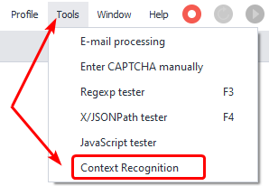
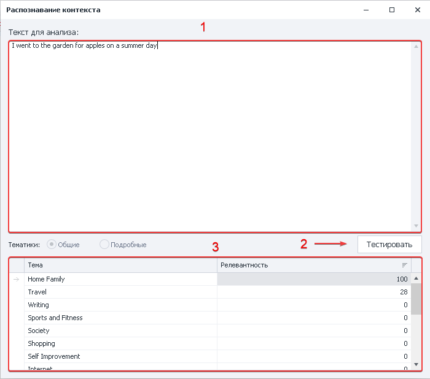
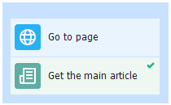

:::info **Please read the [*Material Usage Rules on this site*](../../Disclaimer).**
:::

> 🔗 **[Original Page](https://zennolab.atlassian.net/wiki/spaces/RU/pages/534315397)** — Source of this material

_______________________________________________  

## Description

Allows you to test the [❗→ Context Recognition](https://zennolab.atlassian.net/wiki/spaces/RU/pages/534085781/Contex+Recognition "https://zennolab.atlassian.net/wiki/spaces/RU/pages/534085781/Contex+Recognition") action before using it in a project. You can determine the minimum relevance thresholds.

:::info Information
The tester only understands English.
:::

  

## How do I open the window?

Use the top menu **Tools =&gt; Context Recognition**

  

## What is it used for?

- Determining the topic of the text

  

## How do I work with the window?

The tester lets you check the relevance of a text without running the project.

1. Enter the required text in the appropriate field.
2. Start the text processing.
3. Result — which topics the text can be classified under, in percentages.

  

## Example usage

Go to a website page, identify the main article, and use the tester to check its relevance.

1. Go to the page.
2. Add the [❗→ Article Extraction](https://zennolab.atlassian.net/wiki/spaces/RU/pages/534315067/Article+Extraction "https://zennolab.atlassian.net/wiki/spaces/RU/pages/534315067/Article+Extraction") action.
3. Place the main article into a variable.
4. Add the text to the tester and check the result.

  

## Useful links

1. [❗→ Context Recognition](https://zennolab.atlassian.net/wiki/spaces/RU/pages/534085781/Contex+Recognition "https://zennolab.atlassian.net/wiki/spaces/RU/pages/534085781/Contex+Recognition")
2. [❗→ Article Extraction](https://zennolab.atlassian.net/wiki/spaces/RU/pages/534315067/Article+Extraction "https://zennolab.atlassian.net/wiki/spaces/RU/pages/534315067/Article+Extraction")
3. [❗→ Content Creation](https://zennolab.atlassian.net/wiki/spaces/RU/pages/489095179 "https://zennolab.atlassian.net/wiki/spaces/RU/pages/489095179")