---
sidebar_position: 1
title: "Email Processing"
description: ""
date: "2025-08-25"
converted: true
originalFile: "Обработка e-mail.txt"
targetUrl: "https://zennolab.atlassian.net/wiki/spaces/RU/pages/534086094/e-mail"
---
:::info **Please read the [*Material Usage Rules on this site*](../Disclaimer).**
:::

> 🔗 **[Original page](https://zennolab.atlassian.net/wiki/spaces/RU/pages/534086094/e-mail)** — Source of this material

_______________________________________________  

## Description

Work with email accounts without using a browser window. Allows you to find the needed email and extract information from it. Suitable for handling large volumes of incoming mail.

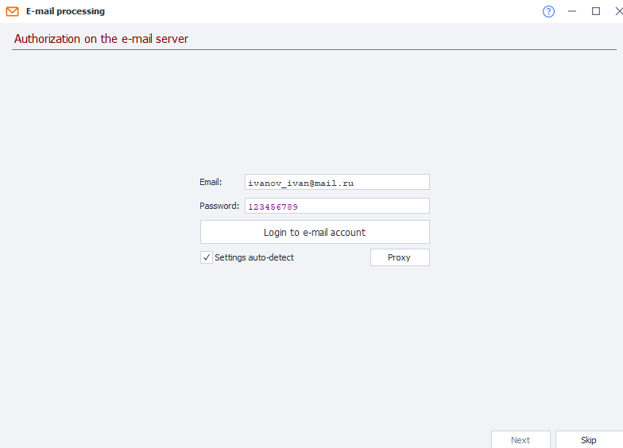

  

## How to add the action to your project?

- Through the *Tools menu:

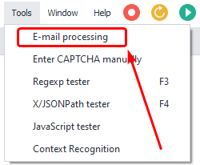

- You can also [❗→ add a button](https://zennolab.atlassian.net/wiki/spaces/RU/pages/735576065#%D0%9D%D0%B0%D1%81%D1%82%D1%80%D0%BE%D0%B9%D0%BA%D0%B8-%D0%BA%D0%BD%D0%BE%D0%BF%D0%BE%D0%BA-%D0%BC%D0%B5%D0%BD%D1%8E "https://zennolab.atlassian.net/wiki/spaces/RU/pages/735576065#%D0%9D%D0%B0%D1%81%D1%82%D1%80%D0%BE%D0%B9%D0%BA%D0%B8-%D0%BA%D0%BD%D0%BE%D0%BF%D0%BE%D0%BA-%D0%BC%D0%B5%D0%BD%D1%8E") for quick access:

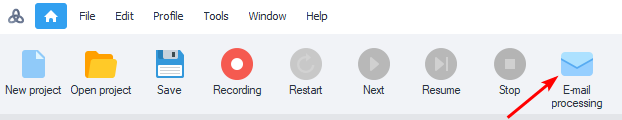

You can also add it using the [❗→ Receive Mail tool](https://zennolab.atlassian.net/wiki/spaces/RU/pages/735576144 "https://zennolab.atlassian.net/wiki/spaces/RU/pages/735576144") by switching to *Advanced view.

  

## What is this used for?

- Quick access to emails
- Extracting data from emails
- Account activation on websites
- Deleting specific emails from the inbox
- Deleting downloaded emails

  

## How to set it up?

:::note Note
Before working with this action, make sure the IMAP option is enabled in your account.
:::

### Email account login settings

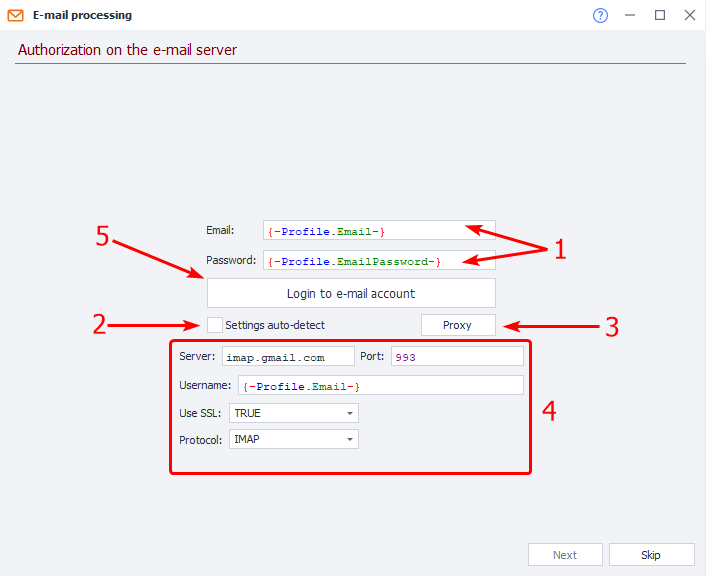

1. Enter your login and password for the account, or variables containing them.
2. If you check the box, Zennoposter will automatically select the parameters for connecting to the mail server. **This doesn’t work with all services.**
3. Choose whether to work with a proxy or through your provider.
4. If Zennoposter couldn’t auto-detect the settings, enter the IMAP connection data. You can get these from the mail service’s website.
5. After filling out all fields, click *Log in to mail to move to the next step.

:::note Note
If an error occurs at this stage, a comment will appear in the bottom left corner.
:::

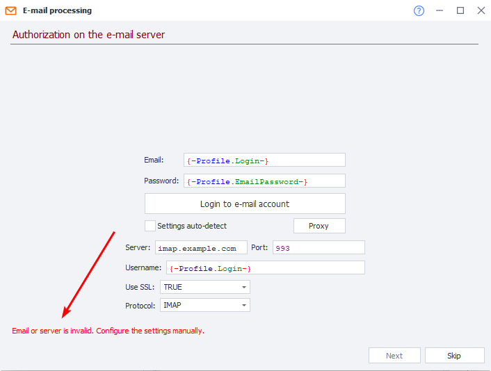

Fix the error according to the recommendations.

  

### Searching for the needed email from all messages

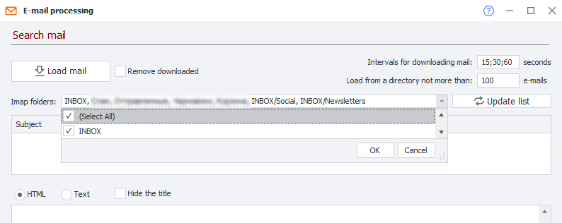

#### Download intervals for emails

Emails from services may be delayed. Here, specify the time interval in seconds and the number of attempts to download the list of emails. The separator “**;**“ on the screenshot indicates the number of attempts: the first after *15 sec, the second at *30 sec, and the third at *60 sec.

#### Download no more than

Specify the number of emails to be downloaded.

#### Delete downloaded

Deletes all downloaded emails. If you entered 200 in the previous setting, all 200 will be removed from the mailbox.

#### Update list

Fetch the folders from the mailbox.

#### IMAP folders

Select the folders where you want to search for the necessary email — *Inbox, Spam, Sent, Drafts, etc. If you leave this field blank, the download will be from *Inbox and *Spam only.

#### Download emails

Zennoposter will download all emails from the mailbox according to the parameters above.

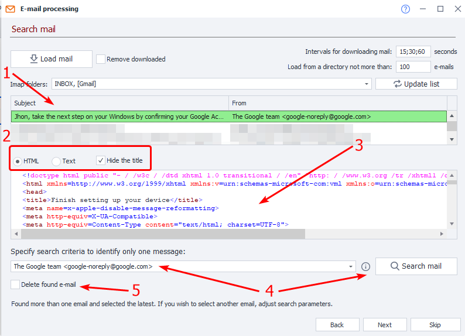

#### List of downloaded emails

#1 on the screenshot

This field will show all downloaded emails along with the *Subject, Name, and Email of the sender.

#### Ways to display email content

#2 on the screenshot

- in original HTML code.
- text only.
- Hide headers (show or hide technical headers).

#### Email body

#3 on the screenshot

Displays the body of the email.

#### Email search criteria

Specify your search criteria using [❗→ regular expressions](https://zennolab.atlassian.net/wiki/spaces/RU/pages/534086111 "https://zennolab.atlassian.net/wiki/spaces/RU/pages/534086111") and click *Search email. If everything is set up correctly, the required email will be highlighted in **green** in the **List of downloaded emails**.

#### Delete found email

If this option is enabled, the found email will be deleted after processing.

Click *Next to proceed to the next step.

:::note Note
The email must be present in the mailbox.
:::

  

### Searching for an element in the selected email

#### List of regular expressions and found elements

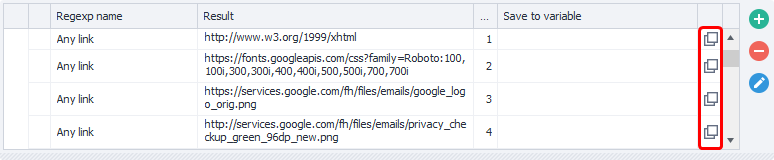

##### **RegExp Name**

The name of the regular expression.

##### **Result**

What was found using the expression.

##### **Match number**

Often one regular expression returns several results. Here you see the ordinal number of the match (starting from zero!).

:::warning Attention
It’s not recommended to tie your project to a match number. Today the email may use one structure with the needed link second; tomorrow the text changes and the needed link is number 7. Try to craft your regular expressions so that only one match remains as a result.
:::

##### **Save to variable**

In this column, you should select (or create a new) variable to save the result of the regular expression.

##### **Copy variable macro to clipboard**

With the buttons outlined in red in the screenshot, you can copy the [❗→ variable macro](https://zennolab.atlassian.net/wiki/spaces/RU/pages/486309922 "https://zennolab.atlassian.net/wiki/spaces/RU/pages/486309922").

:::tip Tip
You can save results from several regular expressions at once! For example, an email might have an activation code, website address, phone number, and name — you can extract all of these in one go! Just create an individual regular expression and variable for each element you want to capture.
:::

#### Editing regular expressions

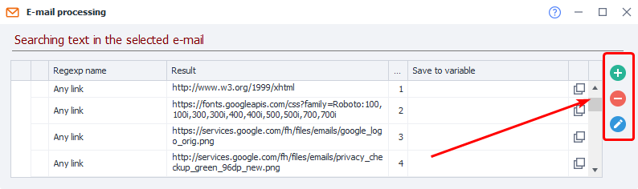

If none of the pre-configured regular expressions fit your needs, you can create your own.

##### **Create from scratch**

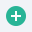  
After clicking the button with the **+** symbol, a window for the [❗→ Regular Expression Builder](https://zennolab.atlassian.net/wiki/spaces/RU/pages/534086111 "https://zennolab.atlassian.net/wiki/spaces/RU/pages/534086111") will open, with the email text already inserted. All that's left is to create your expression, give it a name (to distinguish it from others), and click OK. Your regular expression will then appear in the shared list.

##### **Delete**

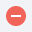  
Clicking the **-** (minus) button will delete the currently selected expression in the list.

:::warning Attention
You can delete only user-created expressions.
:::

##### **Edit**

  
With this option, you can edit the selected expression.  
If you selected a pre-configured expression to edit, after clicking OK in the [❗→ Expression Builder](https://zennolab.atlassian.net/wiki/spaces/RU/pages/534086111 "https://zennolab.atlassian.net/wiki/spaces/RU/pages/534086111"), a new regular expression will be added to the general list.  
If you selected a user-created expression, after clicking OK in the *Builder your changes will be saved to the same, selected, regular expression.

  

### Completion

Once you’ve finished searching for the needed information, click *Finish.

  

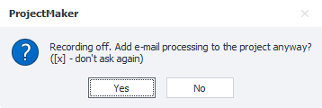

Zennoposter will suggest adding the [❗→ Receive mail](https://zennolab.atlassian.net/wiki/spaces/RU/pages/735576144 "https://zennolab.atlassian.net/wiki/spaces/RU/pages/735576144") action to your project for further use.

:::warning Attention
If there are two identical emails in your mailbox, the action will process the newest one.
:::

  

## Useful links

1. [❗→ Receive mail](https://zennolab.atlassian.net/wiki/spaces/RU/pages/735576144 "https://zennolab.atlassian.net/wiki/spaces/RU/pages/735576144")
2. [❗→ Regular expression tester](https://zennolab.atlassian.net/wiki/spaces/RU/pages/534086111 "https://zennolab.atlassian.net/wiki/spaces/RU/pages/534086111")
3. [❗→ List](https://zennolab.atlassian.net/wiki/spaces/RU/pages/534053375 "https://zennolab.atlassian.net/wiki/spaces/RU/pages/534053375")