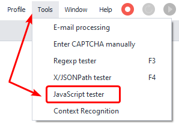
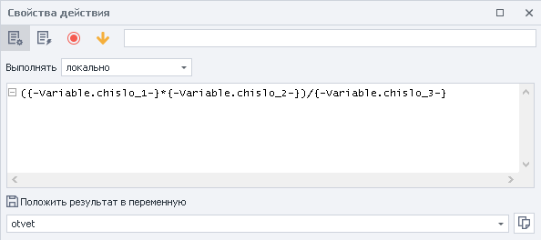
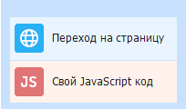

---
sidebar_position: 5
title: "JavaScript Tester"
description: ""
date: "2025-08-25"
converted: true
originalFile: "Тестер JavaScript.txt"
targetUrl: "https://zennolab.atlassian.net/wiki/spaces/RU/pages/534086128/JavaScript"
---
import DisclaimerNotice from '@site/src/components/DisclaimerNotice';

<DisclaimerNotice />

> 🔗 **[Original page](https://zennolab.atlassian.net/wiki/spaces/RU/pages/534086128/JavaScript)** — Source of this material

_______________________________________________  
## Description

This tool allows you to check if your local JS code works correctly. The tester generates code for inserting into an action.

:::info Information
Works only with code executed locally
:::

  

## How do I open the window?

Use the top menu: **Tools =&gt; JavaScript Tester**.

  

## What is this used for?

- Check your JS before using it in a project
- Generate code for use in a template

  

## How do I use the window?

1. Fields for the code you want to check.
2. The format you need to insert the code in the action [❗→ JavaScript](https://zennolab.atlassian.net/wiki/spaces/RU/pages/489259137/JavaScript "https://zennolab.atlassian.net/wiki/spaces/RU/pages/489259137/JavaScript").
3. The result of the code execution.
4. Run a test of your code.
5. Close the tester.

Example

You need to do some math calculations in JS using variables.

Action [❗→ JavaScript](https://zennolab.atlassian.net/wiki/spaces/RU/pages/489259137/JavaScript "https://zennolab.atlassian.net/wiki/spaces/RU/pages/489259137/JavaScript") and variables.

Before using it in your project, let's run the tester and check that the code syntax and execution are correct.

The tester showed that we wrote the code correctly—just replace the static values with variables and add it to the action [❗→ JavaScript](https://zennolab.atlassian.net/wiki/spaces/RU/pages/489259137/JavaScript "https://zennolab.atlassian.net/wiki/spaces/RU/pages/489259137/JavaScript").

  

## Usage Example

Go to the page and run [❗→ JavaScript](https://zennolab.atlassian.net/wiki/spaces/RU/pages/489259137/JavaScript "https://zennolab.atlassian.net/wiki/spaces/RU/pages/489259137/JavaScript").

1. Log in on the website.
2. Place your code into the tester and check that it works.
3. Copy the code for your project.
4. Add the [❗→ JavaScript](https://zennolab.atlassian.net/wiki/spaces/RU/pages/489259137/JavaScript "https://zennolab.atlassian.net/wiki/spaces/RU/pages/489259137/JavaScript") action in the format from the tester.

So not only do you test your code before using it in your project, but **Zennoposter** will also tell you in what format it should be added to the action.

  

## Useful links

1. [❗→ JavaScript](https://zennolab.atlassian.net/wiki/spaces/RU/pages/489259137/JavaScript "https://zennolab.atlassian.net/wiki/spaces/RU/pages/489259137/JavaScript")
2. [❗→ Project variables](https://zennolab.atlassian.net/wiki/spaces/RU/pages/735608872 "https://zennolab.atlassian.net/wiki/spaces/RU/pages/735608872")