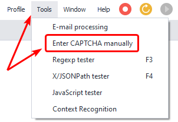
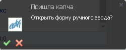
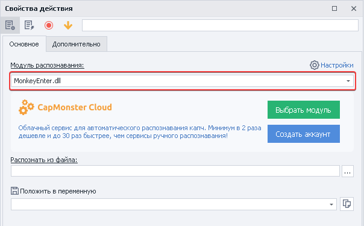
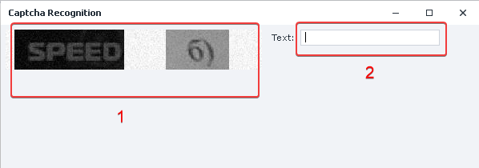
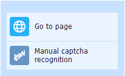

:::info **Please read the [*Material Usage Rules on this site*](../../Disclaimer).**
:::

> 🔗 **[Original page](https://zennolab.atlassian.net/wiki/spaces/RU/pages/534053215)** — Source for this material

_______________________________________________  

## Description

Website protection with captchas is getting tougher every day, making mass operations more difficult. If services can't solve a captcha, you can always do it manually.

:::warning Attention
This action works only with simple, text-based captchas. You won't be able to solve Recaptcha, Funcaptcha, HCaptcha, or other advanced captchas using this method.
:::

  

## How do you open the window?

Use the top menu **Tools =&gt; Manual Captcha Entry**.

You can also open it through the pop-up window in the bottom right corner (this window appears when sending from the [❗→ Solve Captcha](https://zennolab.atlassian.net/wiki/spaces/RU/pages/534053026 "https://zennolab.atlassian.net/wiki/spaces/RU/pages/534053026") action).

  

## What is this used for?

- Solving captchas without using services.

  

## How do you use the window?

### Preparation

Add the [❗→ Solve Captcha](https://zennolab.atlassian.net/wiki/spaces/RU/pages/534053026 "https://zennolab.atlassian.net/wiki/spaces/RU/pages/534053026") action to your project.

From the list, select the **MonkeyEnter.dll** recognition module.

  

### Solving a captcha

1. The captcha you need to solve.
2. Enter the result.
3. Press the **Enter** key.
4. The answer is stored in the variable that you specified when configuring the [❗→ Solve Captcha](https://zennolab.atlassian.net/wiki/spaces/RU/pages/534053026 "https://zennolab.atlassian.net/wiki/spaces/RU/pages/534053026") action.

:::warning Attention
This method is not suitable for solving ReCaptcha2, ReCaptcha3, FunCaptcha, or hCaptcha.
:::

  

## Usage example

Suppose you need to send a message on a forum where there's a captcha that services can't handle.

1. Add the [❗→ Solve Captcha](https://zennolab.atlassian.net/wiki/spaces/RU/pages/534053026 "https://zennolab.atlassian.net/wiki/spaces/RU/pages/534053026") action to your project.
2. Select the **MonkeyEnter.dll** recognition module.
3. Open the captcha entry window in any way you prefer.
4. Enter the solved captcha.
5. Send the message.

This way, if you encounter a new kind of captcha, your work won't be interrupted. You can always use manual entry as an alternative to services.

  

## Useful links

1. [❗→ Solve Captcha](https://zennolab.atlassian.net/wiki/spaces/RU/pages/534053026 "https://zennolab.atlassian.net/wiki/spaces/RU/pages/534053026")
2. [❗→ Solve ReCaptcha](https://zennolab.atlassian.net/wiki/spaces/RU/pages/534053033/ReCaptcha "https://zennolab.atlassian.net/wiki/spaces/RU/pages/534053033/ReCaptcha")