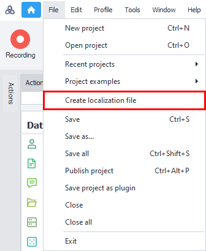
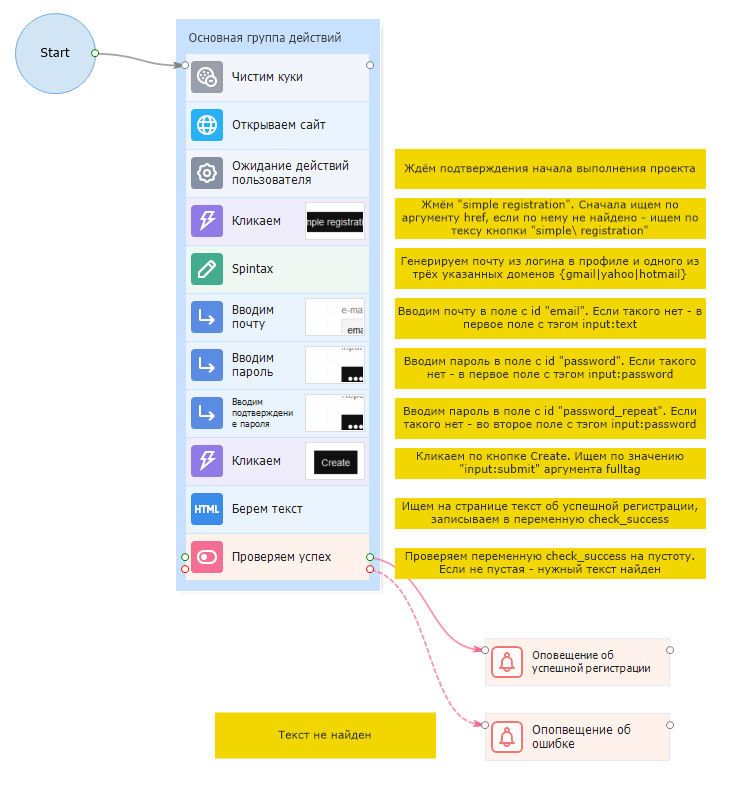
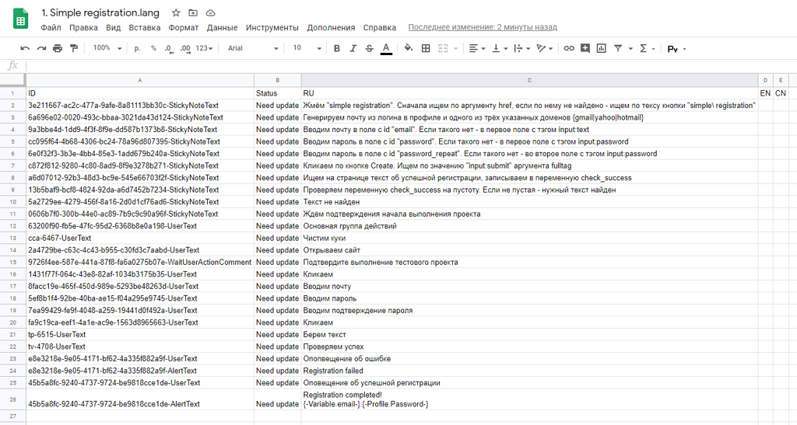
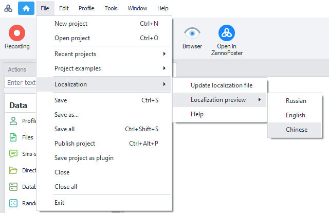
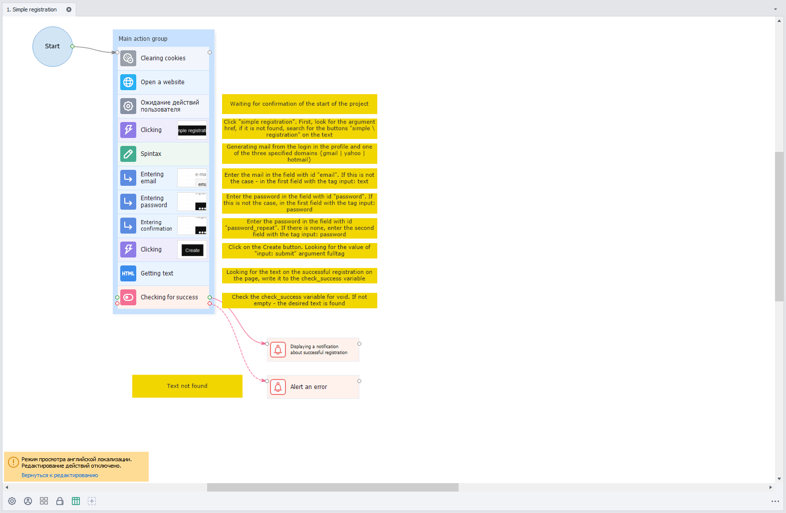

---
sidebar_position: 10
title: "Project Localization (Translating Templates to Other Languages)"
description: ""
date: "2025-08-25"
converted: true
originalFile: "Локализация проектов (Перевод шаблонов на другие языки).txt"
targetUrl: "https://zennolab.atlassian.net/wiki/spaces/RU/pages/744423487"
---
import DisclaimerNotice from '@site/src/components/DisclaimerNotice';

<DisclaimerNotice />

> 🔗 **[Original page](https://zennolab.atlassian.net/wiki/spaces/RU/pages/744423487)** — Source of this material

_______________________________________________  

## General Information

:::tip Tip
The project localization feature allows you to adapt your projects for foreign audiences by replacing the project’s informational text fields with translations specified in a special file.
:::

## Creating a Translation File

The translation file is a .csv table separated by commas. You can open it with any spreadsheet editor. You may also add the translation file to your project as a static “Table” or “Google Table” block, after first importing it into Google Docs.

:::note Note
One way to translate might be to use a project that automatically translates the table text using the “Text Processing – Translate Text” action.
:::

You can create the table using ProjectMaker’s main menu: File → Create translation file:

:::info Info
Clicking this button will collect and write the following project text fields to the file: Note textMessage text of the “Wait for User Actions” action Alert action textsAction commentsAction group comments
:::

:::tip Tip
Localized alerts and messages will also be translated during ZennoPoster project execution.
:::

So, for the following project:

The following translation table will be generated:

:::info Info
The project’s current values will be written in the column corresponding to the program’s current localization.
:::

## Editing the Table

The table consists of 5 columns:

| **Column name** | **Description** |
| --- | --- |
| ID | The ID of the element to be translated, used for applying the translation |
| Status | The translation element’s status, used to track whether the data is up to date.  Status "Need update" is set: - By default, for all elements; - When alternative localization texts are missing; - The first time you update the file after changing the text in the project;  Status "Ok" is set: - When at least one alternative localization text exists;  Status "Not found" is set: - When the element with the specified ID is missing from the project. |
| RU | The text of the element’s Russian localization |
| EN | The text of the element’s English localization |
| CN | The text of the element’s Chinese localization |

You can freely edit the columns containing alternative localization texts and the status column.

:::tip Tip
Any changes to the file take effect immediately—no need to reload the project or program.
:::

:::note Note
If you change the ID column, the element will not be found in the project and will be given the status “Not found”. This also happens if you delete the element from the project, so it’s not recommended to edit this parameter. If you change the current localization column in the table (rather than in the project itself), the file will become outdated, and the element won’t be considered translated. In this case, when you try to view the translation for another localization, you’ll be prompted to update the file.
:::

:::warning Warning
To avoid translation file loading errors, it’s recommended to make all table changes using spreadsheet editors.
:::

## Updating the Translation File

:::tip Tip
The update file feature is required to write new values to the file and to update the text of the current localization for elements.
:::

If a translation file is present next to your project, there will be a “Localization” menu section with buttons to update the file and view other project localizations:

When you click “Update translation file,” the program will collect the current project text field values and match them with their entries in the file. Existing elements will have their current localization text and status updated. New elements will be added with the status “Need update”, and elements that exist in the file but weren’t found in the project will receive the status “Not found”.

## Translating the Project

:::tip Tip
Translating a project is done by replacing the text of translated elements with the texts specified in the localization file when viewing a localization or when opening a project created in a localization different from the program’s current one.
:::

During replacement, the program checks both element IDs and compares the current element value in the project with the localization text in the file. So if the text was changed in the project and the file wasn’t updated, that element is considered outdated and won’t be translated when opening the project in a different localization. However, when viewing a localization, you’ll be prompted to update the file—without doing so, viewing will not be available. This logic is meant to prevent discrepancies between the project’s original text and the file’s original localization text when viewing translations, while still allowing as many translated elements as possible to be used when opening a project directly in another localization.

:::info Info
If there’s no translation for a particular element in the localization you’re viewing, that element’s text won’t be changed and will remain as it appears in the project’s original localization.
:::

## Viewing the Translation

:::tip Tip
The View Translation feature translates the project exactly as if you opened it in another program localization.
:::

:::warning Warning
While viewing the translation, you cannot run, record, save, or edit the project.
:::

To exit translation view mode, click the “Return to editing” button in the info panel or, in the menu, select “View translation” for the program’s current localization.

If the translation table file gets damaged or deleted while viewing, the project will revert to its original state and display an error message.

:::note Note
Also, please note that unlike action group comments and the actions themselves, notes do not auto-adjust their size depending on their text.
:::