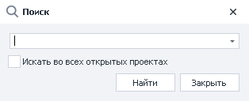
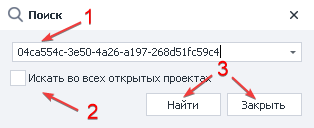
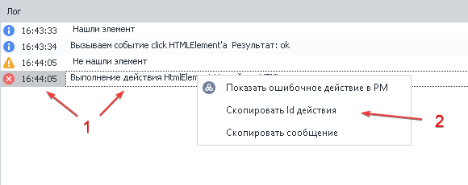

---
sidebar_position: 8
title: "Project Search"
description: ""
date: "2025-08-25"
converted: true
originalFile: "Поиск по проекту.txt"
targetUrl: "https://zennolab.atlassian.net/wiki/spaces/RU/pages/724566074"
---
:::info **Please review the [*Rules for Using Materials on This Resource*](../Disclaimer).**
:::

> 🔗 **[Original page](https://zennolab.atlassian.net/wiki/spaces/RU/pages/724566074)** — Source of this material

_______________________________________________  

## Description

Allows you to find an action in the project by its id or by the variable it uses.

  

## How to open the window in ProjectMaker?

- Use the **CTRL+F** hotkey
- For convenience, you can also put a button on the top Toolbar. How to do this can be [❗→ read here](https://zennolab.atlassian.net/wiki/spaces/RU/pages/735576065#%D0%9D%D0%B0%D1%81%D1%82%D1%80%D0%BE%D0%B9%D0%BA%D0%B8-%D0%BA%D0%BD%D0%BE%D0%BF%D0%BE%D0%BA-%D0%BC%D0%B5%D0%BD%D1%8E "https://zennolab.atlassian.net/wiki/spaces/RU/pages/735576065#%D0%9D%D0%B0%D1%81%D1%82%D1%80%D0%BE%D0%B9%D0%BA%D0%B8-%D0%BA%D0%BD%D0%BE%D0%BF%D0%BE%D0%BA-%D0%BC%D0%B5%D0%BD%D1%8E").

  

## What is this used for?

- Project debugging
- Searching for errors, variables, and actions
- Quick navigation to a project element

  

## How does the search work?

1. Enter the action id or variable name in the field.
2. Check the box if you have more than one project open and need to search in all of them.
3. Start the process or close the window.

:::info Information
The screenshot shows an error id. How to get it is described below.
:::

  

### How to get the action id

While working on your project, errors may occur in the [❗→ log](https://zennolab.atlassian.net/wiki/spaces/RU/pages/725352532 "https://zennolab.atlassian.net/wiki/spaces/RU/pages/725352532").

1. Hover your mouse over the message and right-click it.
2. Click the corresponding section.

:::note Note
Starting from ZennoPoster 7.3.2.0 you can copy the id not only from error messages, but from any message at all.
:::

  

## Usage example

After you have created your project in ProjectMaker, you decide to run it in Zennoposter. During execution, one of the threads shows an error—you need to find and fix it.

1. Copy the error code to the clipboard.
2. Open the Project Search window.
3. Paste the error id.
4. You will be taken to the action where the error occurred in that particular thread.
5. Fix the error or change the logic.

This method works not only for your own templates, but also for purchased ones. Often, authors sell their products in a closed form, and you will not be able to view or edit them. Simply copy the error and send it to the developer for further troubleshooting.

  

## Useful links

1. [❗→ Log](https://zennolab.atlassian.net/wiki/spaces/RU/pages/725352532 "https://zennolab.atlassian.net/wiki/spaces/RU/pages/725352532")