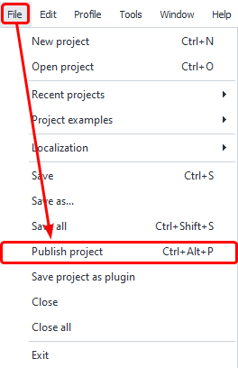
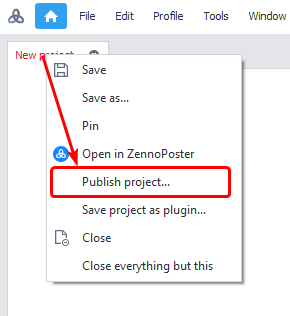
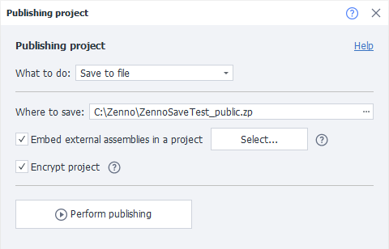
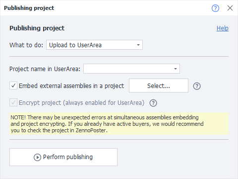
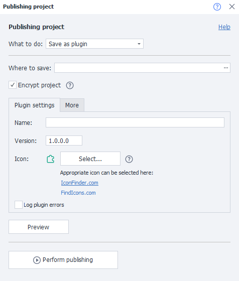

:::info **Please read the [*Material Usage Rules on this site*](../../Disclaimer).**
:::

> 🔗 **[Original page](https://zennolab.atlassian.net/wiki/spaces/RU/pages/724566067)** — Source of this material

_______________________________________________  
  
## Description

Publishing will gather all dependent libraries, encrypt, archive, and package them into a new template. Template sellers no longer need to manually collect a set of libraries and include them with the template, or specify instructions for where those libraries should be located. All of the project execution rights you configured will remain unchanged. And with the new upload feature in your [User Area](https://userarea.zennolab.com/lk/login.aspx "https://userarea.zennolab.com/lk/login.aspx"), you don’t have to spend much time supporting and updating your project—just upload the update from ProjectMaker, and your clients will get the update automatically.

  

## How do you open the window?

- Use the hotkey combination `Ctrl+Alt+P` (default combination)
- Via the top menu ***File***=&gt;***Publish Project***

- By right-clicking the tab of the desired template in the open projects panel

  

## What is this used for?

- To provide access to a template for users of [❗→ ZennoBox](https://zennolab.atlassian.net/wiki/spaces/RU/pages/495386651 "https://zennolab.atlassian.net/wiki/spaces/RU/pages/495386651") or Zennoposter on a subscription basis.
- [❗→ To save plugins](https://zennolab.atlassian.net/wiki/spaces/RU/pages/475365697 "https://zennolab.atlassian.net/wiki/spaces/RU/pages/475365697");
- To encrypt projects that use third-party libraries.

  

## Features

- Package external dependencies into a single project. Now you no longer need to worry about how to transfer “External Dependencies” to the user.
- Speeds up project execution and startup thanks to precompilation of all project logic and code.
- Improves security: even if your account is stolen, the project cannot be opened.

  

## How to use the tool?

### What should you do?

Here, you need to select what you want to do with the project:

- Save to a local file.
- Upload to [❗→ UserArea](https://zennolab.atlassian.net/wiki/spaces/RU/pages/494895200 "https://zennolab.atlassian.net/wiki/spaces/RU/pages/494895200").
- Save as a [❗→ plugin](https://zennolab.atlassian.net/wiki/spaces/RU/pages/475365697 "https://zennolab.atlassian.net/wiki/spaces/RU/pages/475365697").

:::note Note
When uploading to UserArea, the project must already exist there.
:::

:::warning Attention
When saving a project as a plugin, you need to use BotUI as the input configuration. It’s also recommended to read the Plugins article.
:::

  

### Save to File

#### Where to save

You’ll need to specify the local path on your computer where you want to save the project.

#### Embed external libraries

:::note Note
This option appears only if you use external libraries.
:::

If you’ve added external libraries using the [❗→ References from GAC](https://zennolab.atlassian.net/wiki/spaces/RU/pages/534315491 "https://zennolab.atlassian.net/wiki/spaces/RU/pages/534315491") block, then you also need to select which libraries will be “embedded” into the project and encrypted.

:::warning Attention
If errors occur, you’ll have to place the libraries next to the .zp project file.
:::

#### Encrypt project

It’s recommended to check “Encrypt project” when you use third-party libraries.

### Upload to UserArea

All you need to select here is the project name from the dropdown list. For more details on how to sell projects through UserArea and what ZennoBox is, see the related articles: [❗→ Selling bots](https://zennolab.atlassian.net/wiki/spaces/RU/pages/494895200 "https://zennolab.atlassian.net/wiki/spaces/RU/pages/494895200") and [❗→ ZennoBox](https://zennolab.atlassian.net/wiki/spaces/RU/pages/495386651 "https://zennolab.atlassian.net/wiki/spaces/RU/pages/495386651") .

#### Embed external libraries

Described above.

If you’ve added external libraries using the [❗→ References from GAC](https://zennolab.atlassian.net/wiki/spaces/RU/pages/534315491 "https://zennolab.atlassian.net/wiki/spaces/RU/pages/534315491") block, then you also need to select which libraries will be “embedded” into the project and encrypted.

### Save project as a plugin

:::note Note
See the Plugins article for details
:::

  

## Limitations

You must add all the assemblies you want to publish to dependent assemblies (if library 1 you’re connecting depends on library 2, you’ll need to add both to Reference). Sometimes this isn’t possible, since some third-party assemblies might use features that cause packing and encryption to fail, or may make the finished template unusable. If your project uses external dependencies, always check that the project works as expected. If something doesn’t work, try excluding assemblies from merging first.

  

## Useful links

- [❗→ Selling bots](https://zennolab.atlassian.net/wiki/spaces/RU/pages/494895200 "https://zennolab.atlassian.net/wiki/spaces/RU/pages/494895200")
- [❗→ ZennoBox](https://zennolab.atlassian.net/wiki/spaces/RU/pages/495386651 "https://zennolab.atlassian.net/wiki/spaces/RU/pages/495386651")
- [❗→ Plugins](https://zennolab.atlassian.net/wiki/spaces/RU/pages/475365697 "https://zennolab.atlassian.net/wiki/spaces/RU/pages/475365697")
- [❗→ Encryption](https://zennolab.atlassian.net/wiki/spaces/RU/pages/534315498 "https://zennolab.atlassian.net/wiki/spaces/RU/pages/534315498")