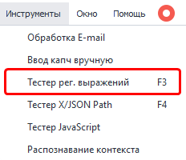
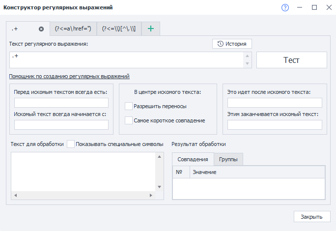
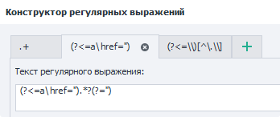
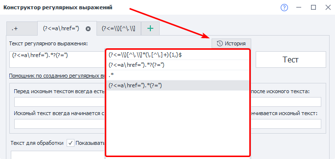
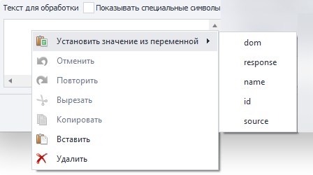
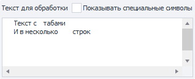
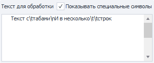
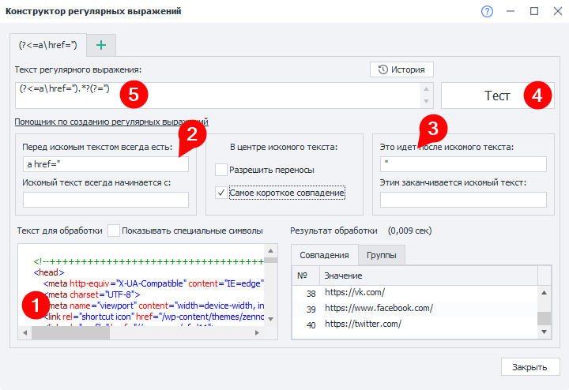

---
sidebar_position: 3
title: "Regular Expression Tester"
description: ""
date: "2025-08-25"
converted: true
originalFile: "Тестер регулярных выражений.txt"
targetUrl: "https://zennolab.atlassian.net/wiki/spaces/RU/pages/534086111"
---
:::info **Please review the [*Terms of Use for materials on this site*](../Disclaimer).**
:::

> 🔗 **[Original page](https://zennolab.atlassian.net/wiki/spaces/RU/pages/534086111)** — Source of this material

_______________________________________________  
  
## Description

Regular expressions are a kind of filter for searching text strings that match specific conditions. The built-in regular expression builder lets you quickly create rules without needing to dive deep into their intricacies.

  

## Where are regular expressions used?

- Extracting information from website pages
- Filtering data in lists and tables
- Searching for an email or registration confirmation link
- Finding a specific piece of text
- Looking for lines to delete in lists
- And many other helpful uses

  

## How can you quickly create a regular expression in ZennoPoster?

To help with this task you can use the *Regular Expression Tester*. You can find it in the menu **Tools → Regex Tester**




### Regular Expression Tester window




#### Tabs




You can work on several regular expressions simultaneously in different tabs. The tab title uses the regular expression's text.

#### History




All expressions you've tested using the *Test* button are saved here.

#### Regular expression text

This is where the regular expression's text will appear. You can edit the text in this field.

:::warning Attention
If you make changes in the fields and checkboxes in the Regex Builder group, any edits you made manually to the expression's text will be lost!
:::

#### Test button

After clicking, the expression from *Regular expression text* is applied to the *Text to process*. You can see the results in *Processing result*.

#### Always before searched text, This comes after the searched text

This text is searched for but won't be included in the expression's result.

#### Searched text always starts with, Searched text ends with

This text will be included in the result.

#### Allow line breaks

Enable/disable multiline search.

#### Shortest match

When enabled, the results will include the shortest substring that matches the constructed expression.

#### Text to process

Enter the text that you want to search through in this field.

You can insert data into this field directly from a project variable: **Right-click => Set value from variable**.

:::info Information
The option to set a value from a variable was added in ZennoPoster 7.4.0.0
:::




The drop-down list will show variables from the currently active project.

##### **Show special characters**

Should newlines, tabs (and a few other characters) be displayed as special symbols?

**Disabled**




**Enabled**




#### Processing result

##### **Matches tab**

This is where the result of applying the regular expression to the text is displayed.

##### **Groups tab**

This is where the results will appear if you use grouped regular expressions. You can find examples of such expressions in the description of the action [❗→ Process text =&gt; Regex =&gt; To variables](https://zennolab.atlassian.net/wiki/spaces/RU/pages/488865793#Regex "https://zennolab.atlassian.net/wiki/spaces/RU/pages/488865793#Regex").

  

## Example of usage

Let's look at a specific and common task—parsing links. Suppose you've got the HTML of some DIV or even [❗→ the entire page DOM](https://zennolab.atlassian.net/wiki/spaces/RU/pages/735903769 "https://zennolab.atlassian.net/wiki/spaces/RU/pages/735903769") and you need to parse all the links from this code and save them to a [❗→ list](https://zennolab.atlassian.net/wiki/spaces/RU/pages/534053375 "https://zennolab.atlassian.net/wiki/spaces/RU/pages/534053375"). 




1. Paste your original code, where you'll be searching for links, into the field (to quickly insert code from the currently active tab into the *Tester*, use the [❗→ View page text](https://zennolab.atlassian.net/wiki/spaces/RU/pages/735903769 "https://zennolab.atlassian.net/wiki/spaces/RU/pages/735903769") window).
2. Specify the substring that usually comes before the link, namely the `a href=”` tag.
3. Add the quotation mark that closes the link string. Don't forget the "Shortest match" checkbox, since you want to capture only what's between two quotation marks.
4. Click the "Test" button and the needed list of links will appear in the "Processing result" field (provided there are matches). If you get the wrong output, try changing the search conditions.
5. You can now copy the regular expression and use it in your template, for example in the [❗→ Process text → Regex](https://zennolab.atlassian.net/wiki/spaces/RU/pages/488865793 "https://zennolab.atlassian.net/wiki/spaces/RU/pages/488865793") action.

:::note Tip
A regular expression will find as many substrings as there are in your text. If you need a specific match number, use ranges.
:::

  

## Characters with special meaning

Most characters in a regular expression represent themselves, except for special characters `[` `]` `\` `/` `^` `.` `|` `?` `*` `+` `(` `)` `{` `}`, which can be escaped with `\` (backslash) to treat them as literal text. So the simplest regular expression looks like `abc`, which will match the string **abc**. 

| **Special character** | **Meaning** | **Example** | **Matches** |
| --- | --- | --- | --- |
| ```*``` | Zero or more repetitions | ```ab*c``` | `abc`, `abbc`, `ac` |
| ```.``` | Any single character except newline | `a.c` | `aac` |
| ```+``` | One or more repetitions | `ab+c` | `abc`, `abbc` |
| ```?``` | Zero or one repetition | `ab?c` | `abc`, `ac` |
| ```\|``` | "OR" operator | ```a\|b\|c``` | `a`, `b`, `c` |
| ```()``` | Grouping | ```zennolab(com)+``` | `zennolabcom`, `zennolabcomcom` |
| ```[]``` | Character set—matches one character from the set | ```zennoposter[57]``` | `zennoposter5`, `zennoposter7` |
| ```[^]``` | Characters not in the set | ```[^0-9]``` | `abc` 123 |
| ```-``` | Character range (used within square brackets) | ```[3-7]``` `[а-д]` | `3`, `4`, `5`, `6`, `7` `а`, `б`, `в`, `г`, `д` |
| ```^``` | Start of string | ```^a``` | `a`aa aaa |
| ```$``` | End of string | ```a$``` | aaa aa`a` |
| ```{}``` | Number of repetitions of the previous character.<br/><br/>Repetition count<br/>`{n}` - exactly n times<br/>`{m,n}` - from m to n times (inclusive)<br/>`{m,}` - at least m times<br/>`{,n}` - no more than n times | `zen{2}oposter` `(abc){2,3}` | `zennoposter` `abcabc`, `abcabcabc` |
| ```\``` | Escape special characters | `a\.b\.c` | `a.b.c` |
| ```\b``` | Word boundary | `a\b` `\ba` | aa`a` aa`a` |
| ```\B``` | Not a word boundary | `\Ba\B` | a`a`a a`a`a |
| ```\s``` | Whitespace character | `aaa\s?bbb` | `aaa bbb`, `aaabbb` |
| ```\S``` | Non-whitespace character | `aaa\S+` | `aaabc` cccc |
| ```\d``` | Digit character | `\d+` | abc `123` abc |
| ```\D``` | Non-digit character | `\D+` | `abc` 123 `abc` |
| ```\w``` | Word or digit character (including underscore) | `\w+` | `abc`, `123` |
| ```\W``` | Any character except letter, digit or underscore | `\W+` | 123`₽` |
| ```\r``` | Carriage return | | |
| ```\n``` | Line break | | |
| ```\t``` | Tab | | |

* * *

## Modifiers

Modifiers apply from the point they appear and continue to the end of the regular expression or until the opposite modifier.

| **Modifier**| **On**| **Off / Description** |
| --- | --- | --- |
| ```(?i)``` | Enable | case-insensitive mode |
| ```(?-i)``` | Disable |
| ```(?s)``` | Enable | dot matches newline mode |
| ```(?-s)``` | Disable |
| ```(?m)``` | Multiline search.<br/>Signals `^` and `$` match at the start and end of lines, not just the start/end of the whole text |
| ```(?-m)``` | Matches only at start/end of text |
| ```(?x)``` | Enable | ignores spaces between regex parts and allows `#` for comments |
| ```(?-x)``` | Disable |

  

## Lookahead and Lookbehind

Search for a fragment of text while "looking" (but not including in the match) at the text before or after the searched fragment. Negative lookahead/lookbehind is used less often, and ensures the specified pattern does NOT appear before or after the target piece.

| **Syntax** | **Type** | **Example** | **Matches** |
| --- | --- | --- | --- |
| ```(?=pattern)``` | Positive lookahead | ```Louis(?=XVI)``` | LouisXV, `Louis`XVI, `Louis`XVIII, LouisLXVII, LouisXXL |
| ```(?!pattern)``` | Negative lookahead | ```Louis(?!XVI)``` | `Louis`XV, LouisXVI, LouisXVIII, `Louis`LXVII, `Louis`XXL |
| ```(?<=pattern)``` | Positive lookbehind | ```(?<=Sergey )Ivanov``` | Sergey `Ivanov`, Igor Ivanov |
| ```(?<!pattern)``` | Negative lookbehind | ```(?<!Sergey )Ivanov``` | Sergey Ivanov, Igor `Ivanov` |

## Regular Expressions Reference

Examples of handy regexes for common tasks.

### E-mail address

```
(?i)[A-Z0-9._%+-]+@[A-Z0-9-]+.+.[A-Z]{2,4}
```

### Phone number

```
+?(\d{1,3})?[- .]?(?(?:\d{2,4}))?[- .]?[\d-]{5,9}
```

### IP address

```
(?:(?:25[0-5]|2[0-4][0-9]|[01]?[0-9][0-9]?)\.){3}(?:25[0-5]|2[0-4][0-9]|[01]?[0-9][0-9]?)
```

### URL

```
(https?:\/\/)?([\w\.]+)\.([a-z]{2,6}\.?)(\/[\w\.]*)*\/?
```

### Extracting filename and extension from a path

```
(?<=\\)[^\.\\]*(\.[^\.]+){1,}$
```

If you're not sure how to write a regular expression for your situation, ask for help on our forum in the [Beginners' Questions section](https://zennolab.com/discussion/forums/voprosy-novichkov.16/ "https://zennolab.com/discussion/forums/voprosy-novichkov.16/") or in the special thread [Regular expressions for any situation](https://zennolab.com/discussion/threads/reguljarnye-vyrazhenija-na-vse-sluchai-zhizni.20829/ "https://zennolab.com/discussion/threads/reguljarnye-vyrazhenija-na-vse-sluchai-zhizni.20829/").