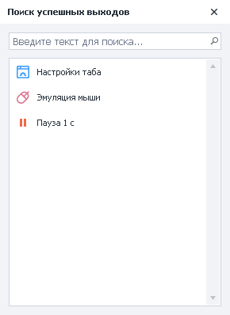
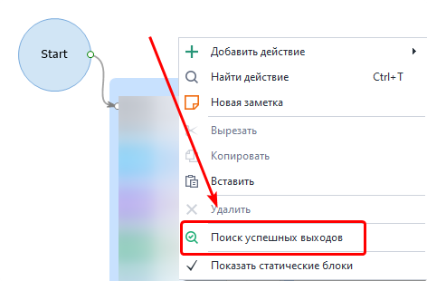
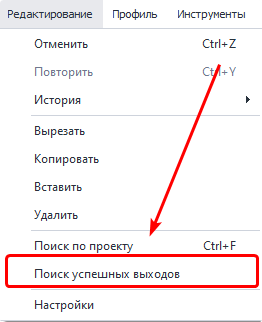
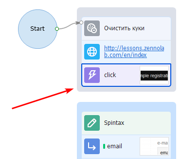
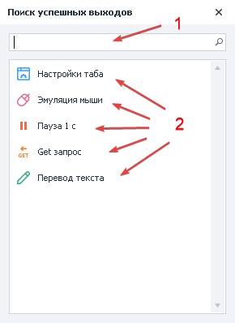

---
sidebar_position: 9
title: "Searching for Successful Exits"
description: ""
date: "2025-08-25"
converted: true
originalFile: "Поиск успешных выходов.txt"
targetUrl: "https://zennolab.atlassian.net/wiki/spaces/RU/pages/724566081"
---
:::info **Please review the [*Rules for Using Materials on This Resource*](../Disclaimer).**
:::

> 🔗 **[Original page](https://zennolab.atlassian.net/wiki/spaces/RU/pages/724566081)** — Source of this material

_______________________________________________  
  
## Description

Allows you to find unplanned “successful” project completions, as well as breaks that occur during template execution.

  

## How do I open the window?

- Right-click anywhere on the project canvas to open the context menu, then select *Search for Successful Exits*.

- Or, use the top menu: *Edit →* Search for Successful Exits.

  

## What is this used for?

Sometimes, due to carelessness or inattention, you might forget to connect two actions with logic arrows, causing your project to not work the way you intended.  
This could manifest as follows: the project finishes successfully, but you notice it only completed part of the work—and there were no errors.

Example:

In the screenshot above, the project will finish successfully at the *click* action, since it's not connected to any other actions.
If your project has only 5-10 [❗→ blocks](https://zennolab.atlassian.net/wiki/spaces/RU/pages/486342706 "https://zennolab.atlassian.net/wiki/spaces/RU/pages/486342706") it might not seem like a problem. But if you're working on a large project with hundreds of actions, searching for such a “break” manually is unlikely to be enjoyable.

## How do I work with the window?

1. Quick search bar for actions or blocks with the specified function.
2. List of actions that will lead to successful project completion.
3. Double-click an action in the list to focus the project on that action.

:::note Note
The search by function works if it's specified inside the action
:::

  

## Example of use

For debugging, we recommend using this function after writing each template.

1. Open the window.
2. Compare the list of successful completions with your logic.
3. Adjust the template as necessary.

So, if you made a mistake somewhere, this function will always help you by showing successful completion points in the flow.

  

## Useful links

- [❗→ Project Editor](https://zennolab.atlassian.net/wiki/spaces/RU/pages/534052914 "https://zennolab.atlassian.net/wiki/spaces/RU/pages/534052914")