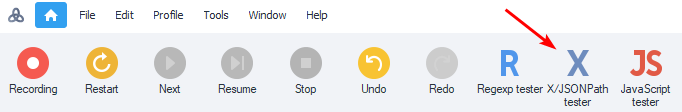
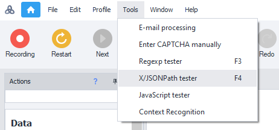
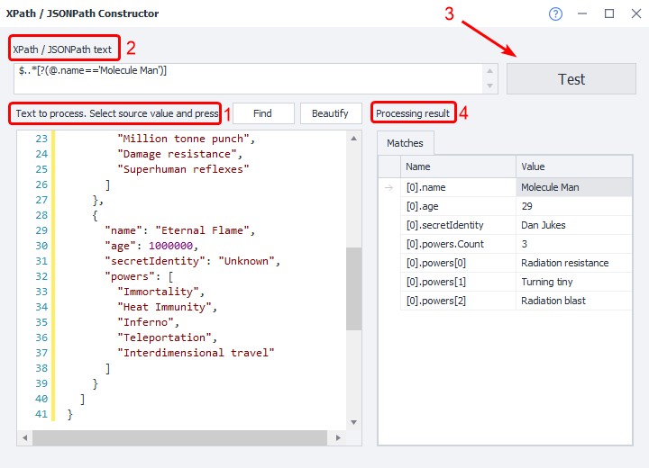
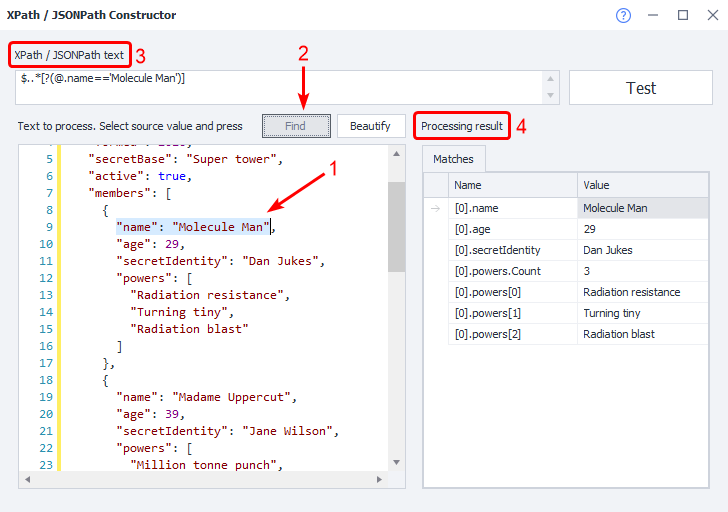

---
sidebar_position: 4
title: "X/JSON Path Tester"
description: ""
date: "2025-08-25"
converted: true
originalFile: "Тестер XJSON Path.txt"
targetUrl: "https://zennolab.atlassian.net/wiki/spaces/RU/pages/534315390/X+JSON+Path"
---
import DisclaimerNotice from '@site/src/components/DisclaimerNotice';

<DisclaimerNotice />

> 🔗 **[Original page](https://zennolab.atlassian.net/wiki/spaces/RU/pages/534315390/X+JSON+Path)** — Source of this material

_______________________________________________  

## Description

This tool is designed to check the correctness of XPath / JSONPath data and help you create accurate expressions for parsing data from XML and JSON documents.

## How to open the window?

On the toolbar, if this button is enabled in the appearance settings:




Or via Main Menu - Tools - X/JSON Path Tester:




## How do I check if an XPath / JSONPath expression is correct?




1. Paste the code you want to process into the input field.
2. Paste the ready-made XPath / JSONPath expression you want to check.
3. Click the "Test" button.
4. In the "Processing result" field, you'll get the matches found using the given expression if it was composed correctly.

## How to quickly compose an XPath / JSONPath expression?




1. Paste the code you want to process into the input field.
2. Click the "Find" button.
3. The "XPath / JSONPath" field will display the ready-to-use expression.
4. In the "Processing result" field, you'll get the matches found using the given expression if it was composed correctly.

You can use the resulting expression in the [❗→ Processing JSON and XML](https://zennolab.atlassian.net/wiki/spaces/RU/pages/488964124/JSON+XML "https://zennolab.atlassian.net/wiki/spaces/RU/pages/488964124/JSON+XML") action.

The **Beautify** button lets you automatically format the code and make it easy to read.

  

## Basic XPath Syntax

| **Expression** | **Result** |
| --- | --- |
| ```*имя\_узла``` | Selects all nodes named "имя\_узла" |
| ```/``` | Selects from the root node |
| ```//``` | Selects nodes matching the selection from the current node, regardless of their location |
| ```.``` | Selects the current node |
| ```..``` | Selects the parent of the current node |
| ```@``` | Selects attributes |

To search for unknown nodes, special characters are used:

| **Special Character** | **Description** |
| --- | --- |
| ```*``` | Matches any element node |
| ```@*``` | Matches any attribute node |
| ```node()``` | Matches any node of any type |

  

## Basic JSONPath Syntax

| **Expression** | **Result** |
| --- | --- |
| ```$``` | Selects from the root node |
| ```..``` | Parent operator |
| ```.``` or ```[]``` | Descendant operator |
| ```..``` | Selects nodes matching the selection from the current node |
| ```@``` | Selects the current node |
| ```?()``` | Applies a filter expression |

### Examples:

``` json
{ "store": {
    "book": [ 
      { "category": "reference",
        "author": "Nigel Rees",
        "title": "Sayings of the Century",
        "price": 8.95
      },
      { "category": "fiction",
        "author": "Evelyn Waugh",
        "title": "Sword of Honour",
        "price": 12.99
      },
      { "category": "fiction",
        "author": "Herman Melville",
        "title": "Moby Dick",
        "isbn": "0-553-21311-3",
        "price": 8.99
      },
      { "category": "fiction",
        "author": "J. R. R. Tolkien",
        "title": "The Lord of the Rings",
        "isbn": "0-395-19395-8",
        "price": 22.99
      }
    ],
    "bicycle": {
      "color": "red",
      "price": 19.95
    }
  }
}
```

| **Expression** | **JSONPath** | **Result** |
| --- | --- | --- |
| `/store/book/author` | ```$.store.book[*].author``` | "author" elements of all "book" entries in "store" |
| `//author` | ```$..author``` | all "author" elements |
| `/store/*` | ```$.store.*``` | everything inside "store" |
| `/store//price` | ```$.store..price``` | the price value for all "price" elements in "store" |
| `//book[3]` | ```$..book[2]``` | the third "book" entry |
| `//book[last()]` | ```$..book[(@.length-1)]``` ```$..book[-1]``` | the last "book" entry |
| `//book[position()<3]` | ```$..book[0,1]``` ```$..book[:2]``` | the first 2 "book" entries |
| `//book[isbn]` | ```$..book[?(@.isbn)]``` | filter all "book" entries that have an "isbn" value |
| `//book[price<10]` | ```$..book[?(@.price<10)]``` | filter all "book" entries where the "price" is less than 10 |
| `//*` | ```$..*``` | all elements in the XML document. All members of the JSON structure. |