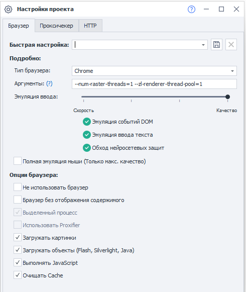
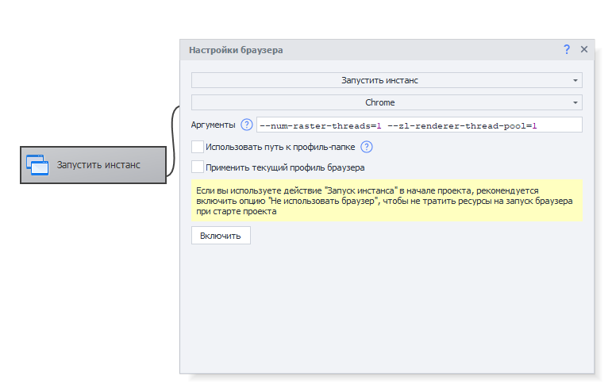

---
sidebar_position: 4
title: "Adjusting the Chrome Process Thread Pool"
description: ""
date: "2025-09-15"
converted: true
originalFile: "Регулировка пула потоков процессов Chrome.txt"
targetUrl: "https://zennolab.atlassian.net/wiki/spaces/RU/pages/1490812931/Chrome"
---
import DisclaimerNotice from '@site/src/components/DisclaimerNotice';

<DisclaimerNotice />

> 🔗 **[Original page](https://zennolab.atlassian.net/wiki/spaces/RU/pages/1490812931/Chrome)** — Source of this material

_______________________________________________  

:::warning Attention
Warning! These settings are intended for advanced users, as they can also make things worse. Please test them individually on each machine.
:::

:::info Info
This article can help you optimize your browser's performance. For example, if your system starts to lag even though your computer's resources aren't maxed out, the reason might be too many threads. Using the settings described in this article, you can slightly reduce the number of threads for browser processes.
:::

The Chrome browser uses a number of auxiliary processes needed for its operation. These auxiliary processes are divided into different types, such as: tab renderers, GPU processes, network processes, and others. Renderer processes can have their thread pools adjusted with command line arguments:

**--num-raster-threads=N** - default value is 4. Sets the number of threads used for rasterization in the renderer process.
**--zl-renderer-thread-pool=N** - default value: number of logical processors minus 1. Sets the maximum thread pool size in the renderer process (Available in ZennoPoster versions above 7.4.0.0).

To reduce the number of threads, try:

```csharp
--num-raster-threads=1 --zl-renderer-thread-pool=1
```

**You can set these arguments in the project settings:**




**Or via the "Start instance" block:**

