:::info **Please read the [*Material Usage Rules on this site*](../../Disclaimer).**
:::

> 🔗 **[Original page](https://zennolab.atlassian.net/wiki/spaces/RU/pages/851116136)** — Source of this material

_______________________________________________  

## Description

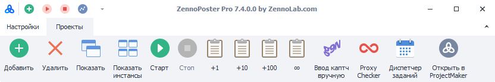

With this menu, you can manage projects — add or delete them, start and stop, set the number of attempts, configure the [❗→ Task Manager](https://zennolab.atlassian.net/wiki/spaces/RU/pages/851116198 "https://zennolab.atlassian.net/wiki/spaces/RU/pages/851116198") and the built-in [❗→ ProxyChecker](https://zennolab.atlassian.net/wiki/spaces/RU/pages/851705960 "https://zennolab.atlassian.net/wiki/spaces/RU/pages/851705960").

  

## Quick Access Toolbar

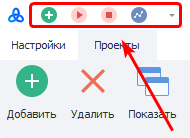

You can add buttons here for easy access. Even if you minimize the main menu with the buttons, this toolbar will still be displayed.
By default, the following buttons appear here: *Add new project, Start and stop ProxyChecker [❗→ ProxyChecker](https://zennolab.atlassian.net/wiki/spaces/RU/pages/851705960 "https://zennolab.atlassian.net/wiki/spaces/RU/pages/851705960") threads (when started, proxy collection and checking is enabled), and the [❗→ Network Monitor](https://zennolab.atlassian.net/wiki/spaces/RU/pages/1721565250 "https://zennolab.atlassian.net/wiki/spaces/RU/pages/1721565250").

How to add new buttons here will be described below.

With the arrow on the right side of this panel, you can hide or show elements without deleting them.

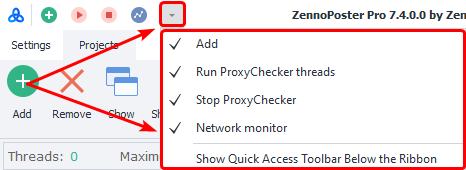

  

## “Settings” and “Projects” tabs

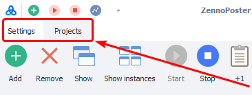

Here you can switch from the projects window to [❗→ ZennoPoster settings](https://zennolab.atlassian.net/wiki/spaces/RU/pages/852885655 "https://zennolab.atlassian.net/wiki/spaces/RU/pages/852885655") and the built-in [❗→ ProxyChecker](https://zennolab.atlassian.net/wiki/spaces/RU/pages/848560318/ "https://zennolab.atlassian.net/wiki/spaces/RU/pages/848560318/").

  

## Menu

### Add

With this button, you can add project(s) to the program. After adding, they will appear in the [❗→ Projects Table](https://zennolab.atlassian.net/wiki/spaces/RU/pages/853737528 "https://zennolab.atlassian.net/wiki/spaces/RU/pages/853737528").

#### Adding several projects at once

If you select several projects at once when adding, the following window will open:

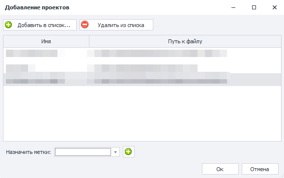

Add/Remove from the list

You can use these buttons to add new project files or remove unnecessary ones from the list you're adding.

Assign tags

Here you can choose existing tags or add new ones. The selected tags will be applied to all projects you are adding. You can read more about them in the article about the [❗→ Settings tab](https://zennolab.atlassian.net/wiki/spaces/RU/pages/851574897 "https://zennolab.atlassian.net/wiki/spaces/RU/pages/851574897").

### Delete

Deletes all templates selected in the [❗→ Projects Table](https://zennolab.atlassian.net/wiki/spaces/RU/pages/853737528 "https://zennolab.atlassian.net/wiki/spaces/RU/pages/853737528").

### Show

Opens the [❗→ Instances tab](https://zennolab.atlassian.net/wiki/spaces/RU/pages/853803144 "https://zennolab.atlassian.net/wiki/spaces/RU/pages/853803144").

### Show instances

Opens the [❗→ Instances tab](https://zennolab.atlassian.net/wiki/spaces/RU/pages/853803144 "https://zennolab.atlassian.net/wiki/spaces/RU/pages/853803144") and expands it to the full window of the program.

### Start

Starts the selected, stopped projects.

### Stop

Stops execution of the selected projects.

### Adding new attempts

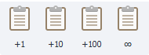

Adds the specified number of template runs to the current value.

If you click the button with the infinity symbol (**∞**), the selected project in the [❗→ How many to do column of the Settings tab](https://zennolab.atlassian.net/wiki/spaces/RU/pages/851574897 "https://zennolab.atlassian.net/wiki/spaces/RU/pages/851574897") will be set to **-1** (minus one), which means infinite execution. The template will run until you stop it or one of the conditions specified in the [❗→ Stop tab](https://zennolab.atlassian.net/wiki/spaces/RU/pages/852885665 "https://zennolab.atlassian.net/wiki/spaces/RU/pages/852885665") is met.

### Manual captcha entry

Opens the [❗→ captcha entry window](https://zennolab.atlassian.net/wiki/spaces/RU/pages/851705951 "https://zennolab.atlassian.net/wiki/spaces/RU/pages/851705951").

### ProxyChecker

Opens the control window for the built-in [❗→ ProxyChecker](https://zennolab.atlassian.net/wiki/spaces/RU/pages/851705960 "https://zennolab.atlassian.net/wiki/spaces/RU/pages/851705960").

### Task Manager

Opens the management tab for the [❗→ Task Manager](https://zennolab.atlassian.net/wiki/spaces/RU/pages/851116198 "https://zennolab.atlassian.net/wiki/spaces/RU/pages/851116198").

### Open in ProjectMaker

Launches the selected projects in [❗→ ProjectMaker](https://zennolab.atlassian.net/wiki/spaces/RU/pages/505970699 "https://zennolab.atlassian.net/wiki/spaces/RU/pages/505970699").

### Minimize menu

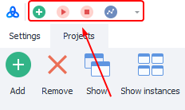

With the button in the upper right corner, you can minimize or maximize the Main Menu (you can also do this with the context menu, described below).

  

## Context menu

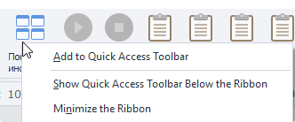

To open the context menu, simply right-click on any button.

### Add to Quick Access Toolbar

Add the selected button to the Quick Access Toolbar (described at the beginning of the article)

### Remove from Quick Access Toolbar

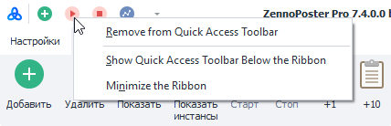

If you right-click on an element that's already in the Quick Access Toolbar, this item will appear first, allowing you to remove that element from quick access.

### Show Quick Access Toolbar Below\Above the Ribbon

Allows you to move the Quick Access Toolbar below the Main Menu (Below) and move it back (Above):

**Above the Ribbon**

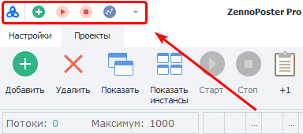

**Below the Ribbon**

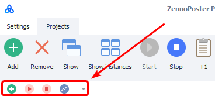

### Minimize the Ribbon

Minimizes the Main Menu.

  

## Useful links

- [❗→ Projects Table](https://zennolab.atlassian.net/wiki/spaces/RU/pages/853737528 "https://zennolab.atlassian.net/wiki/spaces/RU/pages/853737528")
- [❗→ Settings](https://zennolab.atlassian.net/wiki/spaces/RU/pages/851574897 "https://zennolab.atlassian.net/wiki/spaces/RU/pages/851574897")
- [❗→ Stop](https://zennolab.atlassian.net/wiki/spaces/RU/pages/852885665 "https://zennolab.atlassian.net/wiki/spaces/RU/pages/852885665")
- [❗→ Instances](https://zennolab.atlassian.net/wiki/spaces/RU/pages/853803144 "https://zennolab.atlassian.net/wiki/spaces/RU/pages/853803144")
- [❗→ Manual captcha entry](https://zennolab.atlassian.net/wiki/spaces/RU/pages/851705951 "https://zennolab.atlassian.net/wiki/spaces/RU/pages/851705951")
- [❗→ ProxyChecker](https://zennolab.atlassian.net/wiki/spaces/RU/pages/851705960 "https://zennolab.atlassian.net/wiki/spaces/RU/pages/851705960")
- [❗→ Task Manager](https://zennolab.atlassian.net/wiki/spaces/RU/pages/851116198 "https://zennolab.atlassian.net/wiki/spaces/RU/pages/851116198")