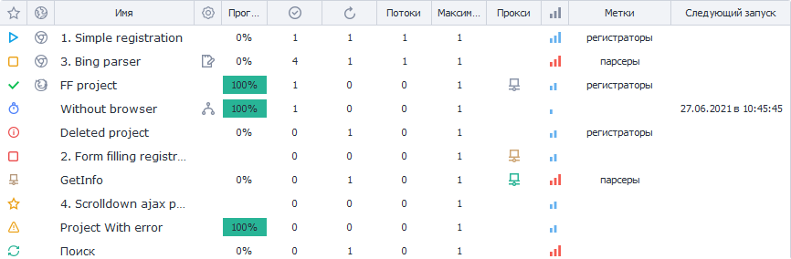
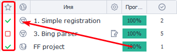
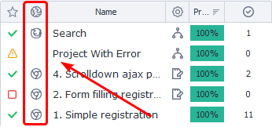
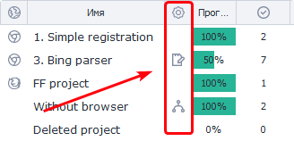
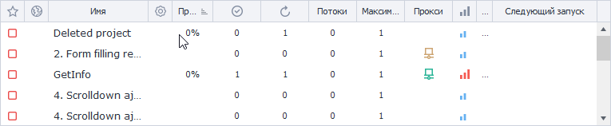

---
sidebar_position: 3
title: "Project Table"
description: ""
date: "2025-09-10"
converted: true
originalFile: "Таблица проектов.txt"
targetUrl: "https://zennolab.atlassian.net/wiki/spaces/RU/pages/853737528"
---
:::info **Please read the [*Material Usage Rules on this site*](../Disclaimer).**
:::

> 🔗 **[Original page](https://zennolab.atlassian.net/wiki/spaces/RU/pages/853737528)** — Source of this material

_______________________________________________  

## Description

This table displays all information about the current status of your added projects.

  

  

## Columns (default)

### Status

The current state of the project.

There are several possible statuses, all of which are described under the spoiler below.

Project statuses

| **Icon** | **Status description** |
| --- | --- |
|  | *Just added* You have just added this project and it has not yet received any tasks. |
|  | *Project is starting* |
|  | *Project is running* |
|  | *Stopped*  For example, you might need to free up computer resources taken up by the poster. You can stop the project(s), in which case its settings won’t change, it simply will not continue running. To resume, click “Start” in the [❗→ Main Menu](https://zennolab.atlassian.net/wiki/spaces/RU/pages/851116136 "https://zennolab.atlassian.net/wiki/spaces/RU/pages/851116136"). Stopping a project is done smoothly, meaning ongoing tasks at the time of stopping will be completed. You can interrupt execution without waiting for current tasks to finish. To do this, click the added project and in the [❗→ context menu](https://zennolab.atlassian.net/wiki/spaces/RU/pages/852885672 "https://zennolab.atlassian.net/wiki/spaces/RU/pages/852885672") select “Interrupt”. |
|  | *Stopping*  After you click “Stop”, the project will stop once it completes its last task. Until then it remains in the “Stopping” state. |
|  | *Done*  The project has successfully completed all tasks or has reached the desired number of successful executions. |
|  | *Completed with errors*  The maximum number of consecutive failed project runs has been reached. You [❗→ can specify the number of consecutive failed runs](https://zennolab.atlassian.net/wiki/spaces/RU/pages/852885665 "https://zennolab.atlassian.net/wiki/spaces/RU/pages/852885665") for the project; upon reaching this limit, the project will go into this state. This is useful if the project is consuming a valuable resource. For example, to prevent all your captcha-solving funds from being spent because a site changed its registration form while you slept, use this setting. |
|  | *Scheduled*  The project is scheduled and waiting for new tasks from the [❗→ task scheduler](https://zennolab.atlassian.net/wiki/spaces/RU/pages/534086320 "https://zennolab.atlassian.net/wiki/spaces/RU/pages/534086320"). You can view the date and time of the next launch in the “Next launch” column in this Table. |
|  | *Error*  The project enters this state if its project file was deleted. It will still be displayed in the project list but is missing from your hard drive. You need to set a new file location. |
|  | *Not enough proxies*  The project is temporarily paused because there are not enough necessary proxies in [❗→ ProxyChecker](https://zennolab.atlassian.net/wiki/spaces/RU/pages/851705960 "https://zennolab.atlassian.net/wiki/spaces/RU/pages/851705960"). Once proxies become available, it will continue working. |

### Instance usage

This column displays whether a browser is used in the project, and if so, [❗→ which type](https://zennolab.atlassian.net/wiki/spaces/RU/pages/534315477#%D0%A2%D0%B8%D0%BF-%D0%B1%D1%80%D0%B0%D1%83%D0%B7%D0%B5%D1%80%D0%B0 "https://zennolab.atlassian.net/wiki/spaces/RU/pages/534315477#%D0%A2%D0%B8%D0%BF-%D0%B1%D1%80%D0%B0%D1%83%D0%B7%D0%B5%D1%80%D0%B0"). If the project works without a browser, this column will be empty.

:::warning Attention
For newly added projects, nothing is displayed in this column either.
:::

Browser types

|  | The project uses Chrome. |
| --- | --- |
|  | The project uses Firefox. |

### Name

The name is generated based on the name of the project file.

You can change it via the [❗→ context menu](https://zennolab.atlassian.net/wiki/spaces/RU/pages/852885672 "https://zennolab.atlassian.net/wiki/spaces/RU/pages/852885672") or by using the hotkey `F2`.

### Settings

This indicates whether the project uses [❗→ input settings](https://zennolab.atlassian.net/wiki/spaces/RU/pages/1846051204 "https://zennolab.atlassian.net/wiki/spaces/RU/pages/1846051204"). If there are no icons in this column for a project, then it does not have any settings.

:::warning Attention
For newly added projects, nothing is displayed in this column either.
:::

Input settings types

|  | The project uses settings based on [❗→ classic input settings](https://zennolab.atlassian.net/wiki/spaces/RU/pages/534020594 "https://zennolab.atlassian.net/wiki/spaces/RU/pages/534020594"). |
| --- | --- |
|  | The project uses settings based on the [❗→ bot interface (BotUI)](https://zennolab.atlassian.net/wiki/spaces/RU/pages/725352539 "https://zennolab.atlassian.net/wiki/spaces/RU/pages/725352539"). |

### Progress

The percentage of project completion.
It is calculated as the ratio of remaining attempts (set in “How many to do” on the [❗→ Settings tab](https://zennolab.atlassian.net/wiki/spaces/RU/pages/851574897 "https://zennolab.atlassian.net/wiki/spaces/RU/pages/851574897")) to successfully completed attempts.

### Successes

The number of successfully completed executions.

### Attempts

The number of planned execution attempts.

### Threads

The number of threads running for the task.

### Maximum threads

The maximum number of allowed threads for the task.

### Proxy

If you selected to work via proxy on the [❗→ Settings tab](https://zennolab.atlassian.net/wiki/spaces/RU/pages/851574897 "https://zennolab.atlassian.net/wiki/spaces/RU/pages/851574897"), the selected mode will be displayed in this column.

Proxy modes

| **Icon** | **Mode description** |
| --- | --- |
|  | *Take proxies from ProxyChecker if possible* If no proxies are available, the project will be launched without a proxy and will use your real IP address. |
|  | *Use (without deleting)* Proxies will be taken from the list of active ones but will not be removed from it. |
|  | *Use*  Proxies will be taken from the active list and removed from it. |

### Priority

This column displays the selected priority for the template.
You can set this on the [❗→ Settings tab](https://zennolab.atlassian.net/wiki/spaces/RU/pages/851574897 "https://zennolab.atlassian.net/wiki/spaces/RU/pages/851574897").

### Labels

The labels (tags) assigned to the project. There may be several.
Labels can be used to filter displayed projects—see more in the [❗→ Side menu](https://zennolab.atlassian.net/wiki/spaces/RU/pages/852787297 "https://zennolab.atlassian.net/wiki/spaces/RU/pages/852787297") article.
You can assign them on the [❗→ Settings tab](https://zennolab.atlassian.net/wiki/spaces/RU/pages/851574897 "https://zennolab.atlassian.net/wiki/spaces/RU/pages/851574897").

### Next launch

If the project has a [❗→ schedule](https://zennolab.atlassian.net/wiki/spaces/RU/pages/534086320 "https://zennolab.atlassian.net/wiki/spaces/RU/pages/534086320") set, this column will show the date and time of the next launch (or a dash if the project is already running).

  

## Columns (hidden)

### How to enable?

To show (or hide) columns, right-click on the header of any column and select the one you need.

### File path

This shows the full path to the project file.

### Rules

The rules by which proxies will be taken from [❗→ ProxyChecker](https://zennolab.atlassian.net/wiki/spaces/RU/pages/851705960 "https://zennolab.atlassian.net/wiki/spaces/RU/pages/851705960").
You can set them on the [❗→ Settings tab](https://zennolab.atlassian.net/wiki/spaces/RU/pages/851574897 "https://zennolab.atlassian.net/wiki/spaces/RU/pages/851574897").

### Consecutive failures

The number of consecutive failed executions.

### Time added

When this project was added to the Project Table.

### Updates

If you have purchased projects (which were [❗→ sold to you via your Personal Account](https://zennolab.atlassian.net/wiki/spaces/RU/pages/494895200 "https://zennolab.atlassian.net/wiki/spaces/RU/pages/494895200")), this column will show a notification about available template updates.

### Subscription expiration

If a template was issued to you via your Personal Account, this will display the subscription end date.

  

## Other features

### Sorting

You can sort the table’s contents by clicking any of the column headers.

### Drag and drop

You can rearrange the table columns as you like. To do this, click the column header and drag the column to the desired location.

Example

### Context menu

By right-clicking the project, you’ll open the context menu. You can find more details in the [❗→ Context menu](https://zennolab.atlassian.net/wiki/spaces/RU/pages/852885672 "https://zennolab.atlassian.net/wiki/spaces/RU/pages/852885672") article.

  

## Useful links

- [❗→ Context menu](https://zennolab.atlassian.net/wiki/spaces/RU/pages/852885672 "https://zennolab.atlassian.net/wiki/spaces/RU/pages/852885672")
- [❗→ Settings](https://zennolab.atlassian.net/wiki/spaces/RU/pages/851574897 "https://zennolab.atlassian.net/wiki/spaces/RU/pages/851574897")
- [❗→ 📆 Schedule Planner](https://zennolab.atlassian.net/wiki/spaces/RU/pages/534086320 "https://zennolab.atlassian.net/wiki/spaces/RU/pages/534086320")
- [❗→ Main Menu](https://zennolab.atlassian.net/wiki/spaces/RU/pages/851116136 "https://zennolab.atlassian.net/wiki/spaces/RU/pages/851116136")