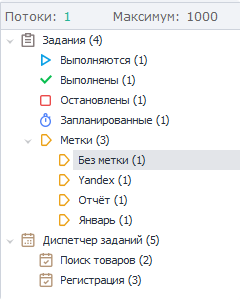
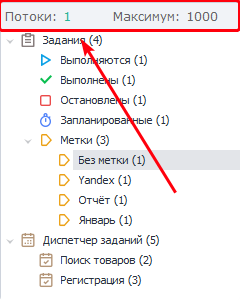
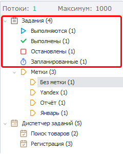
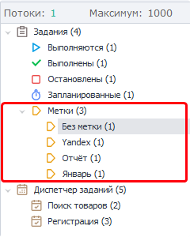

---
sidebar_position: 2
title: "Side Menu"
description: ""
date: "2025-09-10"
converted: true
originalFile: "Сайд-меню.txt"
targetUrl: "https://zennolab.atlassian.net/wiki/spaces/RU/pages/852787297/-"
---
:::info **Please review the [*Rules for using materials on this resource*](../Disclaimer).**
:::

> 🔗 **[Original page](https://zennolab.atlassian.net/wiki/spaces/RU/pages/852787297/-)** — Source for this material

_______________________________________________  
# Side Menu

  

## Description

With the sidebar menu, you can filter templates in the [❗→ project table](https://zennolab.atlassian.net/wiki/spaces/RU/pages/853737528 "https://zennolab.atlassian.net/wiki/spaces/RU/pages/853737528") by status (running, stopped, scheduled), or by tags (which you can set in the [❗→ Settings](https://zennolab.atlassian.net/wiki/spaces/RU/pages/851574897 "https://zennolab.atlassian.net/wiki/spaces/RU/pages/851574897") tab). To do this, simply select the desired item in the menu.
The number shown in brackets next to a status or tag indicates how many projects are in that category.

  

## Menu Header

### Threads

This number shows the total number of currently running threads in the program for all templates.

### Maximum

The maximum allowed number of threads running simultaneously across all projects. You can change this value in the [❗→ poster thread settings | Maximum number of threads](https://zennolab.atlassian.net/wiki/spaces/RU/pages/808812646#%D0%9C%D0%B0%D0%BA%D1%81%D0%B8%D0%BC%D0%B0%D0%BB%D1%8C%D0%BD%D0%BE%D0%B5-%D0%BA%D0%BE%D0%BB%D0%B8%D1%87%D0%B5%D1%81%D1%82%D0%B2%D0%BE-%D0%BF%D0%BE%D1%82%D0%BE%D0%BA%D0%BE%D0%B2 "https://zennolab.atlassian.net/wiki/spaces/RU/pages/808812646#%D0%9C%D0%B0%D0%BA%D1%81%D0%B8%D0%BC%D0%B0%D0%BB%D1%8C%D0%BD%D0%BE%D0%B5-%D0%BA%D0%BE%D0%BB%D0%B8%D1%87%D0%B5%D1%81%D1%82%D0%B2%D0%BE-%D0%BF%D0%BE%D1%82%D0%BE%D0%BA%D0%BE%D0%B2") 

## Main Menu

### Tasks

Project filtering by current status.
The number in brackets next to “Tasks” indicates the number of projects added.

**Running** - templates currently in progress.
**Completed** - projects that have successfully finished.
**Stopped** - projects whose execution has been stopped.
**Scheduled** - projects with a configured and enabled [❗→ schedule](https://zennolab.atlassian.net/wiki/spaces/RU/pages/534086320 "https://zennolab.atlassian.net/wiki/spaces/RU/pages/534086320").

### Tags

Filter projects by tag. You can set tags for a project in the [❗→ Settings](https://zennolab.atlassian.net/wiki/spaces/RU/pages/851574897 "https://zennolab.atlassian.net/wiki/spaces/RU/pages/851574897") tab.
The number in brackets next to “Tags” shows how many templates have at least one tag set.

The number in brackets next to each tag shows how many templates have that particular tag.

### Task Manager

Here you'll see tasks from the [❗→ Task Manager](https://zennolab.atlassian.net/wiki/spaces/RU/pages/851116198 "https://zennolab.atlassian.net/wiki/spaces/RU/pages/851116198"), with the number of templates in each task shown in brackets.
When you click on a task, the project table will display the templates included in that task.

  

## Useful Links

- [❗→ Task Manager](https://zennolab.atlassian.net/wiki/spaces/RU/pages/851116198 "https://zennolab.atlassian.net/wiki/spaces/RU/pages/851116198")
- [❗→ Settings](https://zennolab.atlassian.net/wiki/spaces/RU/pages/851574897 "https://zennolab.atlassian.net/wiki/spaces/RU/pages/851574897")
- [❗→ Project Table](https://zennolab.atlassian.net/wiki/spaces/RU/pages/853737528 "https://zennolab.atlassian.net/wiki/spaces/RU/pages/853737528")