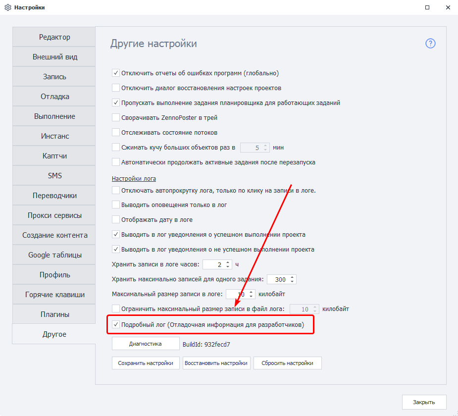
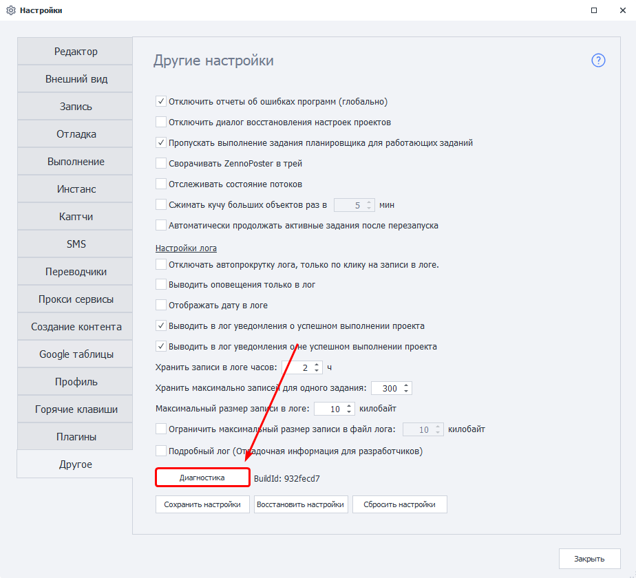
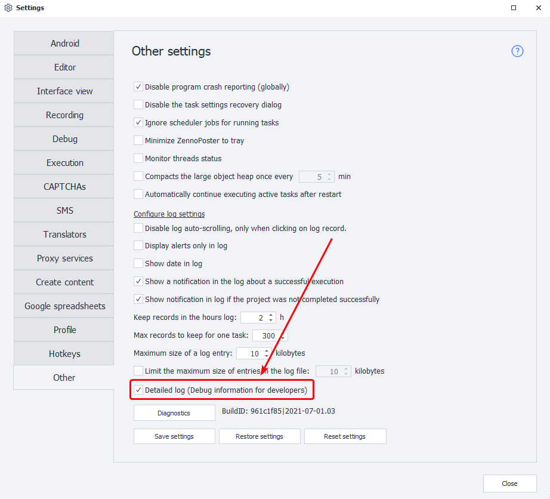
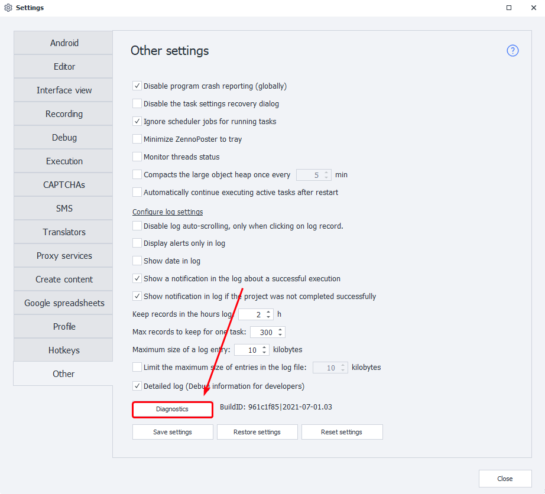
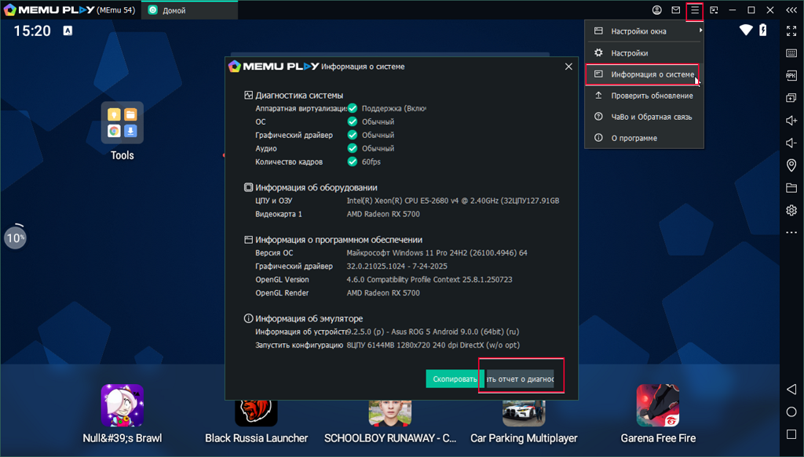

:::info **Please read the [*Material Usage Rules on this site*](../Disclaimer).**
:::

> 🔗 **[Original page](https://zennolab.atlassian.net/wiki/spaces/RU/pages/870419658)** — Source of this material

_______________________________________________  

## Instructions for ZennoPoster and ZennoBox

<details>
<summary>Click here to expand</summary>

### **1. Enable the detailed log.**

*Settings-Other-Detailed Log (Debug information for developers)*




**You can also enable it via** [**a special app.**](https://github.com/ZennoHelpers/DetailedLogSwitcher "https://github.com/ZennoHelpers/DetailedLogSwitcher")

### **2. Restart the program.**

### **3. Perform the actions that led to the error.**

### **4. Run the** ***Diagnostics**.**

You should run diagnostics **after** the problem occurs; ideally, please remember the time the issue appeared.  
You can start diagnostics in several ways:

- From the program interface (*Settings-*Other-button *Diagnostics at the bottom of the window)




- Or from the installed program directory  
ZennoPoster 7 -` C:\Program Files\ZennoLab\RU\ZennoPoster Pro V7\7.4.0.0\Progs\Diagnostic.exe`  
ZennoPoster 5 - `C:\Program Files\ZennoLab\RU\ZennoPoster Pro\5.47.0.0\Progs\Diagnostic.exe```json

The path may differ on your system (different drive letter, program version, language)

### **5. Send us the resulting report.zip file**

After diagnostics are completed, a report.zip file will be created. This file will be in the program's installation directory (it will open automatically once diagnostics finish).

Please [send the resulting file to support](https://helpdesk.zennolab.com/ "https://helpdesk.zennolab.com/").

</details>

  

## Instructions for ZennoDroid

<details>
<summary>Click here to expand</summary>

### **1. Enable the detailed log.**

*Settings-Other-Detailed Log (Debug information for developers)*




**You can also enable it via** [**a special app.**](https://github.com/ZennoHelpers/DetailedLogSwitcher "https://github.com/ZennoHelpers/DetailedLogSwitcher")

### **2. Restart the program.**

### **3. Perform the actions that led to the error.**

### **4. Run the** ***Diagnostics**.**

You should run diagnostics **after** the problem occurs; ideally, please remember the time the issue appeared.  
You can start diagnostics in several ways:

- From the program interface (*Settings-*Other-button *Diagnostics at the bottom of the window)




- Or from the installed program directory

```C:\Program Files\ZennoLab\RU\ZennoDroid Pro\2.2.4.0\Progs\Diagnostic.exe```json

The path may differ on your system (different drive letter, program version, language)

### **5. Send us the resulting report.zip file**

After diagnostics are completed, a report.zip file will be created. This file will be in the program's installation directory (it will open automatically once diagnostics finish).

Please [send the resulting file to support](https://helpdesk.zennolab.com/ "https://helpdesk.zennolab.com/").

### **5.1. If using the MEmu emulator**

Start the emulator, click on System Information in the menu, then click the Generate Diagnostics Report button. Send the generated file to support along with the main diagnostics report.

System Information in MEmu




</details>

* * *

## Instructions for CapMonster2

<details>
<summary>Click here to expand</summary>

### **1. Enable the detailed log.**

*Settings => Program => Detailed Log (debug information for developers) (above the Diagnostics button)*


**You can also enable it via** [**a special app.**](https://github.com/ZennoHelpers/DetailedLogSwitcher "https://github.com/ZennoHelpers/DetailedLogSwitcher")

### **2. Restart the program.**

### **3. Perform the actions that led to the error.**

### **4. Run the** ***Diagnostics**.**

You should run diagnostics **after** the problem occurs; ideally, please remember the time the issue appeared.  
You can start diagnostics in several ways:

- From the program interface (*Settings* => *Program* => *Diagnostics* button (at the very bottom of the window))


- Or from the installed program directory

```C:\Program Files\ZennoLab\RU\CapMonster Pro\2.12.2.0\Progs\Diagnostic.exe```json

The path may differ on your system (different drive letter, program version, language)

### **5. Send us the resulting report.zip file**

After diagnostics are completed, a report.zip file will be created. This file will be in the program's installation directory (it will open automatically once diagnostics finish).

Please [send the resulting file to support](https://helpdesk.zennolab.com/ "https://helpdesk.zennolab.com/").

</details>

  

## Instructions for ZennoProxyChecker

<details>
<summary>Click here to expand</summary>

### **1. Perform the actions that led to the error.**

### **2. Run the** ***Diagnostics**.**

You should run diagnostics **after** the problem occurs; ideally, please remember the time the issue appeared.  
You can start diagnostics from the installed program directory

```C:\Program Files\ZennoLab\RU\ZennoProxyChecker\3.6.0.0\Progs\Diagnostic.exe`
The path may differ on your system (different drive letter, program version,)

### **3. Send us the resulting report.zip file**

After diagnostics are completed, a report.zip file will be created. This file will be in the program's installation directory (it will open automatically once diagnostics finish).

Please [send the resulting file to support](https://helpdesk.zennolab.com/ "https://helpdesk.zennolab.com/").

</details>