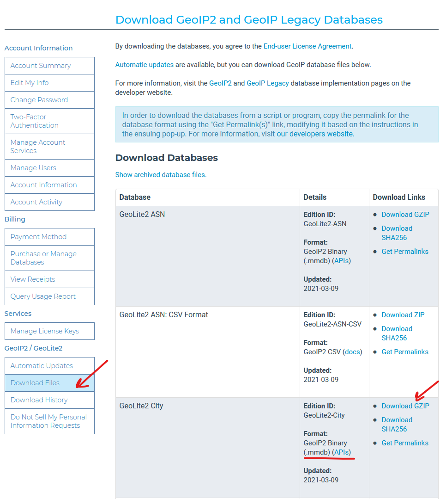

:::info **Please read the [*Material Usage Rules on this site*](../../Disclaimer).**
:::

> 🔗 **[Original page](https://zennolab.atlassian.net/wiki/spaces/RU/pages/1500020737/geo+ZennoPoster)** — Source of this material

_______________________________________________  

If the geo database is missing on your computer, ZennoPoster won't be able to perform some actions. You can check if the database is present at: 

`%appdata%\ZennoLab\ZennoPoster\7\Data\GeoLite2-City.mmdb` for ZennoPoster-7

`%appdata%\ZennoLab\ZennoBox\7\Data\GeoLite2-City.mmdb` for ZennoBox-7

If you don't have this file, or if you think it might be corrupted or outdated, you can update it yourself. To do this, you need to:

1. Register on the website https://www.maxmind.com
2. Log in to your personal account

3. Click on Download files and select GeoLite2 City in binary format, then click Download GZIP

4. Unzip the downloaded archive and place `GeoLite2-City.mmdb` in the required directory (examples of the paths are provided at the beginning of this article). The file name in the target directory must be exactly `GeoLite2-City.mmdb`