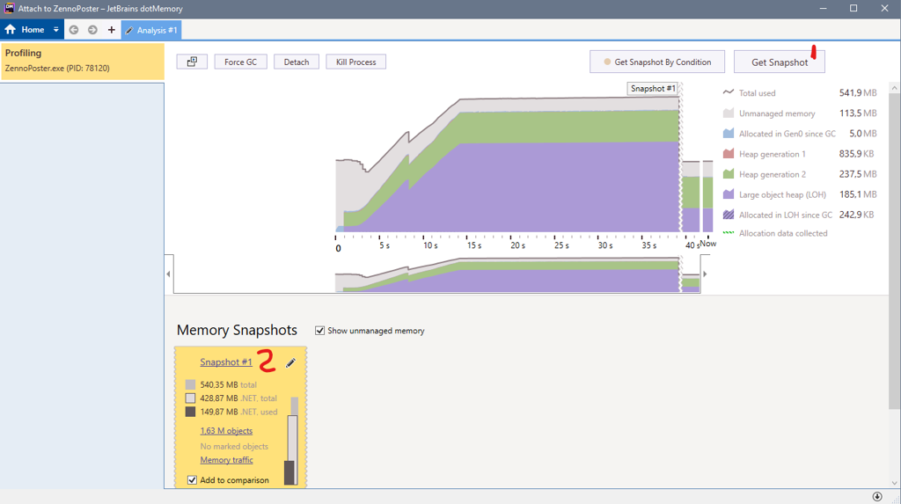
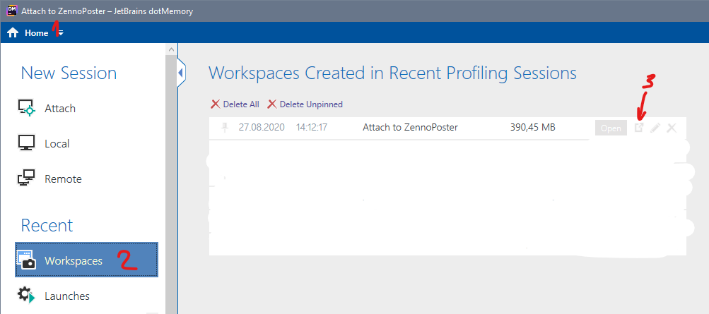

---
sidebar_position: 2
title: "If you suspect a memory leak in the program"
description: ""
date: "2025-09-15"
converted: true
originalFile: "Если вы подозреваете утечку памяти в программе.txt"
targetUrl: "https://zennolab.atlassian.net/wiki/spaces/RU/pages/1474691080"
---
import DisclaimerNotice from '@site/src/components/DisclaimerNotice';

<DisclaimerNotice />

> 🔗 **[Original page](https://zennolab.atlassian.net/wiki/spaces/RU/pages/1474691080)** — Source of this material

_______________________________________________  

:::info Information
ZennoPoster is a complex program with a huge number of functions and thousands of usage scenarios. We try to test most of them, but reaching 100% is not easy. If you face a situation where the program starts to slow down after some time, a detailed report about the problematic behavior in your specific case would be extremely helpful to us. This information will help the development team eliminate the cause of the issue.
:::

### Links to the software used in this article

[**Process Explorer**](https://docs.microsoft.com/en-us/sysinternals/downloads/process-explorer "https://docs.microsoft.com/en-us/sysinternals/downloads/process-explorer")

[**dotMemory**](https://www.jetbrains.com/dotmemory/download/#section=web-installer "https://www.jetbrains.com/dotmemory/download/#section=web-installer")

### Memory leak recording procedure (using ZennoPoster as an example)

- You should check which process has the memory leak. Process Explorer is convenient for viewing the process tree. In ZP7, there are two ZennoPoster processes. You can tell them apart by the presence of the -ZennoPosterCore argument.
- Start dotMemory, then run ZennoPoster. In dotMemory, use Attach to connect to the process with the -ZennoPosterCore parameter if the Core process is using memory, or without this argument if it's the UI process.

- dotMemory will connect. Take several snapshots using the Get Snapshot button: at the beginning, when the memory starts leaking, and once a significant amount has leaked.
- After you have these three snapshots, do Detach or Kill Process.

- Next, click Home in the upper left, go to Workspaces, and the top workspace should be the current one (you can check the date).
- Click Export on the current workspace and send it to us.

