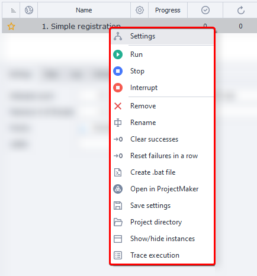

---
sidebar_position: 2
title: "Context Menu"
description: ""
date: "2025-09-10"
converted: true
originalFile: "Контекстное меню.txt"
targetUrl: "https://zennolab.atlassian.net/wiki/spaces/RU/pages/852885672"
---
import DisclaimerNotice from '@site/src/components/DisclaimerNotice';

<DisclaimerNotice />

> 🔗 **[Original page](https://zennolab.atlassian.net/wiki/spaces/RU/pages/852885672)** — Source of this material

_______________________________________________  

## Description

To open the context menu, right-click on a project in the [❗→ project table](https://zennolab.atlassian.net/wiki/spaces/RU/pages/853737528 "https://zennolab.atlassian.net/wiki/spaces/RU/pages/853737528").
You can also select multiple templates and right-click, and the chosen action will then be applied to all selected projects at once.




  

## Menu Items

### Settings

This option opens the project's [❗→ input settings](https://zennolab.atlassian.net/wiki/spaces/RU/pages/1846051204/ZennoPoster "https://zennolab.atlassian.net/wiki/spaces/RU/pages/1846051204/ZennoPoster").
You can also open these by double-clicking on the project.

### Run

Starts executing the template.
In the “[❗→ Project Settings](https://zennolab.atlassian.net/wiki/spaces/RU/pages/851574897 "https://zennolab.atlassian.net/wiki/spaces/RU/pages/851574897")” tab, be sure to set the number of threads and repetitions.

### Stop

Gracefully stops the process.
When you select this function, all running threads will finish their current work and won’t start again until the “Run” button is pressed.

### Abort

Force stops the process immediately.
The project will be stopped right away.

### Delete

Removes the template from the [❗→ project table](https://zennolab.atlassian.net/wiki/spaces/RU/pages/853737528 "https://zennolab.atlassian.net/wiki/spaces/RU/pages/853737528").

### Rename

This function allows you to change the project name.
You can also open the rename dialog by pressing F2.

### Reset Success, Reset Consecutive Failures

Lets you reset the (un)success counter to zero.
This may be useful when [❗→ stopping by count](https://zennolab.atlassian.net/wiki/spaces/RU/pages/852885665 "https://zennolab.atlassian.net/wiki/spaces/RU/pages/852885665") is configured.

### Create bat file

This function allows you to create a file for launching templates.
More details are described in the article [❗→ Create bat file](https://zennolab.atlassian.net/wiki/spaces/RU/pages/1940979747 "https://zennolab.atlassian.net/wiki/spaces/RU/pages/1940979747") 

### Open in ProjectMaker

Opens the selected template in ProjectMaker for [❗→ editing](https://zennolab.atlassian.net/wiki/spaces/RU/pages/534052914 "https://zennolab.atlassian.net/wiki/spaces/RU/pages/534052914") (if you have [❗→ permissions to open and edit](https://zennolab.atlassian.net/wiki/spaces/RU/pages/534315498 "https://zennolab.atlassian.net/wiki/spaces/RU/pages/534315498") this project).

### Save Settings

This function lets you save all settings and data for the project — thread count, number of runs, tags, stop conditions, current status, id, schedule, and more.

The resulting file extension is `.zptsk`. You can open this file with any text editor (Notepad++, SublimeText, etc.). The contents will be in XML format. 

There is an example of the data below as a spoiler.

<details>
<summary>Settings in XML format</summary>


```xml
<id>e6a601d1-fd0e-4198-a667-80614726186f</id>
 <name>ProjectZ</name>
 <isnewbie>True</isnewbie>
 <isenable>True</isenable>
 <createtime>08/08/2021 12:14:32</createtime>
 <settingstype>InputSettings</settingstype>
 
 
 <showautofilterrow>False</showautofilterrow>
 <executionsettings>
 <id>552d0abb-9629-4521-a960-c11ac9274676</id>
 <limitofthreads>1</limitofthreads>
 <maxallowofthreads>0</maxallowofthreads>
 <donesuccessfully>1</donesuccessfully>
 <doneall>1</doneall>
 <numberoftries>0</numberoftries>
 <lastnumberoftries>1</lastnumberoftries>
 <priority>100000</priority>
 <proxy>UseProxyWithoutRemove</proxy>
 <status>Complete</status>
 
 <shouldbeexecutedrandomly>False</shouldbeexecutedrandomly>
 <grouplabels>sometag</grouplabels>
 <groupstates>Выполнены</groupstates>
 <maxnumofsuccessstop>1024</maxnumofsuccessstop>
 <timeout>-1</timeout>
 <maxnumoffailstop>128</maxnumoffailstop>
 <numoffailstop>0</numoffailstop>
 <showtask>False</showtask>
 <tracetask>False</tracetask>
 <performbadendoninterrupt>True</performbadendoninterrupt>
 </executionsettings>
 <scheduler7settings>
 <id>e6a601d1-fd0e-4198-a667-80614726186f</id>
 <isactive>False</isactive>
 <executeperiod>EveryDay</executeperiod>
 <startdatetype>Immediately</startdatetype>
 <attemptsrange>12</attemptsrange>
 <isclearsuccess>False</isclearsuccess>
 <intervals>09:00 - 17:00</intervals>
 <stopexecutionoutsideofintervals>True</stopexecutionoutsideofintervals>
 <repeattype>Continued</repeattype>
 <enddatetype>Count</enddatetype>
 <repeatcounttotalrange>525252</repeatcounttotalrange>
 
 
 <taskname>ProjectZ</taskname>
 
 <isonetimerunning>False</isonetimerunning>
 <istaskrunning>False</istaskrunning>
 </scheduler7settings>
 <project>
 <projectfilelocation>C:\ProjectZ.zp</projectfilelocation>
 <projecttype>Assembly</projecttype>
 </project>
 <schedulersettings>
 <id>4095f5b5-141f-43a1-888e-fa809fe3404d</id>
 <startdate>08/08/2021 12:14:00</startdate>
 <schedulerondate>01/01/0001 00:00:00</schedulerondate>
 <enddate>08/08/2022 12:14:00</enddate>
 <repetitioncount>1</repetitioncount>
 <scheduletype>EveryMinutes</scheduletype>
 <repeattype>FinishAfter</repeattype>
 <activatetime>01/01/0001 00:00:00</activatetime>
 <activateworktime>01/01/0001 00:00:00</activateworktime>
 <isactive>False</isactive>
 <numberoftries>0</numberoftries>
 <minutes>1</minutes>
 <days>1</days>
 <lastscheduledate>01/01/0001 00:00:00</lastscheduledate>
 <nextscheduledate>null</nextscheduledate>
 <isclearsuccess>False</isclearsuccess>
 
 </schedulersettings>
 <purchasestate>None</purchasestate>
```


</details>
#### How to import the data?

You can load these settings using a bat file with the following contents:


```bash
"%ZennoPosterCurrentPath%\TasksRunner.exe" -o LoadSettings -o "c:\path\to\file.zptsk"
```


#### What is this useful for?

- You can dynamically change the project settings:

 - create several settings files in advance and load them using the [❗→ Run Programs](https://zennolab.atlassian.net/wiki/spaces/RU/pages/534315231 "https://zennolab.atlassian.net/wiki/spaces/RU/pages/534315231") action
 - create the file dynamically (with [❗→ file operations action](https://zennolab.atlassian.net/wiki/spaces/RU/pages/486309948 "https://zennolab.atlassian.net/wiki/spaces/RU/pages/486309948")), save the data to a file, and then load it in
- loading a template that was previously removed from the [❗→ project table](https://zennolab.atlassian.net/wiki/spaces/RU/pages/853737528 "https://zennolab.atlassian.net/wiki/spaces/RU/pages/853737528"):

<details>
<summary>Detailed process description</summary>

Click the [❗→ Add](https://zennolab.atlassian.net/wiki/spaces/RU/pages/851116136#%D0%94%D0%BE%D0%B1%D0%B0%D0%B2%D0%B8%D1%82%D1%8C "https://zennolab.atlassian.net/wiki/spaces/RU/pages/851116136#%D0%94%D0%BE%D0%B1%D0%B0%D0%B2%D0%B8%D1%82%D1%8C") button in the [❗→ Main Menu](https://zennolab.atlassian.net/wiki/spaces/RU/pages/851116136 "https://zennolab.atlassian.net/wiki/spaces/RU/pages/851116136"), and in the file selection dialog that appears, choose All files ( * ) in the bottom right corner (this will show files of all types, not just `.zp` files)


Then select the saved settings file `.zptsk` and click “Open”. The template along with all its settings will be added to the project table.

</details>

### Project Directory

File Explorer will open the folder where the template file is saved.

### Show/Hide Instances

The [❗→ Instances](https://zennolab.atlassian.net/wiki/spaces/RU/pages/853803144 "https://zennolab.atlassian.net/wiki/spaces/RU/pages/853803144") tab will be activated.

### Trace Execution

This will start tracing the project. Learn more: [❗→ project tracing](https://zennolab.atlassian.net/wiki/spaces/RU/pages/494829586 "https://zennolab.atlassian.net/wiki/spaces/RU/pages/494829586")

* * *

## Useful links

- [❗→ Project table](https://zennolab.atlassian.net/wiki/spaces/RU/pages/853737528 "https://zennolab.atlassian.net/wiki/spaces/RU/pages/853737528")
- [❗→ Create bat file](https://zennolab.atlassian.net/wiki/spaces/RU/pages/1940979747 "https://zennolab.atlassian.net/wiki/spaces/RU/pages/1940979747")
- [❗→ Input settings](https://zennolab.atlassian.net/wiki/spaces/RU/pages/492339208 "https://zennolab.atlassian.net/wiki/spaces/RU/pages/492339208")
- [❗→ Project parameters](https://zennolab.atlassian.net/wiki/spaces/RU/pages/851574888 "https://zennolab.atlassian.net/wiki/spaces/RU/pages/851574888")