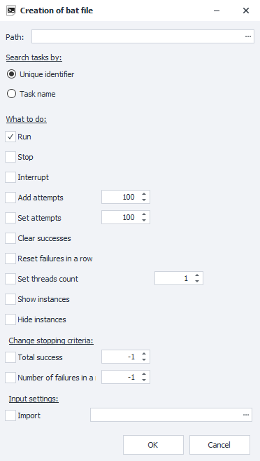
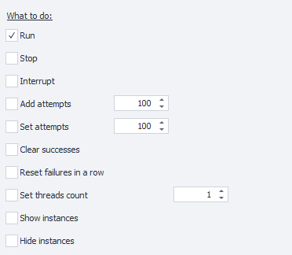

:::info **Please read the [*Material Usage Rules on this site*](../../Disclaimer).**
:::

> 🔗 **[Original page](https://zennolab.atlassian.net/wiki/spaces/RU/pages/1940979747/bat)** — Source of this material

_______________________________________________  

## Description

For each project you add to ZennoPoster, you can create a bat file, which lets you start and stop the template, add attempts, change the number of threads, set new input settings, and more.

You can select several options at once.

:::warning Attention
bat files do not work in the DEMO version of the program.
:::

  

## How to create one?

In the [❗→ project table](https://zennolab.atlassian.net/wiki/spaces/RU/pages/853737528 "https://zennolab.atlassian.net/wiki/spaces/RU/pages/853737528"), right-click on the project and choose “Create bat file” from the [❗→ context menu](https://zennolab.atlassian.net/wiki/spaces/RU/pages/852885672 "https://zennolab.atlassian.net/wiki/spaces/RU/pages/852885672").

  

## Path

Here you need to specify the path where the bat file will be saved.

## Search for task by

In this section, you need to choose how the bat file will search for the project.

**Unique identifier** - each project you add to ZennoPoster has a unique identifier (example - `81ca46b9-8eaa-94e3-92be-33b22ba4ca1a`).  
*NOTE*: every time you add a project, a new identifier is generated. If you add and remove the same template multiple times, each time a new ID will be created.

**Task name** - the template will be found by its name.  
If there are several projects with the same name in the project table, the settings will be applied to the first one found.

## What to do

**Start, Stop, Interrupt** - see more in the article about the [❗→ Context menu](https://zennolab.atlassian.net/wiki/spaces/RU/pages/852885672 "https://zennolab.atlassian.net/wiki/spaces/RU/pages/852885672").

**Add attempts** - the specified number of attempts will be added to the current execution attempts.

**Set attempts** - for the selected template, the specified number of execution attempts will be set.

**Reset successes/failures in a row** - reset the number of consecutive [un]successful executions.

**Set number of threads** - sets the number of threads for the template.

**Show/hide instance** - these options allow you to show or hide instances for running threads.

## Change stop criteria

Allows you to set the conditions under which the template will stop working. This is similar to the functions in the [❗→ Stop tab](https://zennolab.atlassian.net/wiki/spaces/RU/pages/852885665 "https://zennolab.atlassian.net/wiki/spaces/RU/pages/852885665").

## Input settings

**Import** - here you need to specify the path to the file containing the saved input settings.  
How to save the settings is described in the article [❗→ Input settings](https://zennolab.atlassian.net/wiki/spaces/RU/pages/1846051204 "https://zennolab.atlassian.net/wiki/spaces/RU/pages/1846051204")  

  

## Useful links

- [❗→ Context menu](https://zennolab.atlassian.net/wiki/spaces/RU/pages/852885672 "https://zennolab.atlassian.net/wiki/spaces/RU/pages/852885672")
- [❗→ Project table](https://zennolab.atlassian.net/wiki/spaces/RU/pages/853737528 "https://zennolab.atlassian.net/wiki/spaces/RU/pages/853737528")
- [❗→ Input settings](https://zennolab.atlassian.net/wiki/spaces/RU/pages/1846051204 "https://zennolab.atlassian.net/wiki/spaces/RU/pages/1846051204")