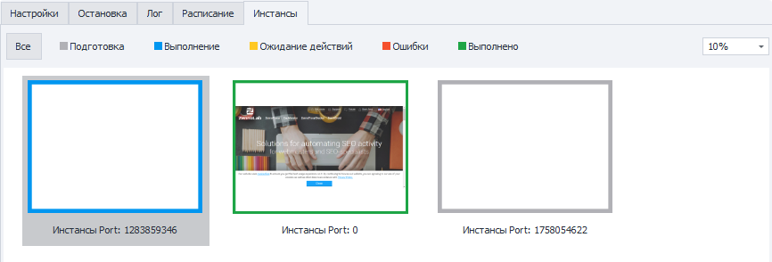
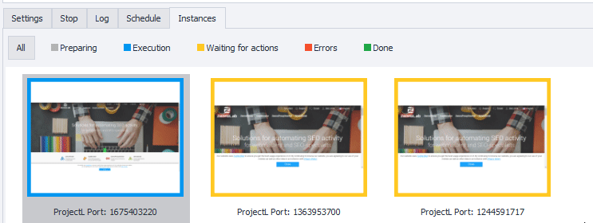

---
sidebar_position: 5
title: "Instances"
description: ""
date: "2025-09-10"
converted: true
originalFile: "Instances.txt"
targetUrl: "https://zennolab.atlassian.net/wiki/spaces/RU/pages/853803144"
---
:::info **Please review our [*Material Usage Policy*](../Disclaimer).**
:::

> 🔗 **[Original page](https://zennolab.atlassian.net/wiki/spaces/RU/pages/853803144)** — Source of this material

_______________________________________________  

## Description

In this tab, you can monitor all instances in real time.

  

## Statuses

The border color of an instance depends on its current state.

- **Preparation**
- **Running**
- **Waiting for actions** ([❗→ Browser settings =&gt; Waiting for user actions](https://zennolab.atlassian.net/wiki/spaces/RU/pages/489324572#%D0%9E%D0%B6%D0%B8%D0%B4%D0%B0%D0%BD%D0%B8%D0%B5-%D0%B4%D0%B5%D0%B9%D1%81%D1%82%D0%B2%D0%B8%D0%B9-%D0%BF%D0%BE%D0%BB%D1%8C%D0%B7%D0%BE%D0%B2%D0%B0%D1%82%D0%B5%D0%BB%D1%8F "https://zennolab.atlassian.net/wiki/spaces/RU/pages/489324572#%D0%9E%D0%B6%D0%B8%D0%B4%D0%B0%D0%BD%D0%B8%D0%B5-%D0%B4%D0%B5%D0%B9%D1%81%D1%82%D0%B2%D0%B8%D0%B9-%D0%BF%D0%BE%D0%BB%D1%8C%D0%B7%D0%BE%D0%B2%D0%B0%D1%82%D0%B5%D0%BB%D1%8F"))
- **Errors**
- **Completed**

### Filter by Status

Additionally, you can filter the display by the current status of an instance:

  

## Scaling

Use the drop-down list in the right part of the tab to change the display scale.

The instances in the screenshot are shown at a 5% scale.

  

## Opening an Instance

If you double-click any thumbnail, a window with the instance in its actual size will open.

To close the window, just click the X in the upper corner.

## Instances in "Waiting for User Actions" Mode

Windows in the “[❗→ Waiting for user actions](https://zennolab.atlassian.net/wiki/spaces/RU/pages/489324572#%D0%9E%D0%B6%D0%B8%D0%B4%D0%B0%D0%BD%D0%B8%D0%B5-%D0%B4%D0%B5%D0%B9%D1%81%D1%82%D0%B2%D0%B8%D0%B9-%D0%BF%D0%BE%D0%BB%D1%8C%D0%B7%D0%BE%D0%B2%D0%B0%D1%82%D0%B5%D0%BB%D1%8F")” mode appear on the taskbar; you can minimize and restore them. However, if the input timeout for an instance expires, it disappears from the taskbar.

  

## Stopping an Instance

You can stop an instance at any time. Just click the thumbnail of the desired instance and press “Stop.”

  

## Useful Links

- [❗→ Waiting for user actions](https://zennolab.atlassian.net/wiki/spaces/RU/pages/489324572#%D0%9E%D0%B6%D0%B8%D0%B4%D0%B0%D0%BD%D0%B8%D0%B5-%D0%B4%D0%B5%D0%B9%D1%81%D1%82%D0%B2%D0%B8%D0%B9-%D0%BF%D0%BE%D0%BB%D1%8C%D0%B7%D0%BE%D0%B2%D0%B0%D1%82%D0%B5%D0%BB%D1%8F "https://zennolab.atlassian.net/wiki/spaces/RU/pages/489324572#%D0%9E%D0%B6%D0%B8%D0%B4%D0%B0%D0%BD%D0%B8%D0%B5-%D0%B4%D0%B5%D0%B9%D1%81%D1%82%D0%B2%D0%B8%D0%B9-%D0%BF%D0%BE%D0%BB%D1%8C%D0%B7%D0%BE%D0%B2%D0%B0%D1%82%D0%B5%D0%BB%D1%8F")