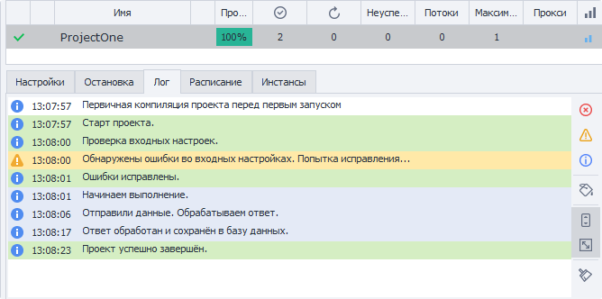

:::info **Please read the [*Material Usage Rules on this site*](../../../Disclaimer).**
:::

> 🔗 **[Original page](https://zennolab.atlassian.net/wiki/spaces/RU/pages/853737573)** — Source of this material

_______________________________________________  

The **Log** tab records notifications on the progress of your project: errors, and marks of successful or unsuccessful completion.

With the buttons on the right side of the tab, you can clear the log, enable auto-scroll, and filter messages by type and/or color.

:::info Information
You can read more about working with this window in the article [❗→ Log window](https://zennolab.atlassian.net/wiki/spaces/RU/pages/725352532).
:::