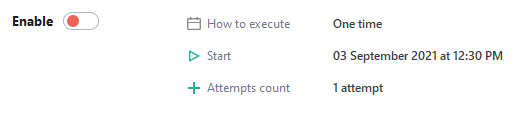
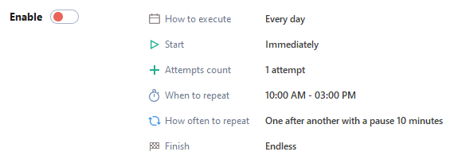
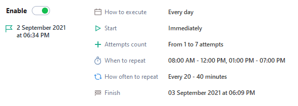
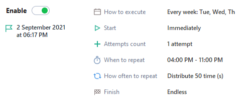

---
sidebar_position: 1
title: "General Information about the Scheduler"
description: ""
date: "2025-09-10"
converted: true
originalFile: "Общая информация по Планировщику.txt"
targetUrl: "https://zennolab.atlassian.net/wiki/spaces/RU/pages/1959329865"
---
import DisclaimerNotice from '@site/src/components/DisclaimerNotice';

<DisclaimerNotice />

> 🔗 **[Original page](https://zennolab.atlassian.net/wiki/spaces/RU/pages/1959329865)** — Source of this material

export const VideoSample = ({source}) => (
  <video controls playsInline muted preload="auto" className='docsVideo'>
    <source src={source} type="video/mp4" />
</video>
); 

_______________________________________________  

:::tip Tip
The schedule planner is an updated tool in ZennoPoster 7 that lets you finely configure and automate project execution based on a schedule.
:::

<VideoSample source={require("@site/static/video/about_scheduler_en.mp4").default}/>

## **Scheduler Features:**

1. Create simple schedules with one-time task execution (example 1).
2. Create complex schedules with time intervals, attempts, and their repetitions (examples 2, 3, 4).
3. [❗→ Schedule debugging](https://zennolab.atlassian.net/wiki/spaces/RU/pages/547520519 "https://zennolab.atlassian.net/wiki/spaces/RU/pages/547520519") to make sure everything runs as planned.

:::info Info
No matter how complex your scheduling needs are, task scheduling in ZennoPoster 7 is available to any user, regardless of experience level. The sequence of interface elements makes the scheduling process clear and logical.
:::

### Example 1

:::note Note
Run a project once tomorrow at 12:30.
:::

### Example 2

:::note Note
Run a template every day from 10:00 to 15:00 a maximum number of times, with a 10 minute pause between runs.
:::

### Example 3

:::note Note
Run a project every day from 8:00 to 12:00 and from 13:00 to 19:00, repeating it every 20–40 minutes and adding between 1 and 7 attempts.
:::

### Example 4

:::note Note
Run a project every Tue, Wed, and Thu from 16:00 to 23:00, randomly spreading 50 project executions over the specified interval.
:::

## **How do you start using the scheduler?**

1. By default, the scheduler is off.
2. First, set up the schedule for how you want the template to run.
3. Then check to make sure the settings are correct.
4. After that, move the slider to the "On" position.

:::warning Warning
Please keep in mind: if there are any errors in your schedule settings, they will be highlighted with a red outline, and the enable function will be inactive.
:::

### Scheduler Menu

:::info Info
Up to version 7.2.1.0, the menu was under the Enable button. Starting from 7.2.1.0, the menu has been moved to the upper right corner of the Schedule tab.
:::

- **Copy** — copy the project schedule;
- **Paste** — paste the project schedule;
- **Load** — load a schedule settings file;
- **Save** — save a schedule settings file;
- **Show log** — show the history of attempts added by the scheduler;
- [❗→ Schedule Debugger](https://zennolab.atlassian.net/wiki/spaces/RU/pages/547520519 "https://zennolab.atlassian.net/wiki/spaces/RU/pages/547520519") — launch the task schedule debugger. Allows you to estimate the approximate time needed to complete the tasks.