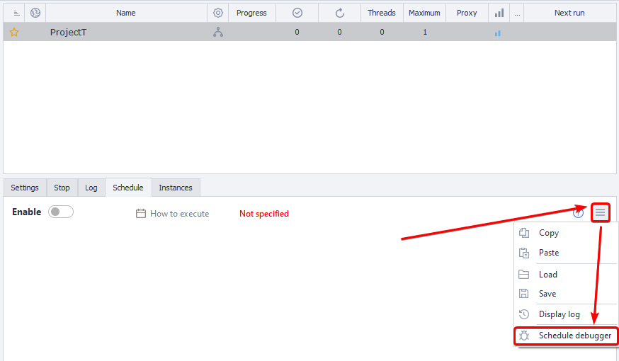
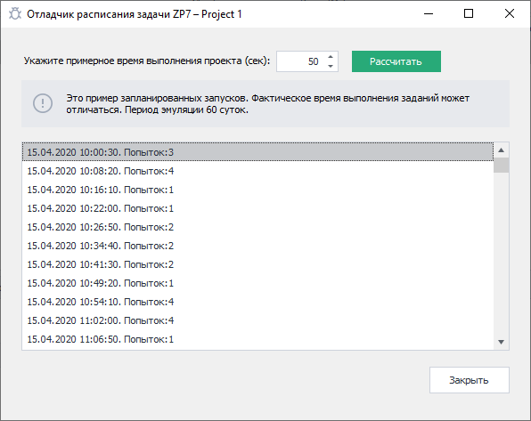

---
sidebar_position: 3
title: "Schedule Debugger"
description: ""
date: "2025-09-10"
converted: true
originalFile: "Отладчик расписания.txt"
targetUrl: "https://zennolab.atlassian.net/wiki/spaces/RU/pages/547520519"
---
import DisclaimerNotice from '@site/src/components/DisclaimerNotice';

<DisclaimerNotice />

> 🔗 **[Original Page](https://zennolab.atlassian.net/wiki/spaces/RU/pages/547520519)** — Source of this material

_______________________________________________  

## General Information

:::info Information
The schedule debugger lets you calculate the approximate time it will take to complete tasks and gives you an idea of how the project will run according to the schedule.
:::

To open the debugger, go to your project’s schedule menu and select “Schedule Debugger”.

:::tip Tip
We highly recommend using the schedule debugger—it's your confidence that everything will run as planned!
:::

## Using the Schedule Debugger

**Step 1.** For the debugger to show a more realistic project execution flow, please specify the approximate time in seconds for a single run of the project. The more accurate this value is, the more precise the calculation will be.

Open Отладчик расписания.png

**Step 2.** After entering the project execution time, click the “Calculate” button and wait a few seconds while the debugger displays the approximate schedule from the planned start to the end of the project or the end of the emulation period.

Open Отладчик расписания 2.png

Once the calculation is complete, the debugger will show the project’s progress information in the following format: **execution date — execution time — number of attempts.** With this data, you can see how your project schedule will operate and check if the intervals and repetitions are set up correctly.

Keep in mind that actual project execution time during scheduled runs may vary and differ from the value you entered in the debugger. The debugger only provides an approximate execution scenario.