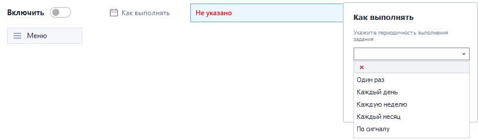
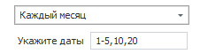
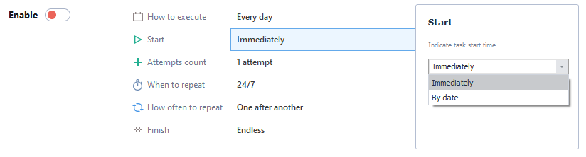
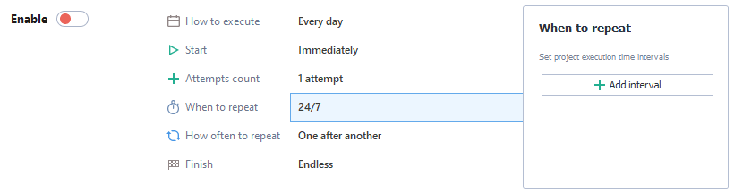
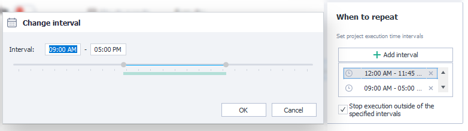
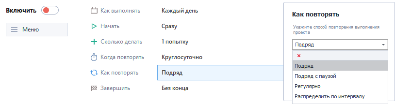
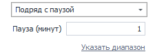
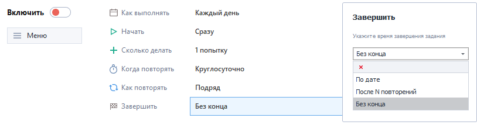
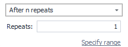

---
sidebar_position: 2
title: "Description of Scheduler Features"
description: ""
date: "2025-09-10"
converted: true
originalFile: "Описание возможностей планировщика.txt"
targetUrl: "https://zennolab.atlassian.net/wiki/spaces/RU/pages/547258378"
---
:::info **Please read the [*Material Usage Rules on this site*](../Disclaimer).**
:::

> 🔗 **[Original page](https://zennolab.atlassian.net/wiki/spaces/RU/pages/547258378)** — Source of this material

_______________________________________________  

## 1. How to execute

This section is responsible for setting the frequency of the task. There are 5 available execution options:

- **Once** — the task will be executed exactly one time.
- **Every day** — the task will be executed every day from Mon to Sun.
- **Every week** — the task will be executed on selected days of the week. Check the needed days with the checkboxes.

- **Every month** — the task will be executed on specific dates. List individual days of the month separated by commas, and use a dash for date ranges. Example: 1-5, 10, 20 (the project will run from the 1st to the 5th of the month, and also on the 10th and 20th).

- **By signal** — the task will start when an uploaded file appears. If you want the file to be deleted after the task starts, check the “Delete file” checkbox.

## 2. Start

This section sets how and when the task will start.

- **Immediately** — the task will start as soon as the scheduler is enabled.
- **By date** — the task will start at the specified date and time.

## 3. How many to run

In this field, specify how many times you want the project to run for this task. You can enter an exact number or a range, from which the number of runs will be chosen randomly. To add a range, click the “Set range” link.

The “Reset successes” checkbox resets the success counter from the “Stop” tab.

## 4. When to repeat

This section defines time intervals when the project should run. To add an interval, click the “Add interval” button ** and in the popup enter the time frame. To add another interval, just click the button again. The number of intervals is unlimited.

If no intervals are set, the project will run 24/7. This feature is available in the “Every day,” “Every week,” and “Every month” modes.

## 5. How to repeat

This function controls the type of repetition for the project. It is activated in the “Every day”, “Every week,” and “Every month” execution modes.

There are 4 available ways to repeat the task:

- **In a row** — the task will start again as soon as the previous repetition finishes.
- **In a row with a pause** — works the same as “In a row,” but adds a pause between repetitions. You can specify the pause as an exact number or a range, and a random value will be chosen from the range. To add a range, click the “Set range” link. The time is specified in minutes.

- **Regularly** — the task will start again after the specified time, regardless of when the previous run finished, similar to the “In a row with a pause” mode.
- **Distribute across interval** — repeats of the task will be automatically distributed across the intervals set in “When to repeat” (section 4).

## 6. Finish

This section sets the conditions for completing the task. This feature is available in “Every day,” “Every week,” and “Every month” modes.

There are 3 available ways to complete the task:

- **By date** — the project will run until the specified date and time.
- **After N repetitions** — the project will finish after exactly the number of repetitions specified, or any number within a set range. To add a range, click the “Set range” link.

- **No end** — the project will run an unlimited number of times, until you stop it manually.